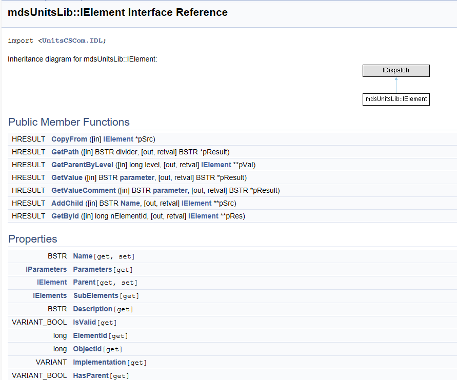
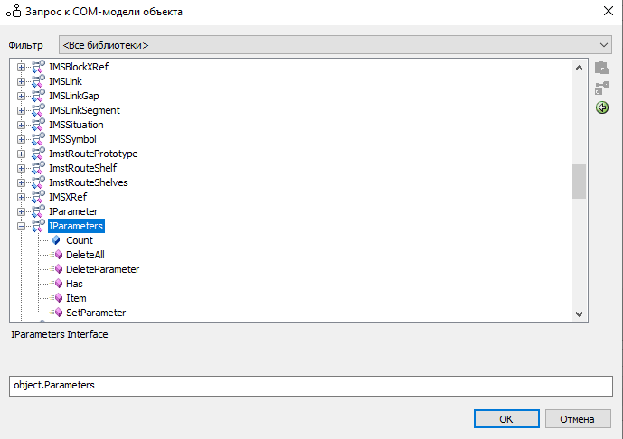
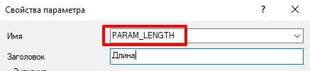

# ModelStudio CS - формулы и COM. Часть 1

Обучающий материал по использованию COM-запросов (хотя, и не только их) в формулах параметров в среде ModelStudio CS (а также и в некоторых вертикальных приложениях Нанософт). 


©[Telegram: Contact @memestudiocs](https://t.me/memestudiocs/2)

## 1. Что ты такое?

В общем случае COM ~~переводится как СлОмай Мозг~~ - это технология обмена информацией между различными процессами в системе и своим появлением в контексте формул в среде ModelStudio CS обязана тем, что "формульный движок" позволяет использовать некоторые процедуры nanoCAD~~/AutoCAD~~ & ModelStudio ActiveX (COM) API. Таким образом, задумай разработчики CSoft Development использовать LISP или Python, история могла бы пойти по иному варианту, и про COM никто бы не услышал, но ... живём с тем, что есть :)

## 2. Знания - сила или о компетенциях

Пользователю, желающему освоить глубины ~~некромантии~~ автоматизации при помощи COM следует быть подкованым в вопросах:

- объектная модель dwg-файла (nanoCAD, AutoCAD -- в зависимости от того, на чём стоит ModelStudio CS);

- объектная модель/структура параметрических объектов ModelStudio CS;

- nanoCAD ActiveX API (см. в составе SDK для платформы nanoCAD);

- ModelStudio CS ActiveX API ([MST_COM_API.chm — Яндекс Диск](https://disk.yandex.ru/d/MFGe8jpJbYpswg));

## 3. О постулатах

Для стороннего человека, тем более не знакомого с разработкой, погружаться в COM будет тяжело, поэтому будет удобно перед начало погружения принять к сведению ряд фундаментальных понятий. Назовём их громко "постулатами":

- ~~Принятные на грудь 100 грамм значительно увеличивают когнитивные способности;~~

- Всякий объект чертежа (модели) nanoCAD/AutoCAD -- это сущность AcadEntity, на стороне формул описывается ключевым словом `object`;

- Всякий параметрический объект ModelStudio CS (и прочих продуктов) обладает параметрическими данными, описывающимися `Element`;

**Примечание**: некоторые типы объектов имеют внутренние параметры, не отображенные в диалоговом окне "Свойства объекта"

- Доступ к текущему приложению осуществляется через вызов `application`;

- Доступ к текущему документу осуществляется через вызов `application.ActiveDocument`;

- В DWG-чертеже объекты могут располагаться как в пространстве модели, так и на любом из листах. Некоторые аннотативные параметрические объекты ModelStudio CS могут располагаться как в модели, так и на листах;

- Родительский объект для любого параметрического - не обязательно пространство модели или листа, это может быть и другой объект;

## 4. Виды COM-объектов

В объектной модели чертежа доступ через COM имеют материальные объекты, коллекции объектов, служебные объекты и некоторые прочие элементы. Что же к ним относятся -- давайте разбираться.

Под <u>материальными объектами</u> будем понимать такие, что мы видим в модели или на листах -- это любые объекты платформы nanoCAD (AutoCAD), описываемые COM-типом `AcadEntity`(отрезки, штриховки, параметрические объекты ModelStudio CS, видовые экраны и т.д.).

<u>Коллекции объектов</u> -- это фиксированные типы объектов, содержащие в себе иные объекты. В nanoCAD (AutoCAD) это:

- перечень всех Блоков `AcadBlocks`;

`application.ActiveDocument.Database.Blocks`

- объекты в Блоке `AcadBlock`;

**Примечание**: Блоком в чертеже являются именованные пространства модели и листов, а также все определения "Вхождений блоков";

- перечень всех Словарей `AcadDictionaries`;

`application.ActiveDocument.Database.Dictionaries`

**Примечание**: Словарем называется служебная ассоциативная коллекция данных раличных типов, доступная по строковому ключу. Далее мы будем активно работать с этими типами данных;

- перечень всех Размерных стилей `AcadDimStyles`;

`application.ActiveDocument.Database.DimStyles`

- перечень всех Внешних ссылок в виде данных `AcadFileDependencies`;

`application.ActiveDocument.Database.FileDependencies`

- перечень всех Групп в виде данных `AcadGroups`;

`application.ActiveDocument.Database.Groups`

**Примечание**: Группой называют именованный набор объектов в модели или на листе;

- перечень всех Слоев `AcadLayers`;

`application.ActiveDocument.Database.Layers`

- перечень всех Листов `AcadLayouts`;

`application.ActiveDocument.Database.Layouts`

**Примечание**: В составе листов также есть и пространство модели. Эту коллекцию можно использовать для перебора всех объектов в модели;

- перечень всех Типов линий `AcadLineTypes`;

`application.ActiveDocument.Database.Linetypes`

- перечень всех Материалов `AcadMaterials`;

`application.ActiveDocument.Database.Materials`

- перечень всех Конфигураций печати документа `AcadPlotConfigurations`;

`application.ActiveDocument.Database.PlotConfigurations`

- перечень всех Текстовых стилей `AcadTextStyles`;

`application.ActiveDocument.Database.TextStyles`

- перечень всех ПСК `AcadUCSs`;

`application.ActiveDocument.Database.UserCoordinateSystems`

- перечень всех Видовых экранов `AcadViewports`;

`application.ActiveDocument.Database.Viewports`

- перечень всех Видов `AcadViews`;

`application.ActiveDocument.Database.Views`

В ModelStudio CS коллекцией является только набор параметров Element.Parameters.

<u>Служебные объекты</u> -- XRecord, Layer и т.д. (не имеющие материального отображения и не являющиеся коллекцией) .

## 5. О структуре параметрического объекта

Мы уже оговорили, что любой параметрический объект [ModelStudio CS] имеет параметры. Со стороны формул доступ к ним осуществляется через свойство 

```c
=Element;
```



Перечень свойств и методов, какими обладает Element (из справки COM API).



Они же, доступные через встроенное окно вставки COM-функции.

- Наименование Element зачастую = имени объекта на панели Свойств;

- Коллекция параметров в составе Element получается вызовом .Parameters;

- Значение отдельного параметра, например, для *PART_GROUP* можно получить несколькими способами:

```c
//Способ 1
=object.Element.Parameters.Item("PART_GROUP");
//Способ 2 (показывает, что .Item по отношению к Parameters можно опустить)
=object.Element.Parameters("PART_GROUP");
//Способ 3
=object.Element.Parameters["PART_GROUP"];
//Способ 4
[PART_GROUP]
```

Все 4 способа (может, даже, есть ещё) возвратят верный результат. Последний вариант, правда, актуален только для данного элемента (то есть в первых трех вместо object можно было бы обратиться к другим элементам модели).

Обращение к елевому параметру ведется по его Внутреннему имени



Если имя имеет символы пробела, то оно должно заключаться в кавычки. Рекомендуется внутренние имена делать латиницей (регистр не важен) без пробелов и любых символов кроме нижнего подчеркивания.

## 6. Тестирование формул

Для апробации механики формул достаточно зайти в свойства любого объекта и создать\редактировать любой параметр. При этом важно помнить:

- Если формула корректна, то её значение сразу будет выведено для параметра в окне "Параметры объекта";

- Если формула не корректна, то выведется раннее успешное значение. Ошибка в формуле будет видна только после перезапуска окна "Параметры объекта";
