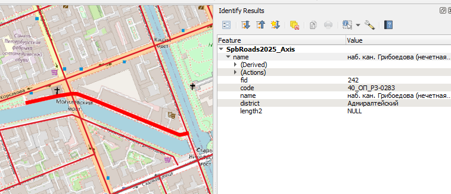

# Нарезка топоосновы в nanoCAD

*8 мая 2025г.*

На одном из месте работы, в СПбПУ, в грядущие 3 месяца буду задействован в проекте по созданию проектов организации дорожного движения на ряд городских улиц СПб. Похожий проект уже выполнялся раннее 4 года назад, нынешний фактически тоже самое, только для других улиц.

Если летом-осенью 2021 г. основные работы по подготовке материалов и оформлению чертежей перед печатью (после вывода из IndorTrafficPlan) выполнялись в AutoCAD, Civil 3D, то теперь неформальной задачей стал перевод процессов в отечественное ПО (nanoCAD). По большому счету, команды менять ПО не было -- это чисто моё желание опробовать на реальных задачах применимость ПО к задачам, главное -- получить результат, а как и где - не имеет значения.

Итак, одна из задач, пока не будут выполнены обследования дорог с лазерным сканером -- это нарезать под каждую дорогу подложки-топоосновы в пределах оси трассы. Предысторию [см. в канале](https://t.me/georg_apocalypse/64).

# 1. Исходные данные

В среде qgis был создан векторный слой данных с осями в пределах каждого их муниципальных образований (если дорога пролегает в нескольких районах, то по каждому району проект выполняется в отдельности, но правила у каждого могут быть свои)

Некоторые дороги могут иметь естественные разрывы и фактически они будут представлять из себя набор нескольких линий (тип данных MultiLineString).

Также исходными данными выступают набор DWG-подоснов. В оригинале это подосновы по квадратам в СК города. Для использования в проекте я их объединил в файлы по районам + небольшой запас данных по краям и перепроецировал в используемую систему координат.

Топоосновы остались с прошлого проекта 4 года назад (были собраны в AutoCAD Map 3D). Если бы такая задача стояла сейчас, то в составе плагина TBS GIS имеется операция "Перепроецирование DWG", которая ~~написана на NRX и~~ работает весьма бодренько.

Вот и все исходные данные. Задача: для каждой дороги, представленной несколькими ломаными осями сформировать DWG-файл с подосновой и осью дороги (из одной или нескольких полилиний). И таких дорог примерно 400 штук.

# 2. Вручную?

Вручную бы это выполнялось через Civil3D: у него есть из Map3d панелька запросов к DWG, подробнее писал вот [в такой статейке](https://inj9.gitbook.io/msk-for-civil-3d/untitled). Но в Civil 3d (да и в map 3d) были крайне ограниченные встроенные ГИС-инструменты, и 4 года назад оси в него импортировались из SHP-файлов. И конечно скорость работы убийственная. 

Рабочий процесс выглядел бы вот так:

* создание нового чертежа по шаблону;

* импорт из SHP-оси (осей);

* создание по осям выпуклой оболочки\буфера (для этого был написан простенький dynamo-скрипт, строящий МВО по методу Грэхэма);

* ручной выбор в параметрах запроса построенного контура;

* ожидание результата;

* сохранение файла и его закрытие;

Повтор ... 400 раз

# 3. Идея автоматизации

Для небольших данных устроила бы следующая реализация: из-под запущенного nanoCAD вызывается команда из написанного плагина (библиотеки классов), которая для каждой оси из ГИС-файла производит отрисовку трассы, расчет буфера (в целом, есть .NET-библиотеки с геометрическими расчетами), и далее открывая по очереди чертежи с топоосновами анализирует целиком их геометрию\делает выборку Selection по границам вычисленной области и копирует объекты в данный чертеж).

Но ... у нас данных много. В примитивах -- около 2.5 млн.  Поэтому наиболее вычислительно-затратную операцию поиска, какие объекты из топооснов нужны для данного файла было решено реализовать через PostGIS-функции.

# 4.  Реализация

## Шаг 1: Индексация объектов и их геометрии

Загруженный в nanoCAD плагин итеративно открывает в памяти чертежи (Database.ReadDwgFile) и считывает геометрию примитивов чертежа. В нашем случае, топооснова представлен только отрезками, полилиниями, текста, Мтекстами и блоками -- точечные и линейные объекты.

Информация об объектах сохраняется в текстовый CSV-файл -- идентификатор объекта чертежа handle, слой (при необходимости), название файла dwg и сама геометрия в виде строки WKT. Использование текстового варианта предпочтительно в плане производительности и последующего импорта в среду postgis напрямую без qgis.

Итак, csv-файлик сформировался, грузим его в БД Postgis. Делал на версии pgsql 16 и postgis 3.4.

Методика импорта будет примерно такой:

```plsql
drop table if exists dwg_data;
create table if not exists dwg_data (id INTEGER NOT NULL PRIMARY KEY GENERATED ALWAYS AS IDENTITY ( INCREMENT 1 ), 
dwg_file TEXT, dwg_handle TEXT, dwg_layer TEXT, dwg_geom TEXT);
COPY dwg_data (dwg_file, dwg_handle, dwg_layer, dwg_geom) FROM 'total.csv' WITH DELIMITER ';';

delete from dwg_data where dwg_geom LIKE 'LINESTRING%' and not dwg_geom LIKE '%,%';

update dwg_data set dwg_geom = replace(dwg_geom, '"', '');

alter table dwg_data add column if not exists dwg_geometry GEOMETRY;
update dwg_data set dwg_geometry = ST_GeomFromText(dwg_geom, 32636);

CREATE INDEX dwg_data_geometry ON dwg_data USING gist (dwg_geometry);
alter table dwg_data drop column if exists dwg_geom;
```

Что здесь происходит? Из CSV грузятся данные, удаляются данные, содержащие линию, представленную точкой -- поправка на линии очень маленькой длины (когда программно считывали линии в nanoCAD мы округляли вершины).

Затем создается столбец dwg_geometry с типом postgis geometry, получаемой как приведение WKT-записи в геометрию, ну и создание пространственного индекса для последующего ускорения поиска.

Время -- около 5 минут с поправкой на вылеты.

## Шаг 2: Расчет

Теперь необходимо посчитать, какие dwg-объекты попадут в контуры вокруг каждой дороги.

В качестве контура будет выступать буферная зона, получаемая в postgis процедурой ST_Buffer на расстояние пусть 70м. Для загородных дорог с разделением потоков большой зоной, конечно расстояние было бы большим, но среди анализируемых дорог таких нет. 

```plsql
--Целевая выборка
drop table if exists spb_roads2025_axis_stat;
create table if not exists spb_roads2025_axis_stat (code TEXT, district TEXT, geom GEOMETRY, dwg_objects integer[]);
insert into spb_roads2025_axis_stat (code, district, geom) (
    select distinct(code), district, ST_Collect(geom2) from spb_roads2025_axis group by code, district);
--Формируем буферы для осей и создаем по ним индекс
alter table spb_roads2025_axis_stat add column if not exists axis_buffer GEOMETRY;
update spb_roads2025_axis_stat set axis_buffer = ST_Buffer(geom, 70.0);
CREATE INDEX spb_roads2025_axis_stat_axis_buffer_geometry ON spb_roads2025_axis_stat USING gist (axis_buffer);

--Считаем, какие объекты DWG попадают в данные зоны из целевых файлов
alter table spb_roads2025_axis_stat drop column if exists dwg_objects;
alter table spb_roads2025_axis_stat add column if not exists dwg_objects TEXT[];
update spb_roads2025_axis_stat set dwg_objects = ARRAY(select dwg_handle from dwg_data 
                                where ST_Intersects(axis_buffer, dwg_data.dwg_geometry) and dwg_data.dwg_district = district);

COPY (SELECT id, dwg_file, dwg_handle FROM dwg_data) 
    TO 'dwg_data_roads.csv' (format csv, delimiter ';');
COPY (SELECT code, district, ST_AsText(geom), dwg_objects FROM spb_roads2025_axis_stat) 
    TO 'dwg_data_roads_axisinfo.csv' (format csv, delimiter ';');
```

Запрос, который производит такую выбору представлен выше. В целом, кажется, он не нуждается в пояснениях -- после анализа мы сохраняем данные обратно в текстовые файлы (геометрию -- в WKT-вид).

> Приведу, наверное, пояснение -- я сделал так, что для дороги в районе будет использоваться только DWG-подоснова для данного района. Имеется сопоставление RU-названий районов (колонка district) с именами файлов.

Время -- не более полуминуты на импорт данных, обработку и экспорт. Или часов 6 чтобы всё отладить и сделать как работает :-) 

## Шаг 3: Генерация подложек

Считываем программно полученные CSV-файлы (из postgis). Да, конечно можно было бы читать эти таблицы в базе, но я не стал заморачиваться с этими подключениями. Операция одноразовая -- зачем всё усложнять?

Далее всё просто, также из-под запущенного nanoCAD запускаем команду, которая откроет в памяти все чертежи топооснов (Database), скопирует оттуда объекты и вставит в новый файл через WblockCloneObjects. Ну и отрисует там ось трассы.

В общем, примерно за 2 часа шаг 3 был сделан -- с поправкой на вылеты (см. ниже)

# 5. Подводные камни

Из-за размера анализируемых DWG-файлов (вернее, из-за большого числа примитивов в них), nanoCAD благополучно вылетал на каждом 2...20 файле без закономерности на процедурах Database.ReadDwgFile и реже на Database.Save. Решение -- перезапуск и повторная работа. Как баг я завёл, надеюсь, разберутся и исправят (как "недопрограммист", эти ошибки очень коварные -- связанные с внутренними вызовами нативного API, в которых будет сложно разобраться).
