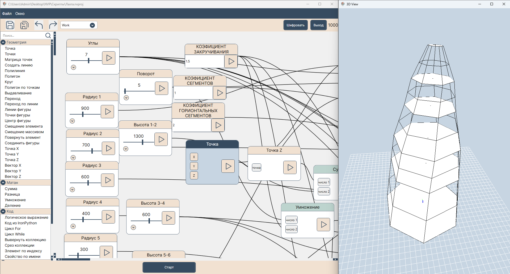
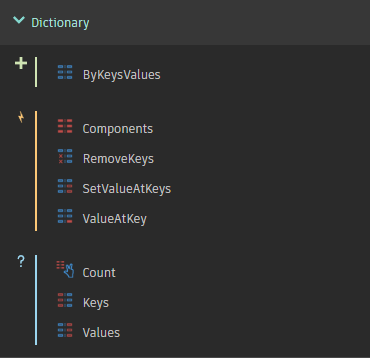
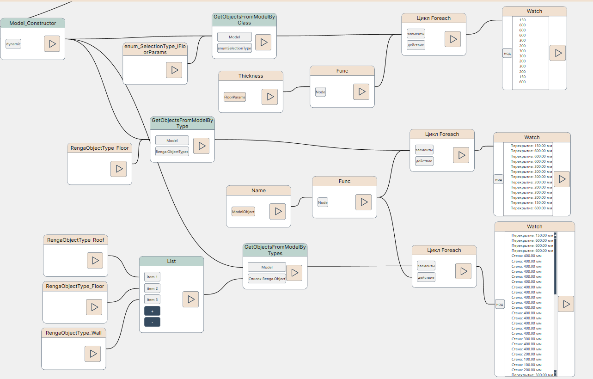
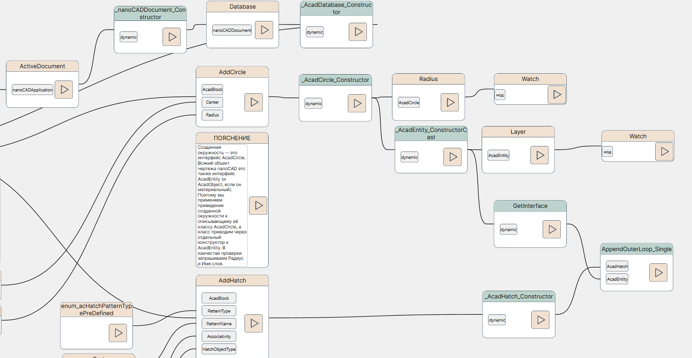
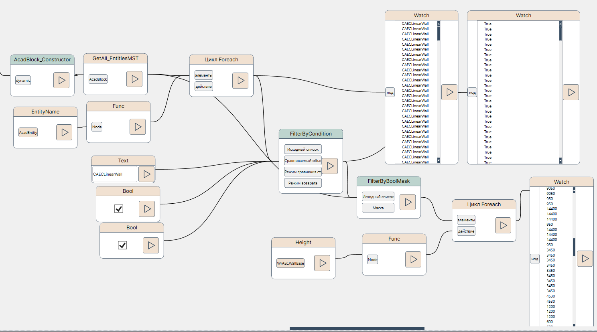

# NVP - О новой среде визуального программирования

*12 августа 2024г.*

Примерно с середины июля на глаза стали попадаться упоминания новой российской разработки - некоего аналога Dynamo. Как раз перед отпуском загружал дистрибутив, мельком смотрел, заявлялась возможность расширения коллекции нодов сторонними разработчиками и кроссплатформенность.

Вернувшись из отпуска подвернулась возможность поучаствовать в создании наборов нодов под отечественные САПР, о чём далее:

## 1. О среде NVP (vs Autodesk Dynamo)

[https://nvp-studio.ru/](https://nvp-studio.ru/)

Приложение написано на C# (как и Autodesk Dynamo), в качестве графической библиотеки используется OpenTK, для поддержки внутренних скриптов - IronPython 3.4.1.

Источник: [https://nvp-studio.ru/static/img/app/work_space.png](https://nvp-studio.ru/static/img/app/work_space.png)

Редакция NVP-studio пока распространяется в виде одного дистрибутива, а загружаемые в память целевых САПР плагины вызывают её из-под себя.

В отличие от нодов Dynamo, которые в рамках группы нодов реализовывали "классовую" концепцию (то есть был изменяемый объект класса), то в NVP на данный момент каждый нод представляет собой отдельный класс и, строго говоря, все ноды равнозначны в программном плане. Поясню, что я имею в виду. Допустим, возьмем знакомый объект **Dictionary** (словарь). В Dynamo был нод **ByKeysValues**, создающий экземпляр нового словаря и далее можно было воспользоваться методами или свойствами, возвращающими некое состояние словаря, то есть в явном виде были ноды-конструкторы и ноды-методы

В NVP такой же цветовой и логической дифференциации нодов пока не предусмотрено, но это не значит, что такую логику там не повторить (сделать можно).

Другое принципиальное отличие от Dynamo (для текущей версии NVP) -- это механика отработки скриптов на коллекциях (списках). Каждый нод в скрипте отрабатывает единожды для массива входящей информации, что отличает его от Dynamo -- где ноды отрабатывали столько раз, сколько объектов было в поданном списке. Сперва я возмутился такой реализации, но потом подумал и решил, что так даже корректнее отрабатывать скрипт на больших наборах данных, а часть особенно сложной логики решать, например, сортировкой данных в Python-нодах.

## 2. Разработка под NVP

Как и в Autodesk Dynamo существовала возможность сторонним разработчикам расширять функциональность (добавлять новые ноды), так она есть и в NVP ([реализована вот так](https://github.com/GeorgGrebenyuk/nvp_NodeLibs/blob/main/docs/DevGuide.md)).

Стояла задача -- обеспечить работу с Renga, nanoCAD, ModelStudio CS из-под среды NVP. Пакет нодов для Renga под Dynamo 2 года назад я писал в общей сложности месяца 3. Разбрасываться временем в текущих реалиях я не мог, поэтому решил воспользоваться своей раннее существовавшей утилитой, которая генерирует файлы кода (будущих нодов) из определения COM-сервера: [GitHub - GeorgGrebenyuk/idl2dynamo_converter: Translator ActiveX lib (from IDL file) to C# NET DLL for Autodesk Dynamo as node-package library](https://github.com/GeorgGrebenyuk/idl2dynamo_converter).

Я переписал её под логику NVP и также выложил в открытый доступ [GitHub - GeorgGrebenyuk/idl2nvp_converter: Translator ActiveX lib (from IDL file) to C# NET DLL for NVP as node-package library](https://github.com/GeorgGrebenyuk/idl2nvp_converter). 

Кстати решением под Dynamo я пользовался, когда делал пакет нодов для [AutoCAD ](https://github.com/GeorgGrebenyuk/Dyn_ActiveX_ACAD_and_C3D) и [nanoCAD + ModelStudio CS](https://github.com/GeorgGrebenyuk/Dyn_ActiveX_NCAD). 

Так как NVP я осваивал походу, то и конечный вид утилиты для преобразования COM-функций в него также претерпевал изменения по ходу). В общем в конечном итоге удалось сформировать (буквально) исходный код для трех пакетов нодов -- под целевые nanoCAD, Renga, ModelStudio CS + CADLib. Их разместил в этом репозитории [GitHub - GeorgGrebenyuk/nvp_NodeLibs: Исходный код библиотек нодов NVP для САПР с COM API (ActiveX) : Renga, nanoCAD, ModelStudioCS](https://github.com/GeorgGrebenyuk/nvp_NodeLibs).

Отмечу его основные особенности (которые также есть во внутренней справке к пакету):

* Каждый COM-интерфейс (класс) и его методы доступен в виде отдельной группы нодов;

* Для каждого COM-интерфейса доступны по крайней мере 2 нода-конструктора (в каждом из них имеется поле `_i` с COM-интерфейсом): первый может принимать на вход COM-объект `System.__ComObject`, а второй - делать операцию приведения внутреннего интерфейса к типу целевого, если на вход ноду подать другой нод-конструктор. В общем, здесь вводится понятие нодов-конструкторов, как было в Dynamo. На слух воспринимается сложно, надеюсь, что будет понятно по примерам;

* Так как в системе может быть запущено несколько сессий целевого приложения, то оставлен вариант подключиться к целевому приложению;

* Для удобства введены и вводятся дополнительные ноды, облегчающие работу с выборкой объектов модели;

* ...

## 3. Доступные возможности автоматизации

Всё, что можно в COM API исключая UI-взаимодействие с Пользователем (это оставлено по минимуму. Пока что).

К слову, в Renga и ModelStudioCS (исключая их С++ API) COM -- это единственный вид API, потому там при помощи настоящего пакета нодов можно делать почти что угодно ("почти" оставлено на тяжелые логические сценарии, которые может быть сложно реализовать скриптом).

Фрагмент скрипта для Renga: выборка объектов модели (перекрытий) и вывод их свойств, названий

Фрагмент скрипта для nanoCAD: создание окружности, определения штриховки и добавление её в штриховку как контур.

Фрагмент скрипта для ModelStudioCS Строительные решения: выборка объектов "Стена прямолинейная" и вывод информации по высоте стены.

## 4. На развитие

* Добавление новых вспомогательных нодов по ходу попыток решения практических задач (многие конструкции были добавлены как раз при написании демо-скриптов);

* Расширение охвата других САПР (создание пакетов на основе их COM API (при наличии) или на .NET API -- Топоматик Робур первый в списке :));

* Добавление нодов общего плана -- работа с коллекциями, словарями, файловой системой и т.д. (что было в Dynamo и его пакетах);
