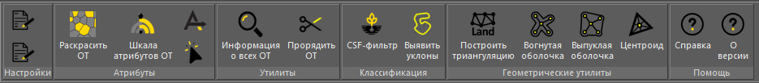
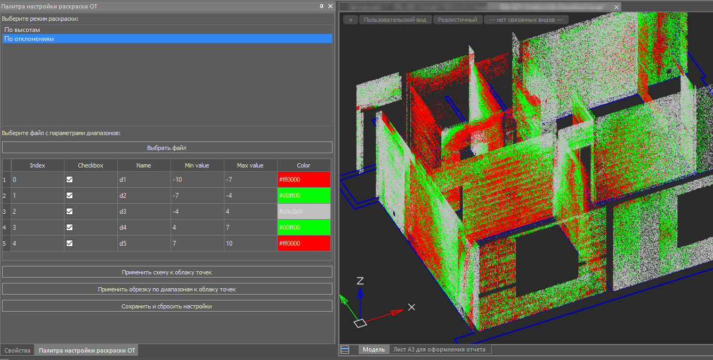
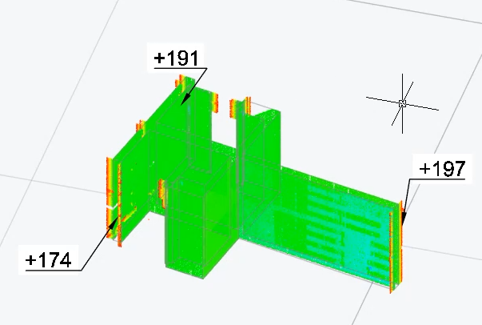
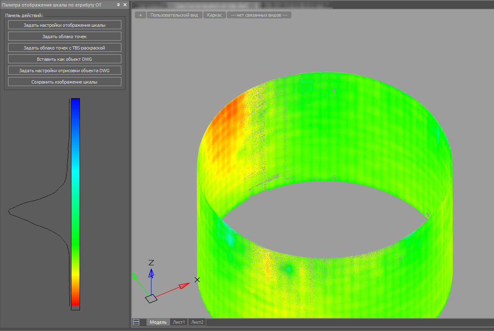
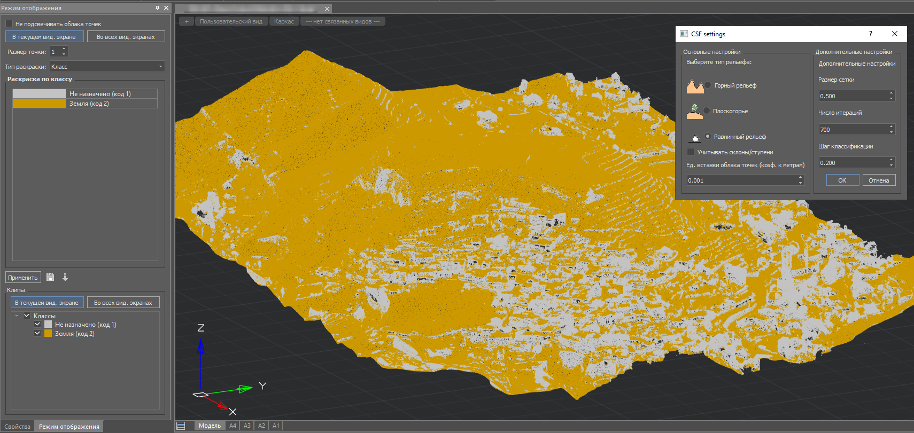
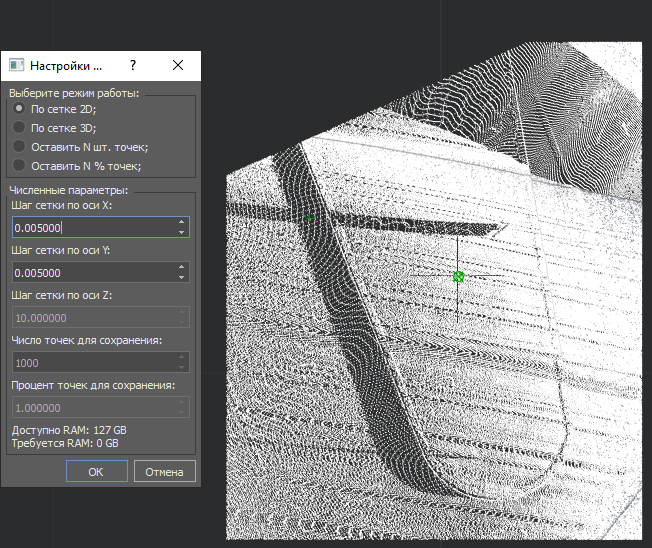
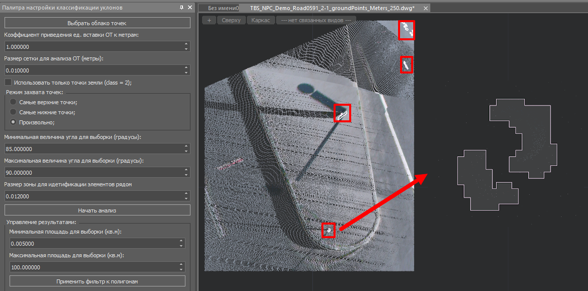
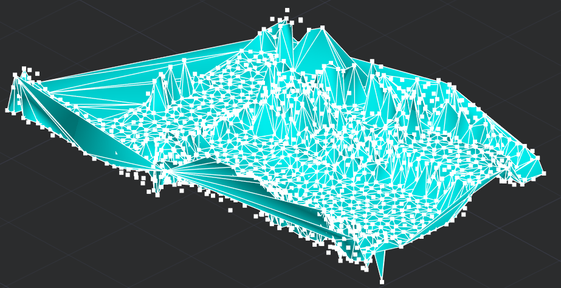
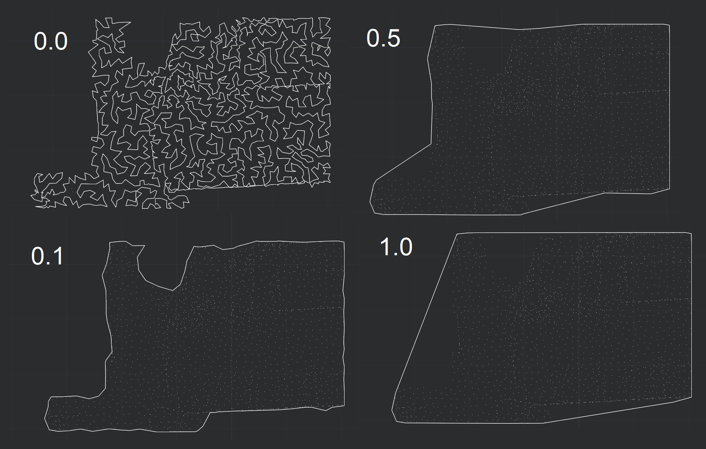

# TBS Cloud - Летая в облаках

*13 апреля 2025г.*

Летом 2024 года по работе в Нанософт я документировал его API для модуля "Облака точек"; оно вышло в составе SDK к платформе nanoCAD для релиза 25.0 в середине января текущего года.

Практически же, я начал погружаться в задачи работы с облаками точек примерно с конца 2024 года; сперва хотел начать с задач, с которыми сталкивался при выполнении вузовских дорожных проектов, но сразу осознал, что для начала это будет слишком сложно (*потом, конечно, они тоже были реализованы*), поэтому реализация полезных утилит началась с совместного общения команд разработки TBS и сканирования Setl-group в части создания инструментов для облегчения выполнения работ по анализу отклонений облаков точек в среде nanoCAD.

Забегая вперед, [прикладываю ссылку](https://nanodrive.nanocad.ru/spb?utm_source=spb&utm_medium=tgtbs&utm_campaign=nanodrive) на очную конференцию 22 апреля в Санкт-Петербурге, на которой будут выступать ребята из Setl и TBS с упоминанием настоящей разработки.

Тот факт, что я пишу эту статью только сейчас, по истечению почти 4 месяцев после начала работ говорит о том, что процесс реализации был мягко говоря не простым, местами я несколько раз бросал из-за сложностей:

* сама по себе разработка на C++ (и Qt);

* использование nanoCAD NRX (C++ API) и сравнительно нового NPC API, который в силу своей специфики и малого числа использования местами содержал ошибки, которые долго не получалось обойти;

* работы с облаками точек программно -- издержки на вдумчивую реализацию работы с памятью для лучшей производительности;

* новая предметная область и её потребности;

* недостаток времени;

Выбор C++ в качестве языка разработки был обусловлен тем, что рабочим является только API на этом языке программирования; соответственно для создания удобной среды работы (включая UI) потребовалось в несколько раз больше времени и усилий, чем обычно занимает аналогичная работа на .NET. Добавлю сюда и то, что раннее с Qt на серьезных проектах я не работал и потому первое время безбожно тупил.

Как выглядит панель с командами реализованного модуля "TBS Cloud".

# Аналитические и визуальные инструменты

Возможность в отдельной палитре отобразить в табличном виде пользовательскую схему раскраски и ограничить видимость точек облака точек по ним.

Совместная реализация с плагином TBS Plus по расстановке значений отклонения (облака точек от твердотельной геометрии, считается стандартными средствами модуля "Облака точек") в виде мультивыносок, ориентирующихся по заданной точке обзора в модели nanoCAD:

Предварительная реализация настраиваемой шкалы отображения облака точек (по каждому диапазону) с выводом текстовых меток, как есть в Leica Cyclone 3DR:

# Классификация

Перенесен CSF-алгоритм из CloudCompare с небольшими правками для меньшего расхода оперативной памяти:

Прореживание по условиям с оценкой достаточности RAM:

Авторская (личная) реализация классификации облака точек на поиск наклонных и вертикальных конструкций путем анализа уклонов между соседними точками облака, по этому пишется научная статейка, выйдет ближе к осени:

# Геометрическая аналитика

Тут используются алгоритмы геометрической библиотеки с открытым исходным кодом GEOS (она входит, в частности, в состав GDAL и многих ГИС-инструментов).

Построение сети (поверхности) по точкам облака

Построение выпуклой (при 1.0) и вогнутой оболочек:

# Публичное распространение

Ожидается после первого публичного релиза 22 апреля 2025 года на конференции Нанодрайв -- регистрируйтесь и приходите, можем встретиться и поговорить.

[Конференция о российских решениях для строительства и производства: САПР/ТИМ/СОД](https://nanodrive.nanocad.ru/spb?utm_source=spb&utm_medium=tgtbs&utm_campaign=nanodrive)

В текущем виде проходит тестирование среди клиентов TBS. В дальнейшем будет распространяться наряду с остальными разработками TBS.

При желании протестировать плагин обращайтесь на info@tbs-soft.ru с указанием данных ФИО, Компании и контактов для связи. 
