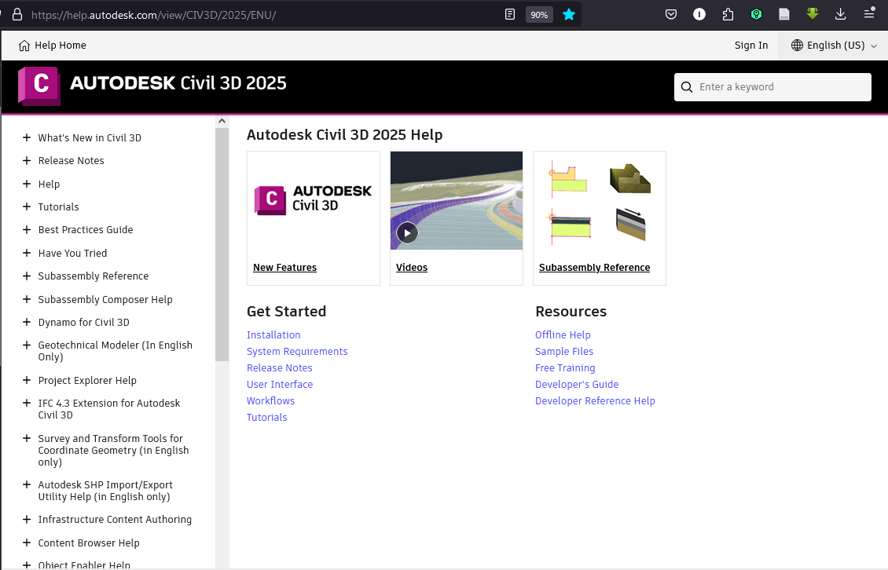
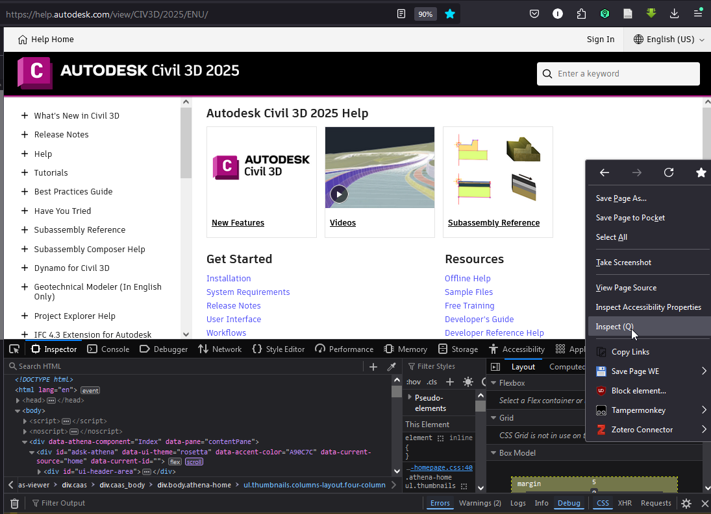
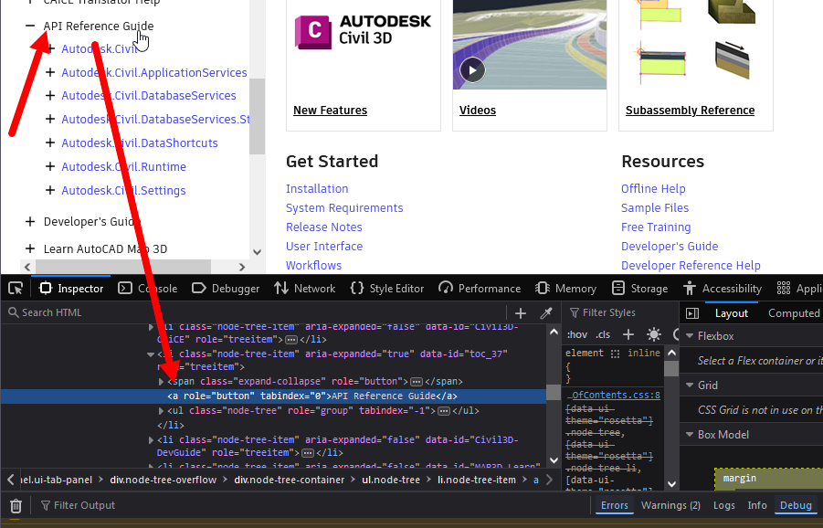
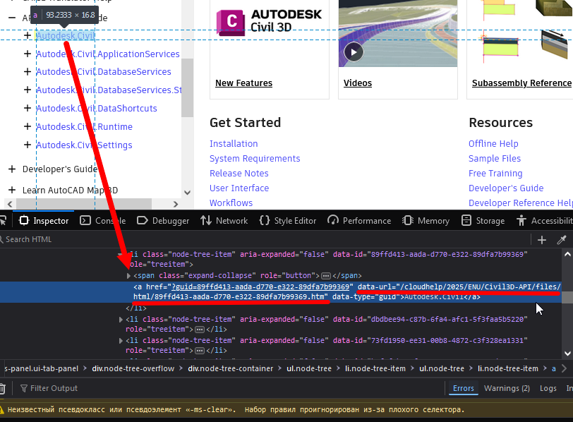
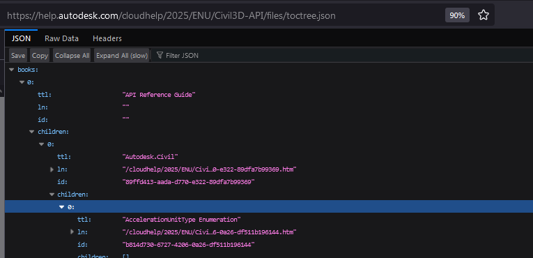
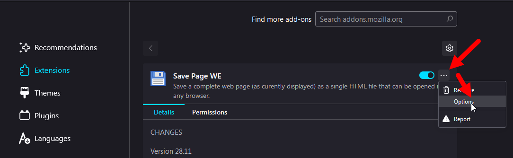
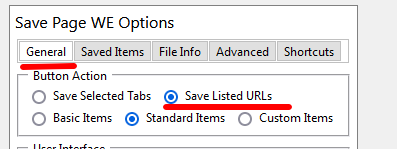
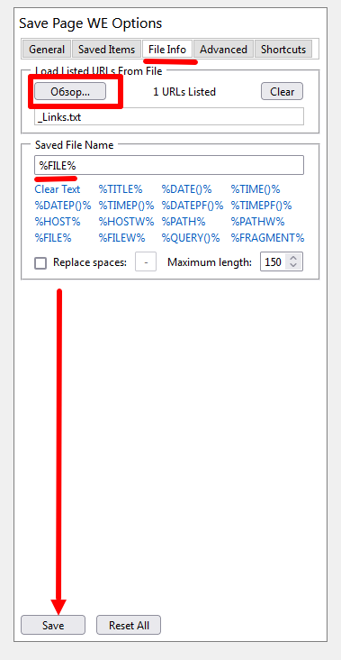
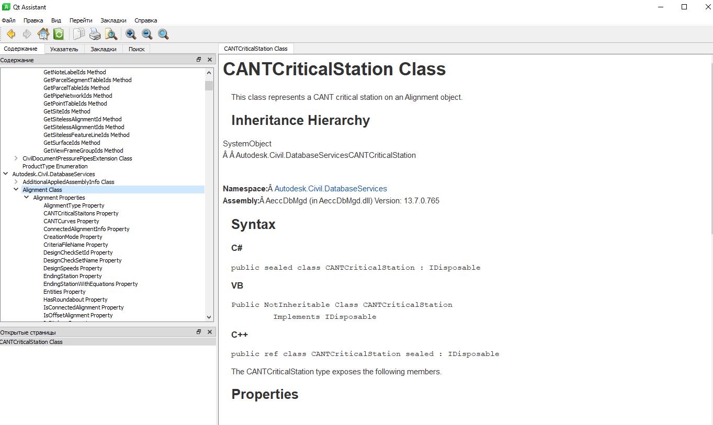

# How to convert Autodesk online-help to offline format

In this guide we're consider a step-by-step process how convert existing Autodesk online help for target product, it's version and language to offline-help in Qt-help (assistant) data format via [custom tool](https://github.com/GeorgGrebenyuk/AutodeskOnlineHelp2Offline).

At least from 2015 Autodesk doesn't offer an offline help for some products and it's content (up that date it were).

## Step 1 - Is it needing?!

Autodesk has offline-help fpr some products and their's components allready, you can search it as `Autocad offline help installer` and on https://www.autodesk.com/ you will find interesting resource. Unfortunatelly there are not single resource to list of all installers and you need find it manually.

If there are no offisial offline installers let's start a creating it manually!

My personals's conver result's you can explore here: [ad_help – Google Drive](https://drive.google.com/drive/folders/1sGKqsnjDdIaWVv900J2g848IfqNAR792)

## Step 2 - Download the Navigation page of target HELP

Go to [portal of Autodesk online help](https://help.autodesk.com) to target product and it's version, for example Civil 3D 2025 ENU: https://help.autodesk.com/view/CIV3D/2025/ENU/



Then open web page in browser's tool to inspect HTML's content, for example in Firefox it's `Inspect` option in context menu:



Then, you need to exapand target part of help, for example the `API Reference Guide`:



Then exapand the child's elements and explore it's HTML definition to check first tag with HTML's `data-url`'s attribute:



Ok. Now we will getting a target Navigation-info for that part of online help. In practise all nested pages in root's structure of product help are placing in separated folders on server.

The `data-url` info for first page in `API Reference guide`-group is "/cloudhelp/2025/ENU/Civil3D-API/files/html/89ffd413-aada-d770-e322-89dfa7b99369.htm". It's internal address to page's content.

Let's create an absolute HTML address as combine the https://help.autodesk.com and it's attribute:

https://help.autodesk.com/cloudhelp/2025/ENU/Civil3D-API/files/html/89ffd413-aada-d770-e322-89dfa7b99369.htm

Now let's getting an index-page. It have const file name `toctree.json` and placing in root of content's folder (for address above -- in `Civil3D-API/files`)

https://help.autodesk.com/cloudhelp/2025/ENU/Civil3D-API/files/toctree.json



Download this file on your machine.

## Step 3 - Getting links for resources

Now we need to getting all HTML's pages addresses in this `toctree.json`. To do it you can explode it manually or use my auxiliary utility at project [GitHub - GeorgGrebenyuk/AutodeskOnlineHelp2Offline: Source code for auxiliary utility and description how download online help from Autodesk Help portal to local help file (in Qt assistant)](https://github.com/GeorgGrebenyuk/AutodeskOnlineHelp2Offline)

Get the latest Release-version from Releases and run:

```batch
AD_HelpGen --mode GetLinks --toctreepath "E:\Temp\AD_C3D_Docs\api\toctree.json" 
```

As the result you are getting a textfile `_Links.txt` near `toctree.json`

## Step 4 - Download HTML pages

No we need to download HTML pages by addresses in text-file. Install to your browser extend-plugin for it. I used `Save Page WE` for FireFox. Dependedly plugin's UI the next actions will be dirrefent. I will talk about `Save Page WE` for FireFox:

1. Go to plugin's settings from Broeser settings - Extensions:



2. Then go to `General` tab and set Button Action to `Save Listed URLs`;



3. Then go to `File Info` tab and set path to your text-file. In `Saved File Name`-textbox click to `%FILE%`



After that Click `Save` in bottom.

4. It's all settings. Run new browser's session, click on plugin's button and wait downloading pages. For example, for 12600 files there were 4 hours (\~ 50 pages per minute).

## Step 5 - Check the content

To check, that all pages are downloaded run 

```batch
ADHelpGen --mode ValidateLinks --toctreepath E:\Temp\AD_C3D_Docs\api\toctree.json --pagesdir E:\Temp\AD_C3D_Docs\api\output
```

It file missing it print in console. If there are no data up to `End!` all OK.

## Step 6 - Create pre-build configuration for target Help

Run:

```batch
ADHelpGen --mode CreateHelp --toctreepath E:\Temp\AD_C3D_Docs\api\toctree.json --pagesdir E:\Temp\AD_C3D_Docs\api\output --serverpaths = "https://help.autodesk.com/cloudhelp/2025/ENU/Civil3D-API/files/html/,https://help.autodesk.com/cloudhelp/2025/ENU/"
```

For me, for downloading Civil 3D API Guide the values of tag `--serverpaths` are "https://help.autodesk.com/cloudhelp/2025/ENU/Civil3D-API/files/html/,https://help.autodesk.com/cloudhelp/2025/ENU/". To your data it can be other. If there are no data, it's procedure (edit all links in HTML) will no processing.

In end of procedure there will created file `helpGen.qhp` in `--pagesdir` folder.

## Step 7 - Compile Help file

I using a Qt-based help for create single file from collection of HTML. CHM is old specification and it is not stable on large files and particulary if HTML contains specific content.

To create Qt-based help you need to download any Qt-SDK for windows MSVC (f.e. with official installer https://www.qt.io/download-qt-installer ). 

Then run script:

```batch
"C:\Qt\5.15.10\msvc2019_64\bin\qhelpgenerator.exe" "E:\Temp\AD_C3D_Docs\api\output\helpGen.qhp" -o "E:\Temp\AD_C3D_Docs\api\C3D2025_API.qch"
```

qhelpgenerator.exe -- absolute path to utility for convert `helpGen.qhp` file to Help's file (with `QCH` extension).

Open help via Qt assistant (assistant.exe). Users can download binary Qt creator's release with viewer of docs from [that resource](https://sourceforge.net/projects/fsu0413-qtbuilds/files/Qt5.15/Windows-x86_64/MSVC/). Navigate to Edit - Settings - Docs, click on `Add` button, select target `QCH` file and show it in Qt Assistant's environmental:



**Notes**: there are some specific HTML's tags that are not mobing (f.e. `Â` in target page are mark it). 
