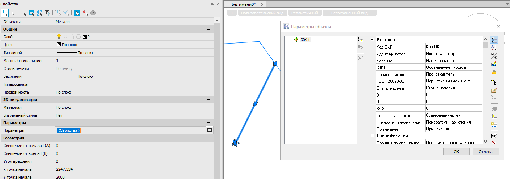
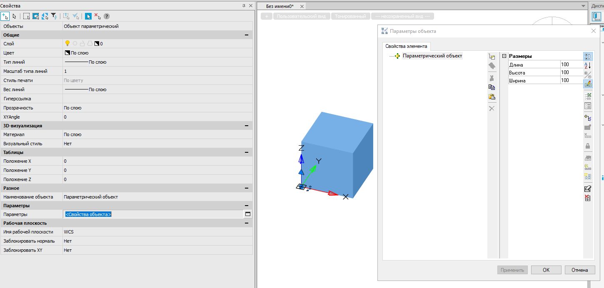

# ModelStudio CS - формулы и COM. Часть 2 - о создании объектов

*18 июня 2025г.*

В [ранней статье](./article_02092024_MST.md) мы подняли понятие COM объекта и остановились на сущности элемента. Держа в памяти тот факт, что любой параметрический объект по сути представляет собой Element, рассмотрим, как можно создавать новые объекты при помощи COM. Данная статья будет не совсем про формулы, а скорее только про COM.

Примеры далее будем рассматривать на примере C# для случая внешнего связывания (консольное приложение на .NET 6.0). Так как из коробки в .NET 6 отсутствуют некоторые вспомогательные методы, позаимствуем их из [Интернета](https://stackoverflow.com/a/65496277).

## 1. Вставка через AddCustomObject

В классических .NET API, NRX создание объектов начиналось с создания экземпляра класса нужного типа и далее в зависимости от задачи редактирования оного экземпляра класса до вставки в модель при помощь специального метода. В классическом COM нет понятия классов, а  экземпляры интерфейсов нельзя создать при помощи директивы `new()`. Да, в C++ есть понятие `coclass`, но сейчас не об этом.

В COM API платформы nanoCAD среди функциональности интерфейса IAcadBlock имеются методы, создающие отдельные примитивы -- AddCircle, AddText, AddTorus и т.д. Вместе с тем, имеется также особый метод, который позволяет создавать объекты любых типов, даже не имеющих COM-интерфейс -- **AddCustomObject**. 

На вход данный метод принимает имя объекта. Не класс, и не guid, и не то, что отображается в свойствах объекта в nanoCAD. 

Не уверен, скажу однозначно верно, но он ожидает имя RXClass'а объекта. Этот класс имеется как в .NET, так и в MRX API. Имя типа можно также получить при помощи простой конструкции:

```lisp
(entget(car(entsel)))
```

На выходе в консоли будет информация вида:

```textile
((-1 . #<Имя примитива: 0000023A218592F0>) (0 . "LINCSPARAMETRICSOLID") (5 . "A83") (330 . #<Имя примитива: 0000023A7962AEA0>) (100 . "AcDbEntity") (67 . 0) (410 . "Model") (8 . "0") (48 . 100.0))
```

Нас будет интересовать то, что идет в скобочках после 0. -- в данном случае "LINCSPARAMETRICSOLID". Регистр не важен. Пояснение - это DXF-строка с информацией об объекте, нулем обозначается DXF-код типа объекта.

Продолжая ряд, металлическая пластина имеет тип MSIRONPLATE, металлическая балка -- IRNAXIS и т.д.

Вне зависимости от того, имеет ли создаваемый объект COM-интерфейс или нет, к нему можно применить трансформацию координат как к сущности AcadEntity (метод TransformBy). Так как мы говорим, всё таки, про параметрические COM-объекты, они могут быть приведены к специальному интерфейсу (например, металлические балки/колонны к IRNAXIS -- ironObjComLib.WrIronAxis). Произвольные параметрические объекты приводятся к mdsUnitsLib.MDSParametricEnt. В любом случае, у объекта может быть получен элемент следующим способом:

```csharp
dynamic obj; // = вашему объекту
mdsUnitsLib.Element objEl = obj.Element as mdsUnitsLib.Element;
```

Пример вставки металлической колонны выглядел бы так:

```csharp
var nc_app = Marshal2.GetActiveObject("nanoCAD.Application.25.0") as nanoCAD.Application;
var nc_ms = nc_app.ActiveDocument.ModelSpace;
var obj_IRNAXIS1 = nc_ms.AddCustomObject("IRNAXIS") as ironObjComLib.WrIronAxis;
if (obj_IRNAXIS1 != null && axisTemplate != null)
{
    obj_IRNAXIS1.StartPoint = new double[] { 2000, 2000, 0 };
    obj_IRNAXIS1.EndPoint = new double[] { 4000, 6000, 1000 };
}
```

.. если бы всё было так просто. 😏

Дело в том, что все параметрические объекты создаются на основе так называемого профиля, в роли которого выступает объект-шаблон из Библиотеки стандартных компонентов и его геометрия.

Если просто взять и создать параметрический объект при помощи подхода выше, то у нас будет создано нечто, имеющее тип изделия но не имеющей геометрии:



(скриншот из среды nanoCAD BIM Строительство)

Даже если сделать Element.CopyFrom() от нормального объекта, это не возымеет действия. Таким образом, предпочтительно создавать новые объекты только копированием имеющихся и дальнейшим редактированием их положения в параметрах.

## 1.2 Создание новых параметрических объектов через AddCustomObject

И всё-таки, для чего тогда использовать метод AddCustomObject? Его можно использовать для создания новых видов параметрических объектов, описываемых интерфейсом mdsUnitsLib.MDSParametricEnt. Код ниже иллюстрирует такой подход -- создается определение параметрического объекта -- linCSParametricSolid, ему задаются параметры спецификации и параметрическая геометрия из одного примитива -- параллелепипеда. В соответствии с XPG-схемой для данного вида примитива задаются обязательные параметры.

```csharp
var nc_app = Marshal2.GetActiveObject("nanoCAD.Application.25.0") as nanoCAD.Application;
var nc_ms = nc_app.ActiveDocument.ModelSpace;
mdsUnitsLib.MDSParametricEnt? ms_object = nc_ms.AddCustomObject("linCSParametricSolid");
if (ms_object == null) return;

//Задание параметров спецификации
var properties = ms_object.Element;
properties.Parameters.SetParameter("DIM_WIDTH", "100");
properties.Parameters.SetParameter("DIM_LENGTH", "100");
properties.Parameters.SetParameter("DIM_HEIGHT", "100");

//Задание параметрической геометрии
var box = ms_object.ParametricData.AddChild("BOX");
var boxParameters = box.Parameters;
boxParameters.SetParameter("Length", "", "", "[DIM_LENGTH]");
boxParameters.SetParameter("Width", "", "", "[DIM_WIDTH]");
boxParameters.SetParameter("Height", "", "", "[DIM_HEIGHT]");
boxParameters.SetParameter("StartPointX", "0");
boxParameters.SetParameter("StartPointY", "0");
boxParameters.SetParameter("StartPointZ", "0");
boxParameters.SetParameter("DirectionX", "1");
boxParameters.SetParameter("DirectionY", "0");
boxParameters.SetParameter("DirectionZ", "0");
boxParameters.SetParameter("OrientationX", "0");
boxParameters.SetParameter("OrientationY", "0");
boxParameters.SetParameter("OrientationZ", "1");
```



(вот так будет выглядеть объект)

Подводя промежуточный итог -- просто так параметрические объекты не создать, даже созданные с помощью метода AddCustomObject они не будут иметь информацию о профиле и эту информацию через COM API не добавить. Единственное, для чего метод применим -- это для создания пользовательских параметрических объектов произвольной сложности путем создания и редактирования параметров (Element).

# 2. Вставка объектов из Библиотеки параметрических компонентов и XPG

Имеется библиотека типов "Model Studio Library Manager 1.0 Type Library", содержащая инструменты для подключения к Библиотеке параметрических компонентов (БСК далее) , обзора её данных и вставки в модель (на основе выбранного профиля).

Получение экземпляра COM-оболочки БСК, как и nanoCAD осуществляется через системные вызовы:

```csharp
mdsLibManagerLib.CADLibrary? library_BSK = Marshal2.GetActiveObject("LibManager.CADLibrary.1") as mdsLibManagerLib.CADLibrary;
```

Есть 2 пути получения конкретных параметрических объектов -- найти их при помощи ручного запроса или выбрать вручную в диалоге объектов БСК.

```csharp
//Выбор вручную
mdsLibManagerLib.CADLibQuery library_Query = library_BSK .GetLibQuery();
library_Query.AddCondition("PART_NAME", mdsLibManagerLib.CADLibRelationType.cl_cndLike, "%Колодец%");
library_Query.AddCondition("PART_TYPE", mdsLibManagerLib.CADLibRelationType.cl_cndEqual, "Колодцы");
mdsLibManagerLib.CADLibObjects? selObjects = library_Query.Execute();
//Выбор через диалог
var nc_app = Marshal2.GetActiveObject("nanoCAD.Application.25.0") as nanoCAD.Application;
mdsLibManagerLib.CADLibObjects? selObjects2 = library_Query.SelectObjects((int)nc_app.HWND, "Выборка профилей", 0);
```

Обратим внимание, что у метода SelectObjects имеется особый первый аргумент -- это Windows-идентификатор приложения, мы принимаем его равным окну nanoCAD. 

После получения набора объектов, удовлетворяющих запросу, выберем первый объект (нам же не важно для примера на чем показывать) и покажем, как вставить объект двумя путями -- через стандартный механизм БСК и ... из XPG файла 😲.

## 2.1 Вставка объекта при помощи инструментов mdsLibManagerLib.CADLibrary

COM-оболочка БСК имеет метод Insert, позволяющий вставить в модель nanoCAD (~~AutoCAD~~) параметрический объект из выборки CADLibQuery.

Метод принимает 3 аргумента -- первый = GUID объекта БСК и два других -- параметры вставки. Второй описывает место вставки, а третий я хз (примеров нигде не нашел), в справке значится "условия вставки". 

И второй, и третий аргументы представляют собой XML-строку, буквально XML-документ в виде строки. Приведем ниже листинг кода на C#, который создаст нам XML-документ с параметрами вставки элемента:

```csharp
//Инициализирует документ Constraints
private XmlDocument CreateConstraintsDocument()
{
    XmlDocument doc = new XmlDocument();
    XmlProcessingInstruction newPI = doc.CreateProcessingInstruction("xml", "version=\"1.0\" encoding=\"utf-8\"");
    doc.AppendChild(newPI);


    XmlElement root = doc.CreateElement("Constraints");
    doc.AppendChild(root);
    return doc;
}

//Создает определение Constraint
private XmlElement CreateConstraint(string strType, XmlDocument doc)
{
    XmlElement eres = doc.CreateElement("Constraint");
    doc.DocumentElement.AppendChild(eres);
    eres.SetAttribute("type", strType);
    return eres;
}

//Создает вспомогательный параметр, описывающий данный Constraint
private XmlElement CreateParameter(string strName, string strValue, XmlElement root)
{
    XmlElement res = root.OwnerDocument.CreateElement("Parameter");
    root.AppendChild(res);
    res.SetAttribute("name", strName);
    res.SetAttribute("value", strValue);
    return res;
}

//Примеры различных Constraint:
//Создает Constraint типа position3d
private XmlElement CreateLocation3D(double x, double y, double z, XmlDocument doc)
{
    XmlElement constr = CreateConstraint("position3d", doc);
    CreateParameter("X", x.ToString(), constr);
    CreateParameter("Y", y.ToString(), constr);
    CreateParameter("Z", z.ToString(), constr);

    return constr;
}

//Создает Constraint типа position3d + rotation
private XmlElement CreateLocation3DAndRotation(double x, double y, double z, double fRotation, XmlDocument doc)
{
    XmlElement constr = CreateLocation3D(x, y, z, doc);
    constr = CreateConstraint("rotation", doc);
    CreateParameter("ANGLE", fRotation.ToString(), constr);
    return constr;
}
```

Полный код включая запрос и вставка объекта:

```csharp
mdsLibManagerLib.CADLibQuery library_Query = library_BSK .GetLibQuery();
library_Query.AddCondition("PART_NAME", mdsLibManagerLib.CADLibRelationType.cl_cndLike, "%Колодец%");
library_Query.AddCondition("PART_TYPE", mdsLibManagerLib.CADLibRelationType.cl_cndEqual, "Колодцы");
mdsLibManagerLib.CADLibObjects? selObjects = library_Query.Execute();
if (selObjects == null) return;

mdsLibManagerLib.CADLibObject? selObject = selObjects.Item(0);
if (selObject == null) return;

XmlDocument doc = CreateConstraintsDocument();
CreateLocation3DAndRotation(2400, 1500, 1000, 65, doc);
string constraints = doc.OuterXml;

library_BSK.Insert(selObject.GUID, constraints);
```

Метод Insert вернёт экземпляр интерфейса того типа, какой объект создается.

## 2.2 Вставка объекта из XPG

Имеется и альтернативный вариант создания параметрического объекта (вставки в модель) из XPG файла. Обратим внимание, что для выполнения этой операции потребуется особый интерфейс, который как и COM-оболочка БСК получается из системы:

```csharp
mdsUnitsLib.MDSUnitsFactory? factory = Marshal2.GetActiveObject("UnitsCSCom.MDSUnitsFactory.1") as mdsUnitsLib.MDSUnitsFactory;
```

Покажем, как получить для целевого объекта из БСК этот XPG, а затем используя его, создать объект в модели:

```csharp
mdsLibManagerLib.CADLibQuery library_Query = library_BSK.GetLibQuery();
library_Query.AddCondition("PART_NAME", mdsLibManagerLib.CADLibRelationType.cl_cndLike, "%Колодец%");
library_Query.AddCondition("PART_TYPE", mdsLibManagerLib.CADLibRelationType.cl_cndEqual, "Колодцы");
mdsLibManagerLib.CADLibObjects? selObjects = library_Query.Execute();
if (selObjects == null) return;

mdsLibManagerLib.CADLibObject? selObject = selObjects.Item(0);
if (selObject == null) return;

string xpgPath = selObject.GetGraphicsPath("Parametric");

//Вставка параметрического объекта из XPG
var fact = CreateFactory();
if (fact == null) return;
MDSParametricEnt? parObject = fact.CreateUnit(xpgPath, new double[3] {5000,5000,1000}, 1, 0, 0);
```

Требует пояснения тот момент, как от объекта БСК mdsLibManagerLib.CADLibObject мы перешли к XPG. Для этого был использован таинственный метод `GetGraphicsPath` с аргументом `Parametric`. Дело в том, что объекты в БСК хранятся рассредоточенным образом, и каждый фрагмент данных задается так называемой категорией (таблица БД FileCategories). При программном получении объектов БСК они кэшируются локально на ПК и пути к определяющим файлам возвращаются методом GetGraphicsPath. Тип файла `Parametric` как раз отвечает за XPG-файл. 

Далее -- просто, путь к XPG файлу подается на вход методу CreateUnit наряду с информацией о точке вставки элемента и информацией об угле поворота и ... в модели будет вставленный элемент.


P.S. Для пункта 1.2 нужен, конечно, большой справочный блок "кто такой XPG"; я не буду выкладывать эту информацию, она будет в составе справки к API nanoCAD BIM Строительство к 25 версии. В целом, вся эта информация открыта, просто надо было порыться, чтоб её структурировать

P.S.S. Надеюсь, с этой статьей некоторые особенности COM стали более очевидными.


