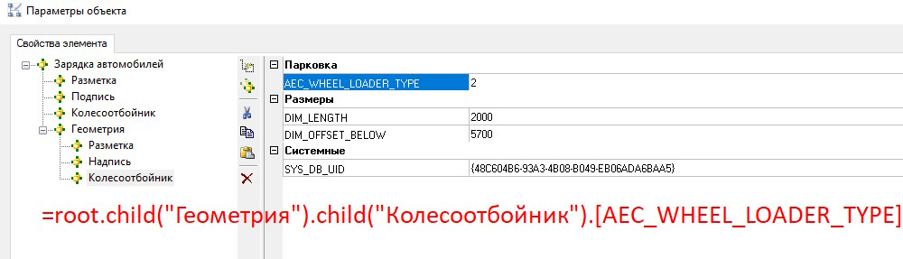
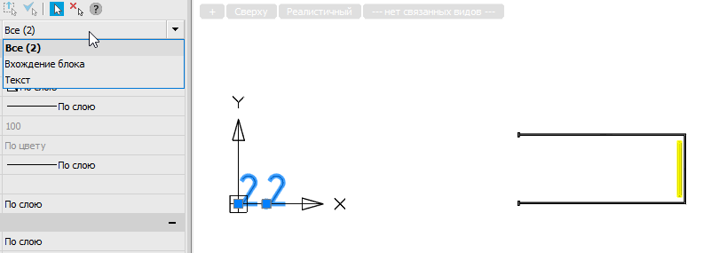

# ModelStudio CS - формулы и COM. Часть 3 - Выражения, создание меток и отчетов

*22 июня 2025г.*

В [первой стетье](./article_02092024_MST.md) вводилось понятие COM-объекта и сущности Element. Во [второй статье](./article_18062025_MST.md) рассматривались способы создания параметрического объекта, в том числе вставки из Библиотки стандартных компонентов и XPG файла.
В данной статье поговорим о работе с библиотекой типов "Model Studio Unified Reporting Service 1.0 Type Library", она же mdsURSLib, вернее только об одном интерфейсе -- IURSApplication, который способен:

* вычислять значение формулы (выражения) для любого объекта;
* получать вывод для настроенной спецификации;
* связывать однострочный текст или вхождение блока с параметрическим объектом -- для вывода в текст или атрибут блока значения формулы;

Под каждую из оговоренных возможностей см. соответствующие разделы настоящей статьи. Особо, на мой взгляд, круто использовать последний метод -- это открывает широкий доступ к аннотатированию информационной модели, а используя .NET API можно будет создавать пользовательские метки в виде атрибутов блока и в аксонометрической проекции (задавая положение блока в пространстве)!

# 1. Инициация mdsURSLib.IURSApplication

Рабочий интерфейс IURSApplication относится к категории компонентов, которые нужно получать из системы. В ранней части 2 был приведен код на C#, позволяющий это сделать, поэтому опустим подготовительные действия и сразу запишем:

```csharp
var urs = Marshal2.GetActiveObject("URS.URSApplication.1") as mdsURSLib.URSApplication;
```

```python
import win32com.client
URS_AppCom = win32com.client.Dispatch("URS.URSApplication.1")
```

**Примечание**: см. раздел "Дополнение" [статьи по добавлению Python в nanoCAD](https://habr.com/ru/companies/nanosoft/articles/718362/). Там имеется **ВАЖНОЕ** примечание, устраняющее баг взаимодействия с COM-компонентами для Python.

# 2. Вывод данных спецификации

Как в ModelStudio CS, так и в nanoCAD BIM Строительство имеется палитра "Спецификатор", доступная по команде URS_SPECIFICATION_PALETTE. Там имеются преднастроенные и пользовательские спецификации широкого назначения -- выгружающие из модели по заданной схеме аналитику.

Программное получение заполненной спецификации осуществляется через метод URSApplication.CreateReport(name), где аргумент name -- это имя спецификации, видимое в Спецификаторе. Если метод отработает корректно, то он вернет COM-оболочку DOM-документа, предоставляющего инструменты работы с XML. Удобнее работать с результатом из-под встроенных библиотек языка программирования -- для C# это System.Xml.XmlDocument, а для Python -- стандартный xml.etree.cElementTree:

### Пример на C#

```csharp
var urs = Marshal2.GetActiveObject("URS.URSApplication.1") as mdsURSLib.URSApplication;

var report = urs.CreateReport("Спецификация конструкций (КЖ)");
if (report == null) return;
XmlDocument reportXML = new XmlDocument();
reportXML.LoadXml(report.xml);

if ( reportXML == null ) return;
Console.WriteLine(reportXML.OuterXml);
```

### Пример на Python

```python
import win32com.client
#Получение COM-оболочки Менеджера отчетов
URS_AppCom = win32com.client.Dispatch("URS.URSApplication.1")

def mdsURSLib_CreateSampleReport():
    report = URS_AppCom.CreateReport("Спецификация конструкций (КЖ)")
    if report is None:
        return
    reportXml = ET.fromstring(report.xml)
    if reportXml is None:
        return
    print(ET.tostring(reportXml))
    pass
```

# 3. Расчет выражений (формул) для параметрических объектов

Записанные в комментарии параметра выражения (формулы) предоставляют Пользователю почти неограниченный доступ к вычислению любых задач. Да, через него сложно реализовать циклы, но тем не менее это довольно продвинутый инструмент.

Метод URSApplication.Query позволяет получить результат выражения (формулы) для заданного параметрического объекта.
Например, рассмотрим вариант получения значения следующего параметра:

Для справки, это параметрический объект из БСК, который можно получить следующим способом:

```csharp
mdsLibManagerLib.CADLibQuery library_Query = library_BSK.GetLibQuery();
library_Query.AddCondition("PART_TAG", mdsLibManagerLib.CADLibRelationType.cl_cndLike, "%МЛП%");
library_Query.AddCondition("PART_NAME", mdsLibManagerLib.CADLibRelationType.cl_cndEqual, "Парковочное место");
library_Query.AddCondition("BOM_GROUP", mdsLibManagerLib.CADLibRelationType.cl_cndEqual, "Парковки и парковочные места");
```

Выражение для получения к нему доступа будет следующим:

```txt
root.child("Геометрия").child("Колесоотбойник").[AEC_WHEEL_LOADER_TYPE]
```

Положим, что этот параметрический объект уже имеется в модели (чтобы не загромождать статью примерами кода по его вставке из БСК -- см. вторую часть статьи). 

В таком случае получение результата для выражения будет осуществляться:

### Пример на C#

```csharp
dynamic insertedObject;
var urs = Marshal2.GetActiveObject("URS.URSApplication.1") as mdsURSLib.URSApplication;
string expression = "root.child(\"Геометрия\").child(\"Колесоотбойник\").[AEC_WHEEL_LOADER_TYPE]";
var expressionValue = urs.Query(insertedObject, expression);
```

### Пример на Python

```python
import win32com.client

URS_AppCom = win32com.client.Dispatch("URS.URSApplication.1")
insertedObject;
expression = "root.child(\"Геометрия\").child(\"Колесоотбойник\").[AEC_WHEEL_LOADER_TYPE]"
expressionValue = URS_AppCom.Query(insertedObject, expression)
```

# 4. Связывание параметрического объекта с текстом или вхождение блока

Для связки параметрического объекта с текстом используется метод URSApplication.BindData. Первым аргументом будет целевой параметрический объект (здесь, `insertedObject`), вторым -- объект текста, описываемый интерфейсом OdaX.AcadText, третьим -- выражение expression, а четвертым -- флаг (0 или 1), будет ли текст связан ассоциативно с целевым параметрическим объектом - вслед за перемещением объекта будет двигаться и текст. 

В случае вхождения блока, будет использоваться метод URSApplication.BindAttributeData; вторым аргументом будет объект OdaX.AcadBlockReference, третьим -- название атрибута и далее аналогично URSApplication.BindData.

### Пример на C#

```csharp
//Создаем текстовый объект
var nc_app = Marshal2.GetActiveObject("nanoCAD.Application.25.0") as nanoCAD.Application;
var nc_ms = nc_app.ActiveDocument.ModelSpace;
OdaX.AcadText? textObject = nc_ms.AddText("Текст тест", new double[3] { 10000, 0, 0 }, 1000);

//Создаем связь (значение вложенного параметра в значение текста)
var urs = Marshal2.GetActiveObject("URS.URSApplication.1") as mdsURSLib.URSApplication;
string expression = "root.child(\"Геометрия\").child(\"Колесоотбойник\").[AEC_WHEEL_LOADER_TYPE]";
urs.BindData(insertedObject, textObject, expression, 1);

//Повторяем для вхождения блока
var blockRef = nc_ms.InsertBlock(new double[] { 1000, 0, 0 }, "TEST1", 1.0, 1.0, 1.0, 0);
urs.BindAttributeData(insertedObject, blockRef, "TEST_OBJECT", expression, 1);
```

### Пример на Python

```python
import win32com.client
URS_AppCom = win32com.client.Dispatch("URS.URSApplication.1")
nanoCAD_AppCom = win32com.client.Dispatch("nanoCAD.Application")

#Создаем текстовый объект
nc_ms = nanoCAD_AppCom.ActiveDocument.ModelSpace
textObject = nc_ms.AddText("Текст тест", [0,0,0], 1000)
#Создаем связь (значение вложенного параметра в значение текста)
expression = "root.child(\"Геометрия\").child(\"Колесоотбойник\").[AEC_WHEEL_LOADER_TYPE]"
#Проверяем формулу на корректность -- она должна вернуть результат
expressionValue = URS_AppCom.Query(insertedObject, expression)

URS_AppCom.BindData(insertedObject, textObject, expression, 1)

#Создаем вхождение блока для блока TEST1
blockRef = nc_ms.InsertBlock([1000,0,0], "TEST1", 1.0, 1.0, 1.0, 0)
URS_AppCom.BindAttributeData(insertedObject, blockRef, "TEST_OBJECT",  expression, 1)
```



То есть созданная связь будет ДИНАМИЧЕСКОЙ! Такого встроенные средства ModelStudio вроде как не умеют.

На этом всё -- оставляю вам решать, зачем это может пригодится, но по мне это позволит решить задачи нестандартного оформления чертежей в том числе в аксонометрии!
