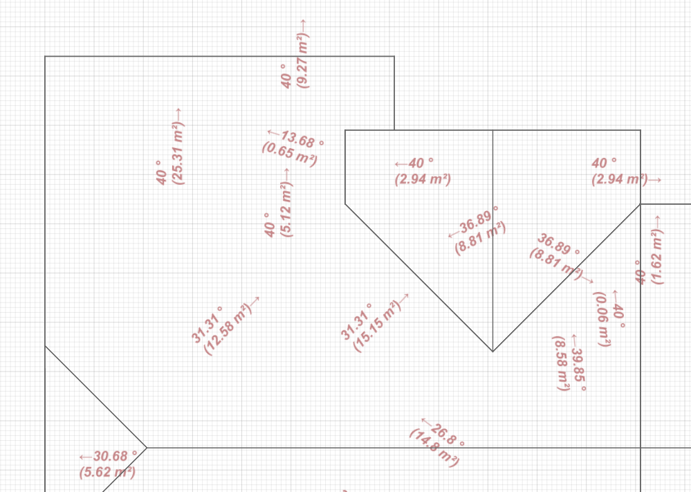
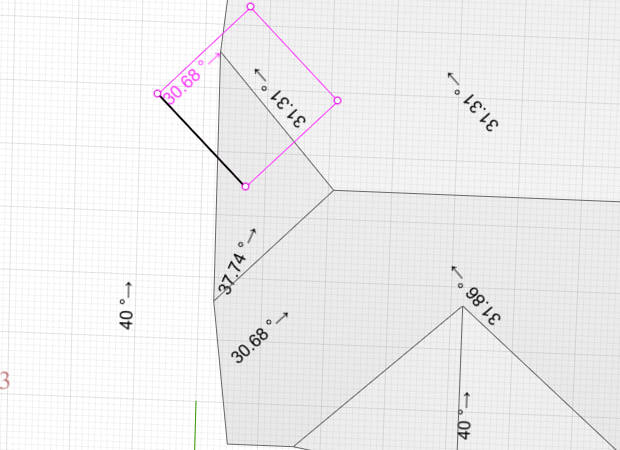
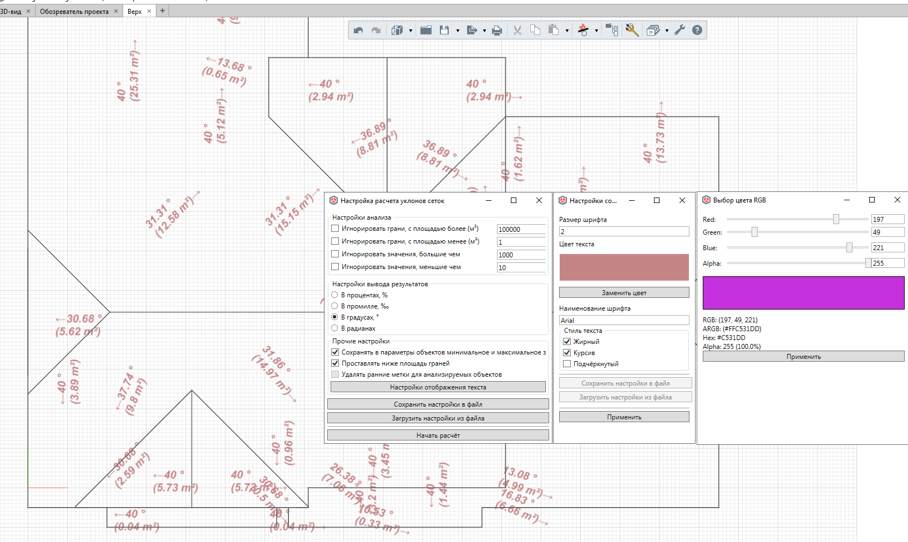

# Обновленное Renga API: Создание объектов на примере меток уклонов кровли

*25 сентября 2025г.*

2 версии назад от текущей 8.8 в Renga начали реализовывать API на создание объектов. Всё не было времени попробовать, но ... немного времени всё же нашлось; ниже взгляд со стороны на данное API на примере задачки вычисления и простановке в модели текстовых отметок уклонов. Кстати, эта задачка заявлена в Дорожной карте как "Ожидает реализацию". Естественно, полученный инструмент не достаточно удобный, но это уже что-то, как минимум инструмент аналитики, если не оформления чертежей. 

На выходе получится нечто такое. Сразу скажу (также будет в конце), функцию можно попробовать в составе небольшого (пока что) плагинчика, ссылку на который я приложу в конце статьи.



# Этап 1 - Постановка задачи

Информация об уклонах, насколько я помню, является часть информационной нагрузки планов кровли, перекрытий в рамках архитектурной составляющей и мероприятий для обеспечения доступа МГН; само собой, без уклонов "никуда" в генплане, но т.к. профильных инструментов генплана в Renga всё-таки нет, то и задачи работать с его спецификой тоже. 

Информация об уклоне представляет собой направление (куда направлен уклон в заданной точке или поверхности геометрии) и его численное значение, выраженное, как правило, в промилле. 

Так как в Renga пока нет возможности создавать или редактировать линии, было принято решение направление заменять символом юникода "стрелочка" (← или→). Присутствие только двух вариантов стрелочек объясняется тем, что текст будет довернут по направлению уклона. Правая стрелочка будет использоваться при направлении уклона для 1 и 4 четверти, а левая -- соответственно для 2 и 3 четвертей.

Для удобства пользователю стиль текста должен быть настраиваемым (размер, стиль, начертание, цвет). Ну а что? В API есть, чего бы и не дать возможность.

> Кстати примечательно, что со стороны пользовательского UI в Renga нет возможности на момент версии 8.8 задавать цвет!

# Этап 2 - Реализация в Renga

Так как в API ещё нет метод пользовательского ввода (указать точку или линию), было принято решение проставлять уклоны везде, по одному на каждый треугольник триангулированного представления геометрии (единственное представление, которое можно программно получить помимо контура для некоторых типов объектов).

Дополнительно, у некоторых типов объектов имеется возможность выделять триангулированные сетки для частей объекта. Например, у кровли и пандуса можно программно идентицифровать только верх кровли и верх поверхности соответственно, и далее их обрабатывать, что и было реализовано.

В помощь был написан небольшой вспомогательный класс, который определял для треугольника триангуляции площадь, центр и определял показатели для метки: уклон и направление уклона. Причем направление уклона определялось от положительного направления оси Ox; фактически речь шла о величине полярного угла. Помощи с некоторыми операциями я просил у Deepseek.

Для структурного разделения кода сперва были рассчитаны все уклоны, информация о каждом занесена в поля вспомогательного класса.

## 2.1 Создание объекта -- указание параметров создания

Для удобства и повышения читаемости кода я стал придерживаться практике создания методов расширения над базовыми функциями API. В данном случае -- над интерфейсом Renga.IModel, в котором находятся методы для создания объектов.

Примечательно, что создавать объекты можно не только в 3D-модели, но и на чертежах. Правда, только 1 типа (на чертежа) -- текстовый примитив. Настройки и поведение такие же, как и у текста модели, только у чертёжного почему-то напрочь отсутствуют свойства. В нашем случае мы будем говорить про создание текста модели.

Создание объекта начинается с указания параметров создания, которые описываются интерфейсом `Renga.INewEntityArgs`. Фактически, это структура, но сигнатура у неё почему-то "интерфейс", ну да не важно.

В параметрах создания необходимо обязательно указать 2 параметра: тип создаваемого объекта и информацию о положении.

Тип можно задать в виде Guid в поле TypeId ИЛИ в виде строки в поле TypeIdS, Guid-типы можно взять из Renga.ObjectTypes;

Информация о положении для объектов трехмерной модели задается через структуру Renga.Placement3D, а для чертежей -- через соответственно Renga.Placement2D.  Пусть вас не удивляет, что одна и та же структура\интерфейс `Renga.INewEntityArgs` используется для создания 2D, 3D объектов. Просто профильные методы "смотрят" только на нужные поля.

> Важно задать все координаты, определяющие Placement3D (Placement2D); так как конструктор структуры по умолчанию НЕ ЗАДАЕТ значения по умолчанию для полей структуры. Если не указать значения, то объект просто не будет создан. Хоть в справке и написано, дескать, можно не задавать, но без этого они почему-то не создавались

```cs
double[] Position; //Координаты ModelText
double angleRadians = Math.PI / 5; //Угол поворота текста
//------------------------------------
double cos = Math.Cos(angleRadians);
double sin = Math.Sin(angleRadians);
double angleX = 1 * cos - 0 * sin;
double angleY = 1 * sin + 0 * cos;
//------------------------------------
Renga.IModel rengaModel;
Renga.INewEntityArgs creationParams = rengaModel.CreateNewEntityArgs();
creationParams.TypeId = Renga.ObjectTypes.ModelText;

creationParams.Placement3D = new Renga.Placement3D()
{
    Origin = new Renga.Point3D() { X = Position[0], Y = Position[1], Z = 0 },
    xAxis = new Renga.Vector3D() { X = angleX , Y = angleY, Z = 0 },
    zAxis = new Renga.Vector3D() { X = 0, Y = 0, Z = 1}
};
```

В листинге выше ориентация осей указана пользовательская. `xAxis` фактически задает поворот объекта от положительного направления оси Ox, здесь он задан для пользовательского угла angleRadians (для примера, 36°).

Несмотря на возможность указания поворота в пространстве `zAxis` эксперименты привели лишь к фатальному снижению производительности Renga (движок не рассчитан, кажется, на текст, лежащий не в плоскости), я особо больше не тестировал.

Отметим, что положение и поворот можно задать и после создания объекта, осуществив приведение интерфейса к Renga.ILevelObject для трехмерного объекта модели и к Renga.IPlacement2DObject для объекта чертежа (об этом будет далее).

Дополнительными параметрами создания могут быть **HostObjectId** и **CategoryId**. Второй параметр (**CategoryId**) применим только для объектов, стили которых были импортированы из STDL -- как правило, в справке указано для MEP-категорий (трубы, воздуховоды, оборудование и прочая). 

**HostObjectId** позволяет задать объект-родитель. Для отверстий, дверей, окон -- это базовая стена\перекрытие\кровля, а для остальных объектов, кроме текста чертежа -- это уровень. Если id уровня не указан, то объекты будут созданы на текущем активном уровне. 

> Кстати говоря, в параметрах Origin Placement3D можно задать отметку текста, но для элементов оформления, коим является текст, это делать на мой взгляд, не корректно, поэтому предварительно имеет смысл создать специальный уровень для результатов (или создать его непосредственно в коде с оговоркой ниже).

К слову, если предварительно создавать уровень, то через API ему невозможно задать имя и ... отметку. Вот так вот. Во всяком случае листинг ниже не создает уровень на ожидаемой отметке (указывай ты её в INewEntityArgs или потом делай Placement.Move, всё без толку). Возможно, это и устранят как баг API в следующей версии, но пока имеет, что имеем.

```cs
public static Renga.IModelObject? CreateLevel(this Renga.IModel rengaModel, double elevation)
{
    if (PluginData.Project == null) return null;
    var editOperation = PluginData.Project.CreateOperation();
    editOperation.Start();

    Renga.INewEntityArgs creationParams = rengaModel.CreateNewEntityArgs();
    creationParams.TypeId = Renga.ObjectTypes.Level;
    creationParams.Placement3D = new Renga.Placement3D()
    {
        Origin = new Renga.Point3D() { X = 0, Y = 0, Z = elevation },
        xAxis = new Renga.Vector3D() { X = 1, Y = 0, Z = 0 },
        zAxis = new Renga.Vector3D() { X = 0, Y = 0, Z = 1 }
    };

    var levelObjectRaw = rengaModel.CreateObject(creationParams);
    if (levelObjectRaw == null)
    {
        editOperation.Rollback();
        return null;
    }

    Renga.ILevel? levelObject = levelObjectRaw as Renga.ILevel;
    if (levelObject == null)
    {
        editOperation.Rollback();
        return null;
    }
    levelObject.Placement.Move(new Vector3D() { X = 0, Y = 0, Z = elevation });
    editOperation.Apply();

    Renga.IModelObject? levelAsModelObject = levelObject as Renga.IModelObject;
    return levelAsModelObject;
}
```

## 2.1 Создание объекта непосредственно

Заполнив INewEntityArgs, передаем его в метод создания объекта:

```cs
Renga.IModel rengaModel;
Renga.INewEntityArgs creationParams;
Renga.IOperation editOperation = PluginData.Project.CreateOperation();
//...
var textObjectRaw = rengaModel.CreateObject(creationParams);
if (textObjectRaw == null)
{
    editOperation.Rollback();
    return null;
}
```

Если по какой либо причине объект не был создан, то откатывает транзакцию (Rollback) и возвращаем null.

Если всё ОК, то переходим к наполнению текстового объекта самим текстом:

```cs
Renga.ITextObject? textObject = textObjectRaw as Renga.ITextObject;
if (textObject == null) 
{
    editOperation.Rollback();
    return null;
}

// Переходим к заданию текста для заданого стиля
Renga.IRichTextDocument textData = textObject.GetRichTextDocument();
Renga.RichTextToken slopeInfo = new Renga.RichTextToken()
{
    FontFamily = "Arial",
    FontCapSize = 2,
    FontColor = new Renga.Color() {Red = 200, Green = 0, Blue = 0, Alpha = 255},
    FontStyle = new Renga.FomtStyle() {Bold = 0, Italic = 1, Underline = 0},
    Text = "Привет, Renga API!"
};
Array tokens = new RichTextToken[] { slopeInfo };
IRichTextParagraph? textParagraph = textData.AppendParagraph(tokens);
```

В отличие от ... того же AutoCAD\nanoCAD с их COM API, где текстовая строка указывалась уже при создании текстового объекта, здесь в Renga всё зачем-то усложнили:

* сперва приводим созданный объект в CreateObject() к интерфейсу Renga.ITextObject;

* затем у объекта получаем оболочку, позволяющую работать с текстом -- Renga.IRichTextDocument;

* затем создаем "структурную единицу" текста -- описываемую структурой Renga.RichTextToken. Под такой единицей понимается текст произвольного содержания с произвольным числом абзацев, но одного стиля -- всё то, что с префиксами Font;

Создав текст с одним стилем добавляем его в документ и ... всё. Если бы не одно НО.

## 2.2 Корректировка положения текста

Текстовый объект, созданный по умолчанию, имеет точку привязки в левом нижнем углу, тогда как сам текст ориентируется с верхнего левого угла, а сама "рамка" занимает непропорционально огромную зону.



На картинке выше (там *неверные* указатели уклонов, не удивляйтесь) обратите внимание на левый треугольный скат кровли (представлен одной гранью). Точка привязки текста лежит в центре грани, но само значение текста вообще за пределами границ кровли. 

Естественно, это неприемлемо, и текст нужно сдвинуть. К счастью, количество действий невелико; ещё находясь в методе по созданию текста надо привести объект  к Renga.ILevelObject и осуществить сдвиг:

```cs
double x2 = 0, y2 = 0;
x2 = 0 * cos + textRectangleSize.Right * sin;
y2 = 0 * sin - textRectangleSize.Right * cos;
Renga.ILevelObject? textObjectOnLevel = textObjectRaw as Renga.ILevelObject;
if (textObjectOnLevel != null)
{
    var pl = textObjectOnLevel.GetPlacement();
    pl.Move(new Vector3D() { X = x2, Y = y2, Z = 0});
    textObjectOnLevel.SetPlacement(pl);
}
```

Вот так. 

Ну и в конце метода делает `editOperation.Apply();`, завершая транзакцию успешно.

Полный метод см. в листинге соотв. класса на страничке приложения на GitHub.

https://github.com/Lex-is-BIM/renga_bri4ka/blob/796b1580575eee0ece91acbd36554f886f010702/src/RengaBri4kaKernel/Extensions/ModelExtension.cs#L38

# Этап 3 - Созерцание



# Замечания

Помимо нерабочего механизма создания уровня.

Во-первых, порадуюсь, что API вообще появилось по созданию объектов в Renga. Имея API к созданию текстовых объектов можно городить грубую "оформительскую" и "аналитическую" автоматизацию, правда я скептически смотрю на ручной труд по доработке этих результатов.

В STDL нет и видимо пока не планируются текстовые примитивы (в XPG есть TextBox), что позволило бы запараметризовать положение текста от параметров и не мучиться так с текстами модели, но чего нет, того нет.

Линии создавать невозможно, также можно создать штриховку (но невозможно отредактировать), то есть костыли с линиями разрыва и оформлением лестниц на планах по сути в минус (разве что городить 2D-объекта на STDL типа "СПДС" и с ними потом выстраивать автоматизацию ... но без адекватного геометрического аналитического API всё это выглядит пока мечтами).

(Мысли вслух) можно и квартирографию сделать, объединяя контуры помещений. Да, API нет, но простейшие геометрические функции aka определение МВО никто не отменял, анализируя внешнюю границу сеток триангуляции.

Вроде всё, что хотел написать.

Ах да, где это можно попробовать? Вот тут:

[GitHub - Lex-is-BIM/renga_bri4ka](https://github.com/Lex-is-BIM/renga_bri4ka/tree/main)

(Кстати анализируются там любые 3D-объекты для уклонов, кровля просто показательна)

Справка в PDF там встроена в скомпилированную версию. Авторство не моё, я лишь помогал автору и может буду в дальнейшем. Всё-таки, понимать, как устроена другая среда проектирования полезно для общего развития (считая "своим" семейство продуктов Нанософт и CSoft).

Засим, прощаюсь. Пробуйте-с.
