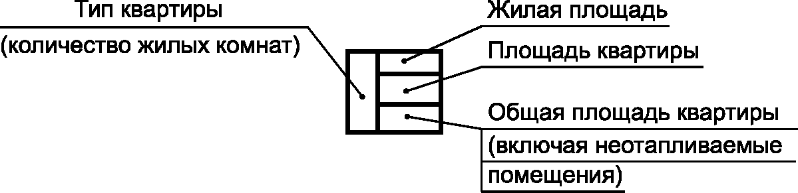
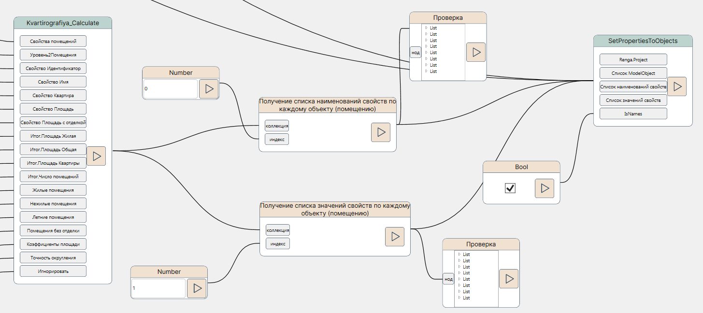

# NVP - О создании кросс-программных нодов на примере Квартирографии

*26 августа 2024г.*

Автоматизация каких-либо задач в САПР (будем понимать под этим собирательным термином множество программ для создания информационных моделей) часто крутится вокруг адаптации уже существующих решений для данной задачи для данной САПР или её аналогов. Например, многие компании стремятся разработать и использовать свой плагин "выдачи отверстий" между архитектурной\конструктивной составляющей и инженерными сетями, другие нацелены на мэппинг или заполнение свойств объектов по определенным наборам правил для выгрузки моделей в IFC. Эти и подобные задачи решаются разными компаниями и для разного ПО (САПР). Гибкий и настраиваемый инструментарий отдельных решений \[автоматизации\] мог бы закрывать большую часть потребностей будь такое решение бесплатным и открытым. Таковыми можно считать, например, некоторые утилиты ModPlus.

Но здесь мы будем вести речь о возможностях гибкого редактирования схемы расчета путем выноса логики в инструменты визуального программирования. Если слегка углубиться в историю, можно заметить, как бум автоматизации в известном всем Revit начался именно с Dynamo, и в нём стремились закрыть все сложные задачи без оглядки на удобство редактирования скрипта, времени его работы. Конечно, в идеальном сценарии логически-сложные задачи целесообразно решать не скриптами, а плагинами (создаваемыми на C#), но когда нет подобных плагинов (даже в виде конкурентных решений) или возможностей их писать (и штата/бюджета) ничего не остается, как решать задачи подручными способами -- в данном случае, через инструменты визуального программирования в отношении задач создания моделей в отечественном ПО.

## 1. Постановка задачи

В качестве предмета автоматизации у нас будет расчет **квартирографии** -- довольно простая архитектурная задача, заключающаяся в подсчете метрик площадей квартир из набора помещений (подсчет жилой, нежилой и общей площади с некоторыми условиями (от имен помещений формируются некоторые коэффициенты). 

Источник: https://e-ecolog.ru/docs_files/KLY52oeeK0_1vaMWVPy0e.png

И указанная задачка имеет место почти везде, где речь идет про  разработку проектов жилья, а если "указывать пальцем", то это Renga, CS ModelStudio:  Строительные решения и nanoCAD BIM Строительство 24. Ну, и, конечно Revit/Archicad и прочее юридически-недоступное ПО. В каждой из перечисленных программ имеется категория/вид объектов "Помещение" с привязкой к уровню, обладающее свойствами и геометрическими характеристиками -- периметр и площадь (остальные нас не интересуют). Посему поставим задачу -- создать нейтральную к среде САПР логику расчета квартирографии.

## 2. Тонкости реализации

На стороне программирования универсальные конструкции, как правило, хранятся в некоей общей библиотеке, к которой идет обращение при разработке условного решения. На стороне визуального программирования общими компонентами могли бы выступать наборы нодов из отдельных скриптов. Такая практика часто применялась на упомянутой "заре" автоматизации Dynamo for Revit, но постепенно себя изжила из-за сложности доработки, громоздких конструкций и т.д. Часть логики кто-то смог перенести в Python-скрипты, являющиеся частью концепции "визуального программирования", но и здесь сохраняется необходимость помимо нодов и пакетов нодов хранить также подобные скрипты/"группы нодов". 

Интересным выходом является вынос подобных САПР-нейтральных расчетных функций непосредственно в поставку нодов, в отдельные группы. Так как отечественная практика визуального программирования почти везде ассоциировалась с созданием скриптов под Revit, а более Dynamo нигде не было (специфика задач в AutoCAD Civil 3D была далека от Revit), то подобного размещения логической части на стороне пакетов нодов также не было. При случае все писали нормальные плагины на C#.

Здесь же стояла задача так абстрагироваться от реалий конкретной САПР, чтобы методика расчета могла быть применена для любой среды. Оригинальная логика разрабатывалась и тестировалась под Renga, с оглядкой на специфику объектной модели MST Строительные решения и nBIM.

Под подобные задачи "Общих сценариев" была выделена группа в составе библиотеки нодов "NVP_Common.Task". Для настоящей квартирографии соответственно -- группа "Kvartirografiya". Основной ~~рабочей лошадкой~~ функциональной доминантой там является нод `Kvartirografiya_Calculate` с 18-ю портами для ввода данных. Не буду перечислять все, они приведены в [описании](https://github.com/GeorgGrebenyuk/nvp_NodeLibs/blob/main/docs/UserGuide_common_Tasks.md#%D0%BA%D0%B2%D0%B0%D1%80%D1%82%D0%B8%D1%80%D0%BE%D0%B3%D1%80%D0%B0%D1%84%D0%B8%D1%8F). Структурно эти входные данные обрабатывают свойства помещений, ищут в них свойства (параметры) для площадей (чистой и с отделкой), подготавливают данные для заполнения свойств и т.д. 

## 3. Реализация

Скрипт для квартирографии пока реализован для Renga

`\samples\Renga\NVP_Renga_COM_Sample_Квартирография.nvproj`.

В планах к следующей версии 0.0.6 реализовать для MST.
