# Погружаемся в системы координат. Часть 6 - автоматизация пересчета координат

*1 мая 2021*

> Это архивная версия статьи. Оригинал на https://dzen.ru/a/YIh9nnTzQzPdSQfq

**Введение**: данная статья будет посвящена вопросам автоматизированного пересчета координат из одной системы в другую при помощи пакета Dynamo.MapConnection на базе Civil 3D. Отдельно мы осветим вопрос преобразования между двумя 3D системами координат в контексте САПР с одной стороны, и координационной модели с другой. 

Ниже ссылки на предыдущие части:

1. [Часть 1 - как всё начиналось](./article_16042021.md)

2. [Часть 2 - ручное внесение в библиотеку информации о СК](./atricle_17042021.md)

3. [Часть 3 - нестандартные виды определений СК](./article_23042021.md)

4. [Часть 4 - автоматизация формирования библиотеки СК](./article_24042021.md)

5. [Часть 5 - стандартные инструменты пересчета координат](./article_27042021.md)

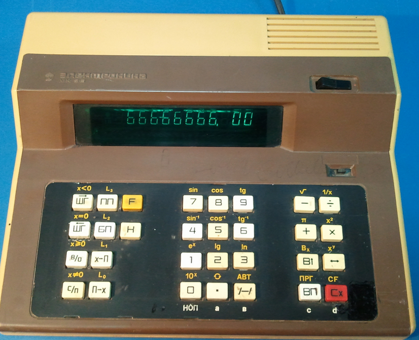

Способы автоматизации немногим лучше стандартных :D Оригинал изображения
 http://лавка57.рф/wp-content/uploads/2016/01/2016-02-16-11.30.19.jpg

Итак, рассмотрим на примере нашего многострадального Нижнего Новгорода ряд практических кейсов по необходимости массового пересчета координат.

## Другие координаты в метках точек

**Описание кейса**: проект разрабатывается в системе координат региона (в нашем случае, МСК-52 Зона 2), а нам необходимо часть проектной документации представлять в городской системе координат. Причем для этой части сказали, что достаточно будет лишь проставить метки для точек в данной системе координат, а сам чертёж оставить в региональной СК [все равно выводятся чертежи в виде PDF где не важно, в какой прямоугольной СК были объекты].

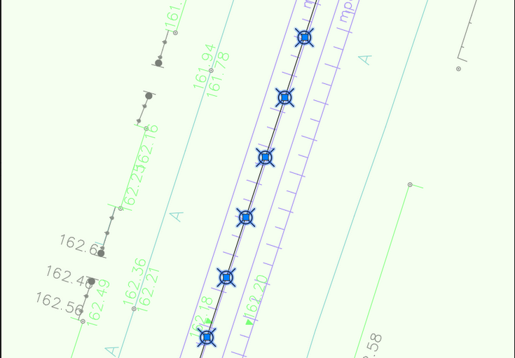

Допустим, у нас есть ось дороги со вспомогательными пикетами через каждые 5м, где необходимо проставить метки координат

В предыдущей части статьи (№5) мы говорили, что это осуществимо и при помощи COGO точек, и при помощи маркера geomarkpoint - но в отношении географических систем координат (WGS-84 EPSG:4326). В случае же необходимости пересчета в другие прямоугольные координаты трудоёмкость намного возрастает.

Для определенности, пусть будущие метки будут в форме блока с атрибутами координат, лежащие в слое "Точки".

Обратимся теперь к скрипту [базово, [он доступен тут](https://inj9.gitbook.io/dynamo-mapconnection/coordtransform/page1)] за минусом описанной выше конструкции о выборки объектов (точки/блоки). Там же приведена красочная инструкция на русском/английском, так что здесь мы не будем особо вдаваться в подробности, а покажем результат.

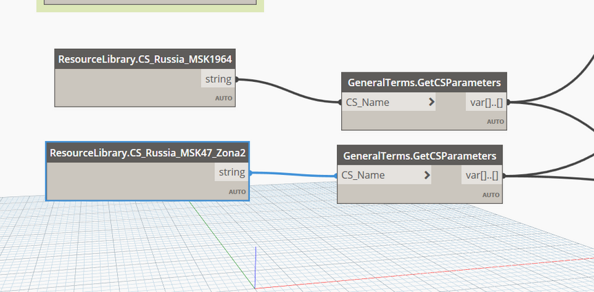

Сперва заменяем ноды для текущей и конечной СК. Текущей будет МСК 52-Зона 2, а конечной - MSK52_Town

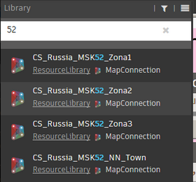

Используемые системы координат

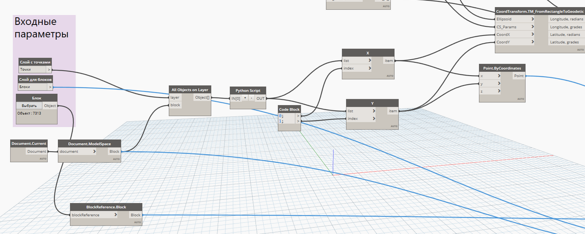

Часть конструкции, для постановки задачи (блоки-метки)

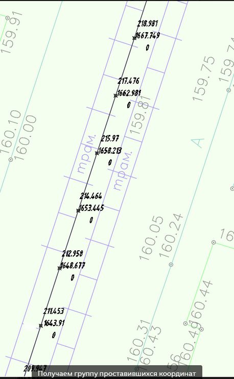

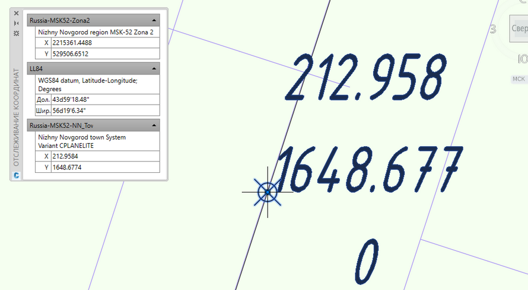

Проверяем проставившися метки

Видно, что точность по первым трем знакам (до мм) все совпадает. Следовательно, параметры преобразования у нас рабочие.

Примечание: рекомендуется для библиотеки систем координат ввести несколько датумов между СК-95, СК-42, СК-63 с нулевыми преобразованиями (так как в данной реализации пакета считается, что эти системы глобально есть "одно и тоже", так как алгоритмически они не влияют на расчет в рамках эллипсоида Красовского) во избежание невязок между перечисленными с помощью пакета координатами и опции MAPTRACKCS [которая ввиду отсутствия между референц-эллипсоидами прямого явного преобразования будет считать через WGS-84].

Более подробно кейсы по пересчету данных между СК см. [в отдельном блоке из данного справочного пособия](https://inj9.gitbook.io/dynamo-mapconnection/coordtransform).

## Пересчет объектов Civil 3D в другую систему координат

> Вообще говоря, только платформой Civil 3D мы не ограничены, это также можно сделать и в Revit с обязательным условием предварительного получения общих координат из DWG-файла подосновы.

В части №5 мы говорили, что стандартные возможности Map 3D с помощью запросов _ADEQUERY позволяют работать только с примитивами AutoCAD. Объекты же Civil 3D могут быть выгружены в формат LandXML, где и пересчитаны в другую СК, и вставлены обратно в модель уже будучи пересчитанными.

Давайте рассмотрим это на примере перевода поверхности из системы координат МСК 52 Зоны 2 в городскую СК г. Нижний Новгород.

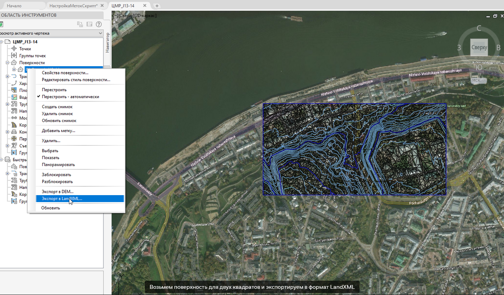

Далее создадим новый чертеж, назначим ему систему координат МСК 52-Town, для города [Можно и не назначать - сугубо для проверки подключением карт потом]

Открываем Dynamo и подаем на вход соответствующему ноду информацию по СК и путь к сформированному LandXML-файлу:

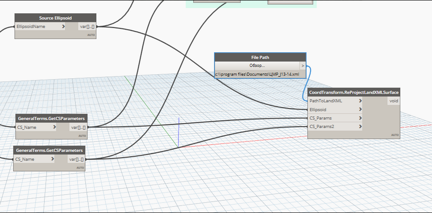

Подаем на вход информацию

Теперь импортируем измененный файл в созданный чертеж:

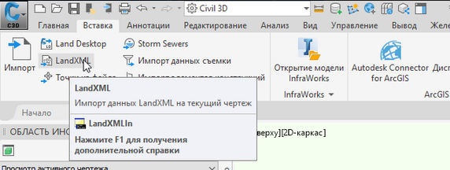

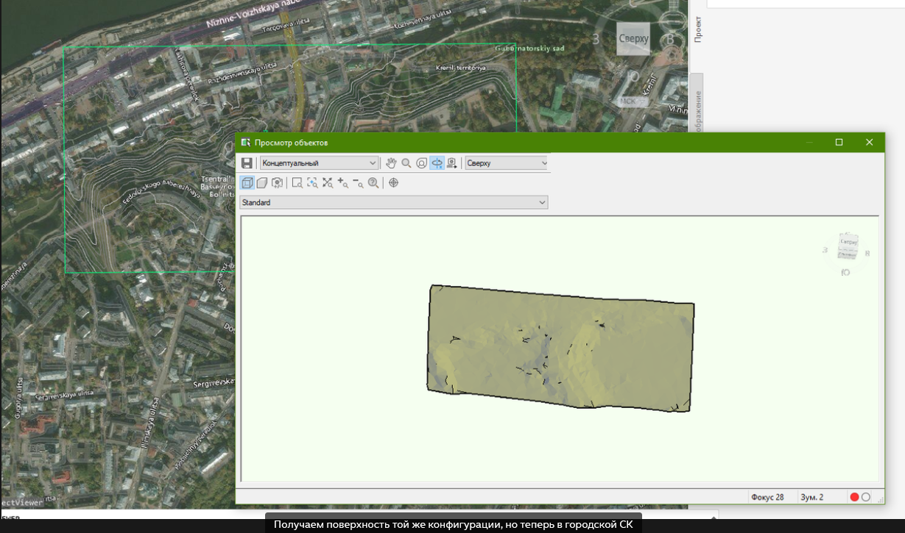

**Примечание**: трансформировать другие объекты Civil 3D я не пробовал, но технически, должно получиться также нормально

## Пересчет из одной 3D системы координат в другую

**Отступление**: здесь речь пойдет о пересчете данных из одной правой [используется во всех САПР] декартовой 3D системы координат в другую. Как частный случай - преобразование модели из некой 3D САПР, где не реализована поддержка задания общих координат на уровне программы для посадки объекта в общие координаты в координационную модель

> На основе данного раздела впоследствии будет создан ряд статей по узким случаям вариантов межпрограммной координации

Итак, предположим, что у нас есть модель в программном комплексе Renga, которую требуется разместить в общей координационной модели. Ссылка на файл приведена [здесь](https://inj9.gitbook.io/ifc-geosupport-guide/data-samples/sample-with-kindergartens-building).

**Примечание**: с версии 4.3.31062 они убрали возможность экспорта в формате IFC 2x3, а в оставшийся IFC 4 добавили расширенный маппинг параметров только в недавнем апрельском обновлении; поэтому рассматриваемый пример рекомендуется использовать как есть (осенний вариант).

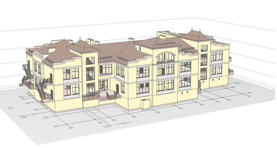

Домик в Renga

Renga, как и подавляющее большинство инженерного ПО, умеет выгружать данные в формат IFC (Industry Foundation Classes), поэтому далее как универсальный вариант будем рассматривать этот источник данных.

Технически, если конечное ПО для формирования координационной модели позволяет для загружаемых объектов задавать сдвижку по осям X,Y,Z и угол поворота в плоскости XOY, то можно рассчитанные параметры задавать и там.

### Методология расчета

Мы будем отталкиваться от общего 7-параметрического **уравнения Гельмерта**, применяемого для расчета трансформации между геодезическими системами координат. А именно, сводить его к 4-параметрическому, оставляя "за кадром" масштабный фактор М и углы поворота относительно осей X,Y. Более подробная реализация алгоритма будет позже опубликована в одном из журналов, и я ссылку прикреплю дополнительно. В общем случае описываемые действия более научным языком описаны в [Лекции № 6](http://www.geogr.msu.ru/cafedra/karta/docs/GOK/gok_lecture_6.pdf) Б.Б. Серапинаса "Геодезические основы карт", разделе "Трансформирование пространственных прямоугольных координат".

Для данного метода необходимы 3 точки в текущей СК координат объекта и 3 точки в проектных координатах (как они занесены в целевой генплан).

Примечание: вообще говоря, алгоритмически достаточно и двух точек, но с тремя точность будет выше

### Шаг №1: готовим среду пред-просмотра файлов

В силу того, что мы обсуждаем файлы IFC [куда программа выгружает геометрию в своих координатах], то и логичнее рассматривать решения, позволяющие открывать файлы и ставить там метки координат на точках геометрии.

Я, к примеру, пользовался в этом вопросе бесплатными Solibri Model Viewer и [BIM Vision](https://bimvision.eu/download/). Последний можно скачать напрямую без заполнения форм регистраций, по сути - это бесплатная платформа с платными плагинами.

### Шаг №2: готовим координаты объекта

Загружаем в среду IFC-Viewer (в данном случае, BIM-Vision) наш файл из Renga:

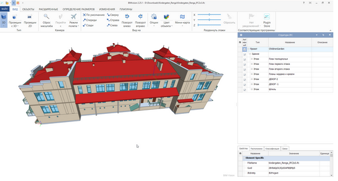

Вид IFC в среде BIM Vision

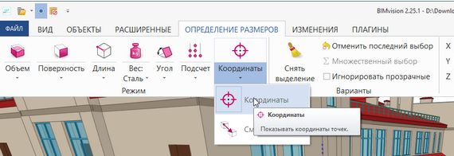

Активируем опцию по простановке точечных меток координат

Теперь собираем потребные координаты точек. Я воспользуюсь подготовленными координатами со [страницы](https://inj9.gitbook.io/ifc-geosupport-guide/data-samples/sample-with-kindergartens-building).

Целевые координаты, как правило, берутся из AutoCAD - среды, где разрабатывается генплан, либо из "координационного" файла Revit - где есть штатная возможность простановки меток координат.

> Old System
> 39.068,21.075,-2.5
> -8.281,21.075,-2.5
> 6.118,-4.275,-2.5

> New System
> 2216547.802,530046.2432,136
> 2216564.37,530001.8864,136
> 2216583.0789,530024.2462,136

### Шаг №3: вычисляем параметры трансформации координат

Приложение по пересчету доступно [как в форме библиотеки dll, так в форме десктопного приложения WinForms, так и в виде скрипта Dynamo](https://github.com/GeorgGrebenyuk/IFC_GeoSupport).

> Независимо от вида, приложение реализовано по тупому методу подбора (нерационально, короче). Хочу попробовать позже для интереса реализовать нахождение параметров через симплекс-метод.

Рассмотрим на примере десктопного приложения:

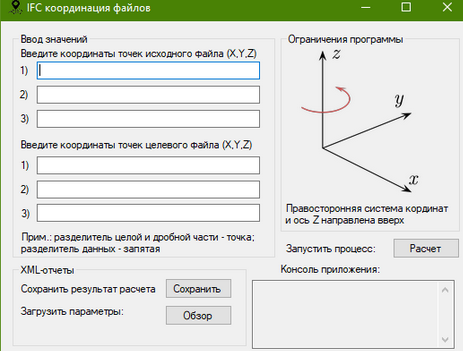

Начальный вид приложения для расчета параметров трансформации

Вводим в строки координаты наших опорных точек и нажимаем на "Расчет". Всё просто)

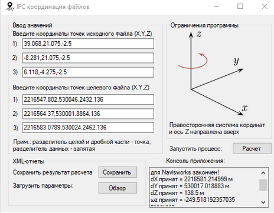

В результате в поле "Консоль приложения" получаем следующий текст:

> Расчет параметров трансформации для Navisworks закончен!
> dX принят = 2216581.214999 м
> dY принят = 530017.018883 м
> dZ принят = 138.5 м
> ωz принят = -249.518192357035 градусов
> Линейная ошибка = 1.903E-06 м

Эти результаты можно сохранить в XML-представлении, чтобы в последующем использовать эти же параметры трансформации для преобразования всех файлов с данного ПО для данного объекта.

**Примечание**: угол поворота ωz специально принят с "-" для Navisworks. Алгоритмически он с плюсом.

Параметр "линейная ошибка" позволяет прикинуть точность расчета. Если он больше 1 см - значит, явно где-то ошибка.

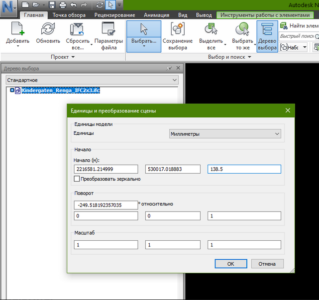

Заполняем параметры в окне "Единицы и преобразование сцены" в среде Navisworks

## Выводы

В данной статье мы с вами рассмотрели возможности по простановке меток точек в любых системах координат в Civil 3D/Revit благодаря пакету Dynamo MapConnection. Использование Dynamo позволяет задавать эти вычисленные значения как **любой** элемент геометрии/свойств объектов (атрибуты блоков, свойства COGO точек, наборы характеристик и т.д.).

Во втором разделе мы коснулись вопроса о возможности пересчитывать объекты Civil 3D из одной системы координат в другую используя представление геометрии объектов в файлах LandXML.

Третий раздел мы посвятили вопросу расчета параметров трансформации между двумя декартовыми системами координат в пространстве (переход от внутренних координат файла из САПР в координационную модель с общими координатами). Этот пункт послужит "отправной точкой" для ряда последующих статей по вопросу передачи данных между различным ПО в том числе с помощью файлов IFC.
