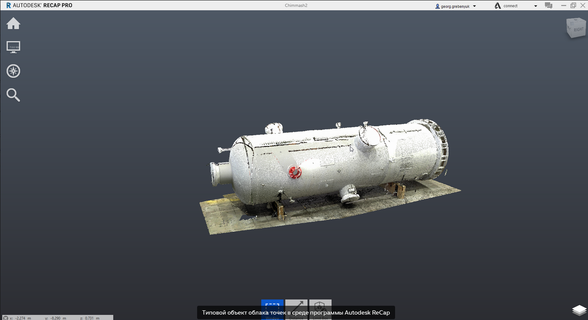
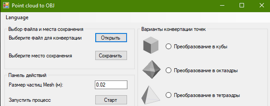
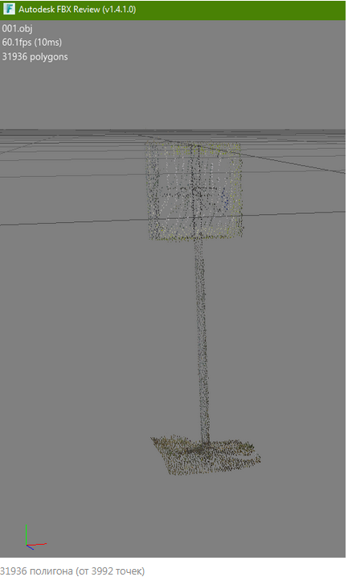

# Занимательное программирование] - экспорт облака точек в OBJ формат

*14 апреля 2021*

> Архивная статья, зеркало с https://dzen.ru/a/YHaRuzciKwCyjmy8

Введение: с ростом популярности и, главное, доступности лазерных сканеров появляются новые кейсы по преобразованию геометрии облака точек в mesh-форматы данных, где посредством той же триангуляции Делоне строятся поверхности по облаку и идут как 3d-mesh. Мне стало интересно, а можно ли заменив точки некими простыми телами, экспортировать их в формат OBJ. Данная статья как раз об этом.

Структура облака точек: здесь не требуется особенных пояснений. Набор точек с координатами X,Y,Z и цветовым кодом RGB. В качестве метаданных может выступать также номер станции сканирования.



Структура формата OBJ: описана [здесь](http://www.martinreddy.net/gfx/3d/OBJ.spec). В качестве типовых геометрических тел будем использовать куб и октаэдр. *Также я использовал и тетраэдр, но не смог его корректно инвертировать.

Примечание: следует иметь в виду, что OBJ формат как 3D-представление графики в ряде ПО имеет левостороннюю систему координат (вместо оригинальной правосторонней) - потому следует закладывать в формате эту поправку сразу.

Отдельный акцент следует сделать на цветопередаче. Почему же? Базово, формат OBJ поддерживает лишь геометрию, а вот за материалы (и, в частности, цвет) отвечает вспомогательный формат MTL (спецификация [тут](https://www.fileformat.info/format/material/)). Следовательно, в рамках чтения каждой точки необходимо будет одновременно формировать структуру заданного тела и прописывать материал (цвет) в 2 разных файла.

Логика работы приложения: к слову, само приложение писалось на .NET Framework 4.8 в среде VS 2019. Исходный код и демо-файлы приведены в открытом репозитории на GitHub [здесь](https://github.com/GeorgGrebenyuk/Point-cloud-to-OBJ).



1. Инициализируем файл с облаком точек [построчно](https://github.com/GeorgGrebenyuk/Point-cloud-to-OBJ/blob/a94bac1272aa39972e73584987b2e1cb66ba57a1/Actions.cs#L26) (в нашем примере это простой файл PTX) со структурой XYZRGBN, где XYZ - координаты точки, RGB - цветовой код, а N - номер станции сканирования.

2. В зависимости от типа варианта конвертации запускаем [свой метод](https://github.com/GeorgGrebenyuk/Point-cloud-to-OBJ/blob/a94bac1272aa39972e73584987b2e1cb66ba57a1/Actions.cs#L34) из класса Geometry

3. Вне зависимости от варианта выбранного тела запускаем [метод по записи цвета файла](https://github.com/GeorgGrebenyuk/Point-cloud-to-OBJ/blob/a94bac1272aa39972e73584987b2e1cb66ba57a1/Actions.cs#L59) как отдельного материала с уникальным именем (номер строки)

4. Задаем размер единицы размера (в зависимости от плотности исходного облака точек)

5. У нас действует ограничитель в 50000 строк (для предотвращения переполнения памяти для элемента StringBuilder), но фактически - итоговые файлы с числом элементов более 10000 мы все равно уже не откроем.

6. Структура файла OBJ для каждой из фигур задается в классе Geometry.cs в зависимости от выбранной фигуры

Начало OBJ файла начинается с подключения файла MTL (в данном случае он лежит рядом с файлом и имеет то же название)

`mtllib Cube.mtl`

А далее перечисляем элементы геометрии

```textile
g p1

v -6.067 2.834 20.039
v -6.067 2.814 20.039
v -6.047 2.814 20.039
v -6.047 2.834 20.039
v -6.067 2.834 20.019
v -6.067 2.814 20.019
v -6.047 2.814 20.019
v -6.047 2.834 20.019
usemtl p1
f 1 2 3 4
f 5 6 7 8
f 4 3 7 8
f 1 4 8 5
f 1 2 6 5
f 2 3 7 6
```

Выше к примеру, структура-описание для куба

```textile
newmtl p1
Kd 0.055 0.325 0.306
Ns 1
```

А вот (выше) соответствующий цвет.

7. По окончанию работы у нас формируются 2 файла OBJ и MTL, которые можно открыть в любых* вьюверах (стандартный Paint 3D WIndows 10; Autodesk FBX Review и пр.)

*Производительность!



А теперь, почему так делать нельзя: действительно, почему же? При подобных операциях число фигур у нас будет огромным, что по-видимому накладывает ограничения на их прорисовку в конечном ПО (особенно при их взаимном наложении). Программно в файл можно запихать любой объем геометрии, но открыть его не сможет ничего.

Вывод: формат OBJ не подходит для хранения облака точек (замена точки на простое тело), ввиду особенности чтения геометрии конечным ПО (проверки условий пересекаемости элементов для формирования вырезов - для случая сложных моделей САПР)), что приводит к фактическому увеличению времени обработки файла и моделировании геометрии по ним. Данный вывод является сугубо-субъективным, не претендующим на истинность.

Что лучше использовать? Сейчас набирает популярность [сервис Potree](https://github.com/potree/potree), все исходники которого опубликованы здесь - он используется на разных web-платформах, также (наверное) может быть использован и как оффлайн-вьювер. Но для подобных "низменных" задач, лучше уж использовать OpenSource решение - [CloudCompare](https://www.cloudcompare.org).
