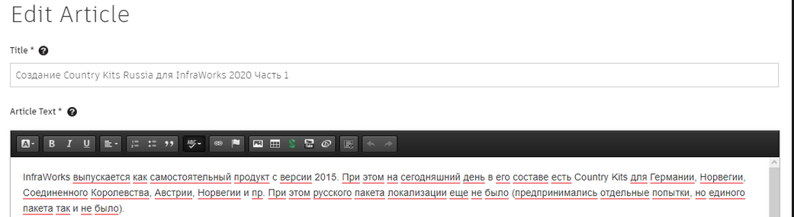
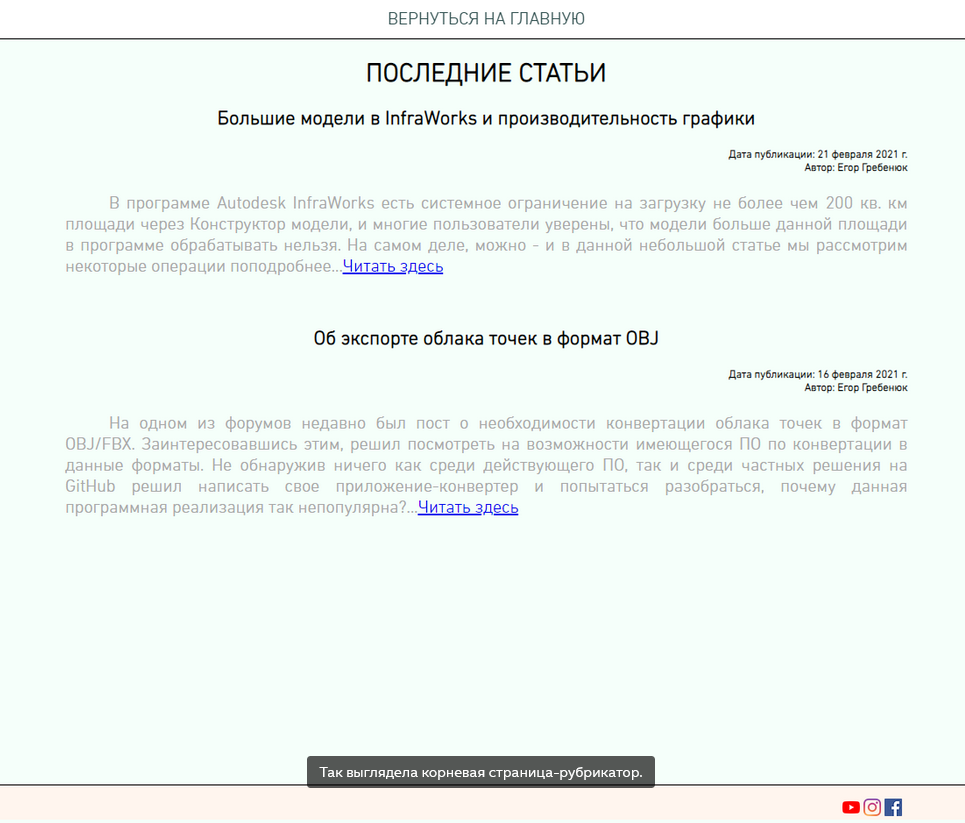
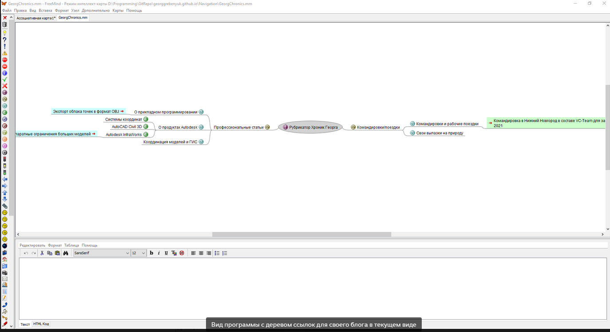
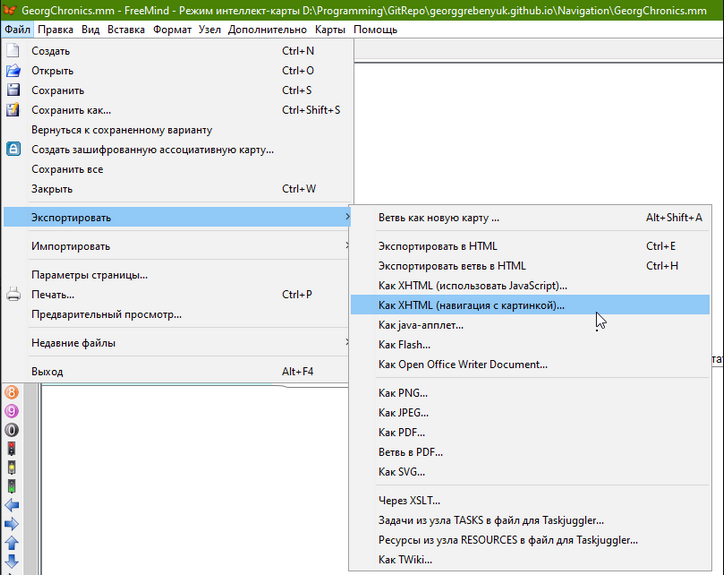
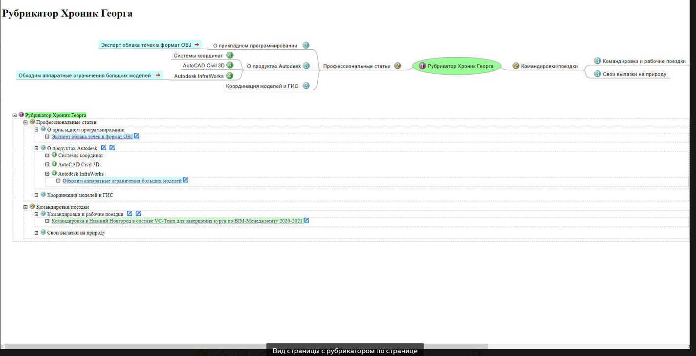

# Делаем рубрикатор блога на GitHub с помощью FreeMind

*15 апреля 2021*

> Это архивная статья. Оригинал на https://dzen.ru/a/YHf_MbV-F3ocZJEM

**Введение**: используем github-pages для создания рубрикатора блога и размещения там ссылок на наши статьи.

Пролог: есть и другие бесплатные сервисы/способы сделать подобное; описываемый ниже способ не претендует на универсальность и отражает сугубо пользовательский опыт

## Предыстория

Как начиналась история: до того, как начать публиковаться здесь я пробовал сперва писать статьи на платформе Autodesk Knowledges, но инструменты редактирования текста там ввергали в полное уныние, как и сохранность структуры текстов (через некоторое время они слетали (особенно таблицы)).

Перед вами инструментарий по созданию статей на [этой платформе](https://knowledge.autodesk.com) (с 2023 вроде прекратила существование)

Платформы типа blogpost/lifejournal тоже не выглядят современными, а почти везде есть ограничение на объем загружаемого контента.

Год назад я познакомился с платформой [GitBook](https://www.gitbook.com/). Там имеются отличные инструменты для создания многостраничных справочных пособий (инструмент позиционируется как продвинутая версия GitHub Wiki). Несмотря на публичный статус гайдов, они не индексируются поисковиками. Никак не индексируются. К примеру, вот [пособие](https://inj9.gitbook.io/msk-for-civil-3d/) написанное ещё год назад как справка к системам координат в рамках пакета локализации для Civil 3D 2021. Точный поиск в Google/Yandex по "...какой-то текст..." не дает результатов.

Тогда я решил попробовать развернуть блог просто на GitHub Pages. То есть создать репозиторий вида <<User's profile name>>.github.io и разместив там в корне страницу index.html перейти к самостоятельной разработке блога на базе html+css. Сразу скажу, встроенные шаблонные генераторы Jekyll мне не зашли (как-то сильно мудрёно если начать лезть вглубь), никак не проще того же html.

## 

## Переходим к сути

Но вот при открытии этой же страницы на мобильных устройствах/смене разрешений начинались искажения содержимого. Безусловно, это можно пофиксить если настраивать исключения в коде страниц - но мне этого было уже слишком ради "написать и забыть". И я уже не говорю про трудоемкость редактирования элементов, смены дизайна глобально, после того как ряд элементов уже готовы - в общем, отсутствие динамики внесения изменения.

Тогда я посмотрел на [схемы коллег](https://aleksandrpankin.github.io/C3D/) и захотел нечто подобное. Отдавать 30 тысяч за MindManager мне было, естественно, жалко, потому я выбрал бесплатный аналог (их, к слову много) FreeMind (загрузить можно [отсюда](http://freemind.sourceforge.net/wiki/index.php/Download)). Да, в обзорах писали, мол его дизайн замер давно в прошлом.

Мне понравилась штатная опция экспорта содержимого схемы в HTML с таблицей-описанием:

Экспортируем в HTML

А далее попросту размещаем сгенерированный файл вместе с папкой с данными в нашем репозитории (при поддержке GitHub pages).

Собственно, вот [ссылка](https://github.com/GeorgGrebenyuk/georggrebenyuk.github.io) на сам репозиторий и на [результат](https://georggrebenyuk.github.io/) - корневую страницу со ссылками на 2 рубрикатора (для [данного блога](https://georggrebenyuk.github.io/Navigation/GeorgChronics.html) и на [все свои репозитории](https://georggrebenyuk.github.io/Navigation/RepoGuide.html)).

### 

## Выводы

Как [говорил](https://t.me/bimsapr/73105) один программист "Правильно - это то, что работает", а то как оформлено - уже дело десятое, потом в целом могу код html экспортируемого и слегка подправить, не проблема - главное, что есть простой способ быстро создавать новое и редактировать текущее дерево ссылок, сохраняя результат как html-страницу с постоянным веб-адресом в сети.
