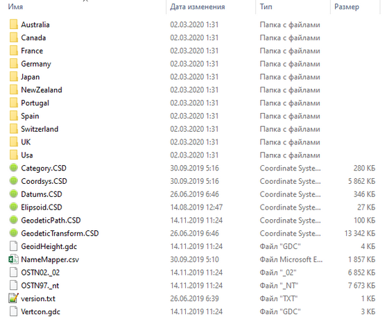
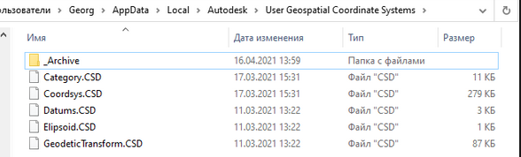
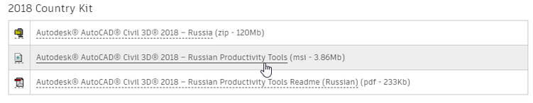
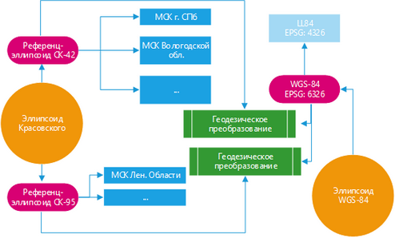
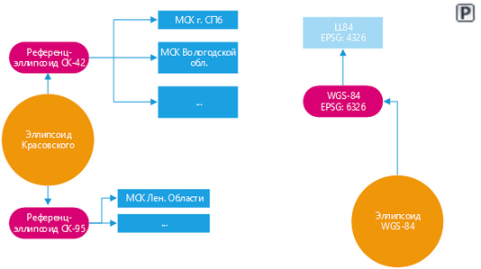
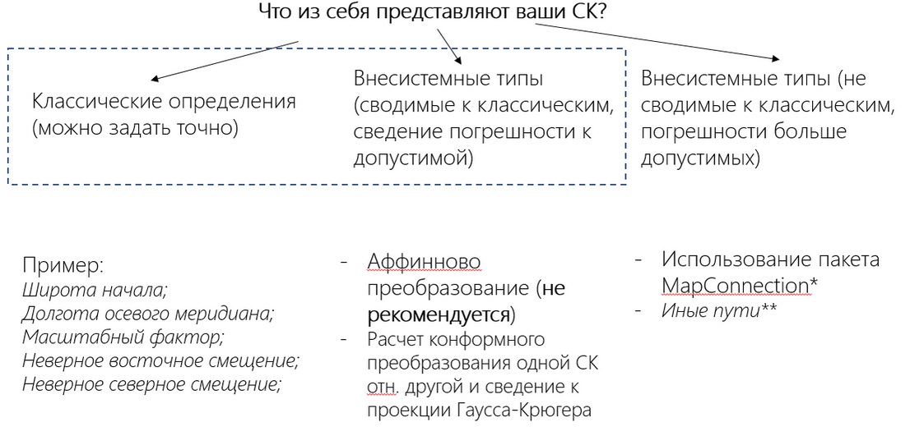

# Погружаемся в системы координат. Часть 1 - как всё начиналось

*16 апреля 2021*

> Это архивная статья. Оригинал на https://dzen.ru/a/YHk1pK9AyyKAQ_08

**Введение**: данная статья открывает серию статей по работе с системами координат внутри САПР (в основном, в рамках продуктов Autodesk) и позволяет перейти к частным случаям вопросов координации как на глобальном, так и на локальном уровне. Здесь будет дано описание библиотеки СК, ее элементов и тех ошибок, которые возникали на разных этапах её (библиотеки) создания.

Другие версии статей из серии:

1. [Часть 2 - ручное внесение в библиотеку информации о СК](./atricle_17042021.md)

2. [Часть 3 - нестандартные виды определений СК](./article_23042021.md)

3. [Часть 4 - автоматизация формирования библиотеки СК](./article_24042021.md)

4. [Часть 5 - стандартные инструменты пересчета координат](./article_27042021.md)

5. [Часть 6 - автоматизация пересчета координат](./article_01052021.md)

## Немного предыстории

Впервые я прямо столкнулся с непонятными системами координат, когда работая в структуре ПСС Грайтек в июне 2019 г. как "специалист по инфраструктуре" намертво застрял на проблеме "как загрузить сцену из InfraWorks в имеющуюся координационную модель в Navisworks в системе координат г. Москвы".

Это сейчас я могу с уверенностью сказать, что это делается следующим образом:

1. Назначить в свойствах модели InfraWorks систему координат для г. Москва из **готовой библиотеки** систем координат

2. Экспортировать файл FBX из InfraWorks с пользовательскими настройками (0,0,0) и таковым загрузить в Невис (Navisworks, далее)

Тогда мне помог бывший сотрудник данной компании, дав эту **готовую библиотеку**, но желание познать это никуда не пропало.

Казалось бы, простые действия, но по факту, чтобы претворить их в жизнь мне потребовалось по скромным прикидкам порядка 8 месяцев, чтобы это осознать и еще полгода чтобы кое-что автоматизировать. 

## Где была зарыта собака?

А собака была зарыта забыта среди упомянутой библиотеки систем координат. Но перед тем как перейти к проблематике вопроса, сперва сделаем шажок назад, задавшись вопросом "а что такое библиотека систем координат?". 

### Что такое библиотека систем координат?

Вообще говоря, глобально, **все продукты Autodesk используют одну и ту же библиотеку систем координат**. Это одна из "аксиом", которую нужно принять. При этом библиотека подразделяется на **системную** (поставляемую с продуктами) и **пользовательскую** (поставляемую отдельно от продуктов/собираемую конечными пользователями самостоятельно).

Перед вами содержимое системной части библиотеки

Если говорить еще глубже - то инструменты по работе с СК опираются базово на open source решение - [OsGeo.MapGuide](https://mapguide.osgeo.org) с некоторыми глючными дополнениями от Autodesk.

Системные библиотеки имеют статичный файловый путь вида:

> C:\ProgramData\Autodesk\Geospatial Coordinate Systems 14.07

Где "14.07" - версия пакета (этот номер был вроде бы для линейки 2020), соответственно для 2021 он будет "14.08" и т.д.

Пользовательские библиотеки имеют также статичный путь, не зависящий от версии линейки продуктов:

> %LOCALAPPDATA%\Autodesk\User Geospatial Coordinate Systems

Этот путь справедлив, как позиционируется где-то в Справке на AKN, для продуктов с версий 2014.

Перед вами содержимое пользовательской библиотеки

### И всё же, в чем была проблема?

А проблема была в том, что в связи с официальной **секретностью** параметров для отечественных СК их не было в составе системной библиотеки.

Но … данная библиотека в некоем виде была сформирована в рамках пакета локализации для Civil 3D к (вроде) 2018 версии Игорем Рогачевым, от чего я и отталкивался в дальнейших своих попытках осознания проблематики вопроса.

Если не ошибаюсь, она была в составе этого пакета здесь https://knowledge.autodesk.com/support/civil-3d/downloads/caas/downloads/content/civil-3d-country-kits-for-russia-0.html

### Что было дальше?

Не помню, на каком этапе я осознал, что данный пакет неполный - но где-то к концу августа 2019 г. я уже добавил в библиотеку (что шла со времен кантри кита) парочку определений, чтобы они работали.

> Тут я прошу внимания читателя, и одновременно прошу извинить за последующие строки, так как без данной "вводной" понять механику работы СК будет сложно

## Как работают системы координат?

Отдалимся пока от глобальной проблемы неполного содержания библиотеки СК, а рассмотрим механику взаимодействия элементов библиотеки друг с другом.

### Какие есть элементы?

Снова та же картинка

Теперь посмотрим внимательно на картинку выше (исключая папку). Нас интересуют именно конфигурационные файлы *.CSD. Не уверен как они расшифровываются - возможно типа "Coordinates Systems Dictionary".

Каждый из этих файлов хранит отдельные элементы в составе библиотеки

- Coordsys.CSD - содержит описания систем координат и параметров их проекций;

- Elipsoid.CSD - содержит перечень эллипсоидов, на базе которых действуют датумы

- Datums.CSD - содержит перечень референц-эллипсоидов (производных от эллипсоидов), которые являются частью описания СК (к какой референцной системе СК относится)

- GeodeticTransform.CSD - содержит числовые параметры датума или параметры геодезического преобразования - параметров, которые позволяют переходить от координат с одного эллипсоида на другой. К слову, именно этой вещи и не было в составе упомянутого пакета локализации

- Category.CSD - перечень категорий (групп) СК

- \*GeodeticPath.CSD - перечень "путей преобразования геод. данных", в случае если необходимо сделать цепочку преобразования данных. Не работает в отношении суммы пары или более геодезических преобразований. Функционирует только в отношении нулевых датумов/географических координат/файлов сетки. **То есть в рамках пакета адаптации не используется никак**.

### Как они взаимосвязаны?

Тут на помощь приходит следующая блок-схема, иллюстрирующая логику взаимодействия этих параметров:

Блок-схема (делал в MS Visio)

Предположим, что есть некая система координат, пусть для примера для г. СПб, и есть необходимость связать данные в системе координат WGS-84 (EPSG:4326) с ней. К примеру, это векторные контуры зданий из OSM (Open Street Maps).

Наша логика действия такая, чтобы удостовериться, что для **родительского** референц-эллипсоида СК для СПб было бы какое-либо **геодезическое преобразование**, которое **связывало** бы данный референц-эллипсоид и референц-эллипсоид конечной системы (LL84). Тогда данные смогут быть преобразованы.

А теперь покажем как выглядела схема ДО моих изменений пакета координат:

Как было "ДО"

Видите? Отсутствуют элементы типа "геодезическое преобразование". И логично, что данные из WGS-84 (это к примеру база данных модели InfraWorks/спутниковые снимки/векторные данные OSM/рельефные карты SRTM) никак не смогут быть скоординированы с нашей моделью при условии что она запроектирована в местных СК.

### Еще о подводных камнях

Многие проблемы (существующие и потенциальные) будут связаны с **официальной секретностью параметров отечественных систем координат**. Одна из них - это возможные невязки данных при вставке каких-либо "публичных данных" из "географической среды общих данных". Тут следующие пути - либо меняем датумы ([читай тут](https://inj9.gitbook.io/msk-for-civil-3d/3.-podbor-i-naznachenie-sk-iz-imeyushikhsya/untitled-3)), либо ищем точные параметры (копаемся на форумах/спрашиваем коллег/запрашиваем официально), либо переходим к вычислению параметров системы координат, которая даст наименьшую погрешность.

Чтобы логически закончить данную часть, рассмотрим ещё один кейс, связанный с внесением информации о системе координат в библиотеку.

## Пути задания систем координат

Схема задания СК в зависимости от их формулировок

Самый хороший вариант, если это некое стандартное определение/формулировка с известными (хорошо, если, официальными параметрами). Тогда методика её задания будет простой (см. [тут](https://inj9.gitbook.io/msk-for-civil-3d/2.-sozdanie-novoi-sk-s-izvestnymi-parametrami/untitled)).

Следующий путь (наиболее вероятный), что систему координат потребуется посчитать вручную по набору опорных точек. Здесь есть как минимум 2 метода - **аффинново преобразование** (тип проекции "Поперечная Меркатора с последующей аффинновой переработкой") и **конформное преобразование** с получением описания проекции "Гаусса-Крюгера". Здесь мы берем координаты точек/пунктов в другой системе координат и относительно неё (этой второй СК) формируем описание новой СК (это мы детально рассмотрим в следующих частях цикла статей).

Отдельный случай - когда единичные объекты, выполняемые в некой системе координат (зачастую условной/местной/строительной), необходимо **свести к некой глобальной СК** (городской/региональной/мировой) в рамках ограниченной зоны местности [до десятка кв. км]. Здесь операции выполняются уже не через привычное создание СК, а через прямой пересчет координат (получение параметров трансформации между двумя СК и применение их для пересчета данных). К слову, данный способ мы реализовывали на нашем курсе по BIM-менеджменту 2020-2021 когда связывали модели из Renga с нашей сборкой в Navisworks. Это мы также обязательно отсвятим далее.

И, наконец, последний момент, напрямую связанный с вопросом формирования библиотеки СК - это **автоматизация** внесения изменений в неё/объединение с другими библиотеками и её перевод в иное описание будет также освящен в отдельной статье при помощи разработанного пакета для Dynamo под названием MapConnection.
