# Civil 3D - Получаем рельеф для произвольной местности со спутниковых снимков

*22 апреля 2021*

> Это архивная версия статьи. Оригинал на https://dzen.ru/a/YIFnmmnxomIXGBZd

**Пролог**: я не люблю громких заголовков, но корректно обозвать этот по-другому сложно. Традиционная история - это получение рельефа по данным инженерно-геодезических изысканий [тахеометрическая съемка/фотограмметрия/облака точек] требует затрат и больше характерна под проекты, а не "частный интерес".

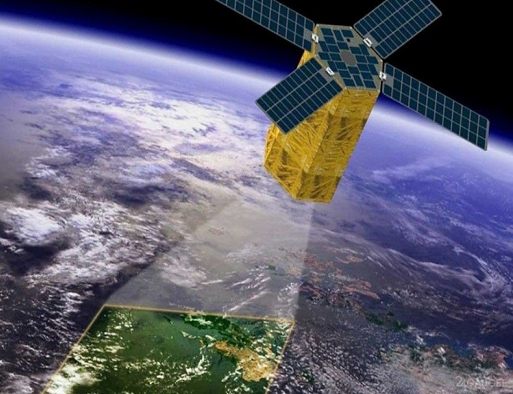

Просто картинка в "тему". Оригинал изображения - https://s30515889574.mirtesen.ru/blog/43100207301/Roskosmos-vyipustit-prilozhenie-dlya-zakaza-snimkov-s-orbityi?utm_referrer=mirtesen.ru

**Введение**: рассмотрим процесс загрузки в чертёж в проектных координатах рельефа на данную местность из общедоступных источников о рельефе (SRTM/ASTER GDEM и пр.) без использования постороннего ПО. В связи с развитостью космической отрасли и наличия средств обработки данных (космическая фотограмметрия) подобные данные о рельефе Земли с низким разрешением являются открытыми и доступными для загрузки - что мы и рассмотрим в данной статье.

**Примечание**: сразу оговорим, что подобный "рельеф" **не является достоверным** для местности и высотные погрешности могут составлять до **5-10** метров в равнинной части и до **сотен** метров в горных районах. Тем не менее, подобный источник данных помогает **примерно оценить** характер рельефа и принять некие предпроектные решения до этапа готовности нормальной съемки.

**Где это может быть полезно**: на предпроектной стадии (до этапа готовности данных изысканий) и в образовательных историях - для выполнения курсовых/дипломных работ [собственно говоря, статья и пишется под задачу показать студенту, как это делать].

### Как это делать автоматизированно?

На самом деле, вариантов делать это с применением ПО гораздо быстрее, к примеру возьмём Autodesk InfraWorks ([один из уроков](https://www.youtube.com/watch?v=eHzxy9b7-tg&list=PLumJSTLBKdHWpn3zzjA2pGUiRvaLqpajT&index=3) моего курса) или QGIS (также [тут ролик](https://www.youtube.com/watch?v=i1FS2mkpkWc&list=PLumJSTLBKdHXkB-7yvOX-qqhxXaiA8j_m&index=9) из другого небольшого курса). Похожую задачу решает пакет DynaMaps (на базе Autodesk Dynamo) и т.д.

Мы же перейдем к технической части - демонстрации упомянутого процесса:

### Часть 1 - подготовка чертежа/модели

На данном этапе необходимо предварительно обозначить границы района, рельеф для которого надо будет загрузить, а также подготовить рабочее пространство чертежа/программы для последующих действий.

Предполагаем, что моделирование выполняется в **общих координатах**, поэтому пользователю необходимо убедиться, что у него установлен [пакет отечественных систем координат](https://github.com/GeorgGrebenyuk/MSK_for-Autodesk-Civil-3D), см. моей предыдущей статьи.

Далее мы открываем новый чертеж в Civil 3D и присваиваем ему систему координат для района проектирования. В нашем примере - это Самарская область (МСК 63 Зона 1).

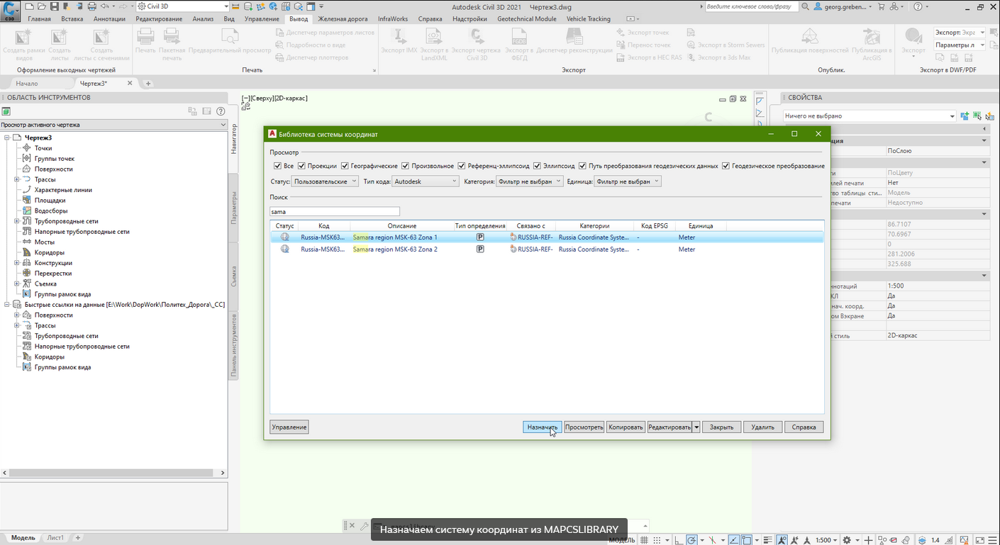

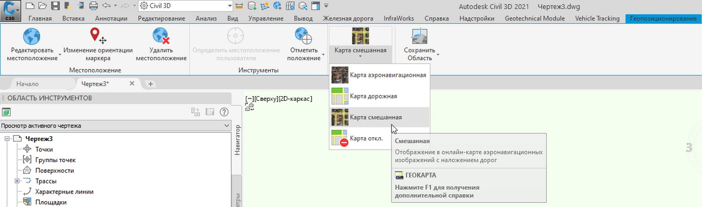

Далее из вкладки "Геопозиционирование" включаем Смешанные карты

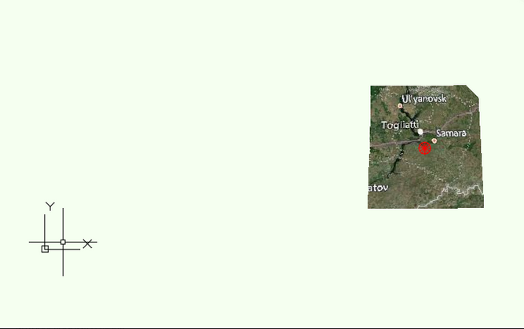

Отдаляем экран, пока не увидим красный маркер - и далее приближаемся обратно - примерно к интересуемому району

В связи с устаревшей подложкой (Bing-карты, не обновляемые с 2010х годов), явно попасть в нужный район сложно - поэтому [при отсутствии каких-либо чертежей в проектных координатах] идём в те же Яндекс-Карты и смотрим, какие населенные пункты лежат поблизости от интересуемого района:

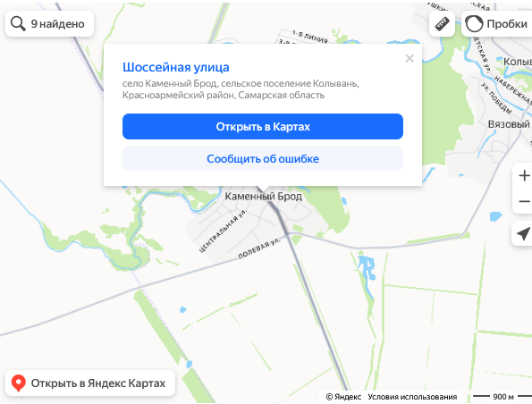

Ниже скрин "дороги" в пределах которой необходимо получить рельеф местности

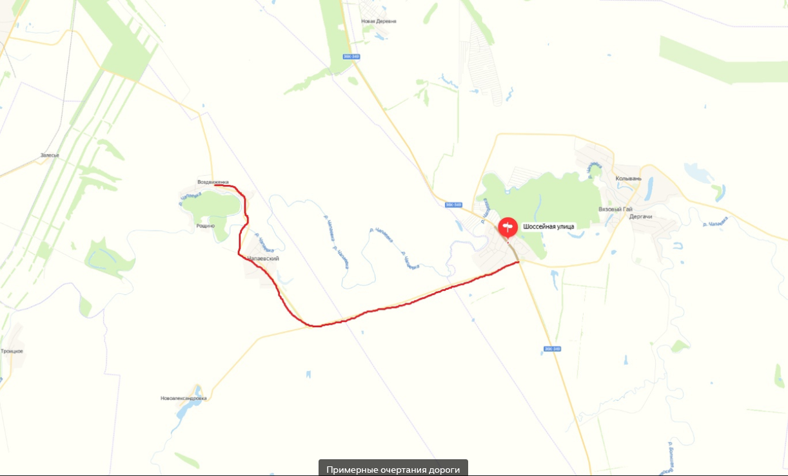

Выпишем опорные координаты одного из населенных пунктов (или обоих, если по одному не получится по карте понять расположение остальных). В моем случае - это 52.894532, 49.968213 (село Каменный Брод, Красноармейский район, Самарская область, Россия).

Перейдем в Civil 3D и из вкладки "Геопозиционирование" запустим следующую опцию:

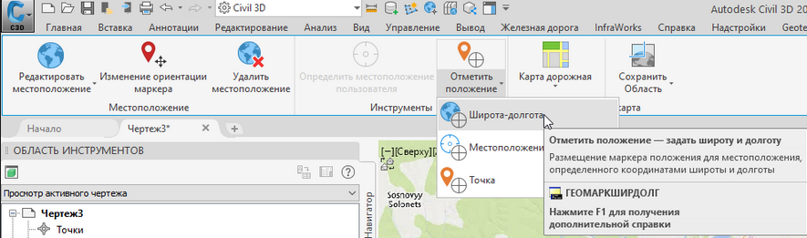

Запускаем опцию по простановке метки для введенных координат

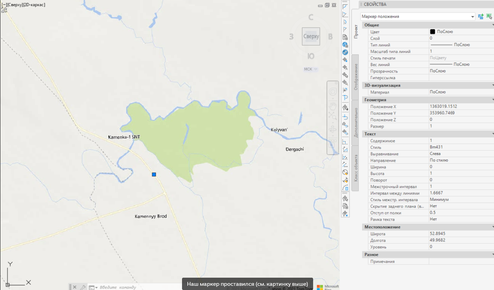

Если данных не хватает, делаем операцию выше ещё раз (простановку метки точки по широте\долготе) - и по итогу обводим контур местности, для которого мы хотим получить рельеф:

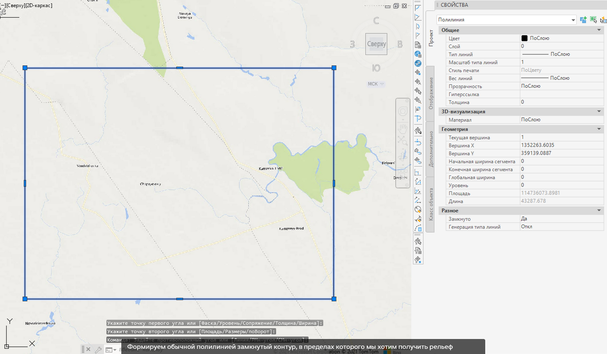

Формируем обычной полилинией замкнутый контур, в пределах которого мы хотим получить рельеф впоследствии

### 

### Часть 2 - загрузка местности с модели DEM 3''

Сервис USGS ([ссылка](https://earthexplorer.usgs.gov)) является актуальным источником информации в том числе о рельефе местности по земному шару.

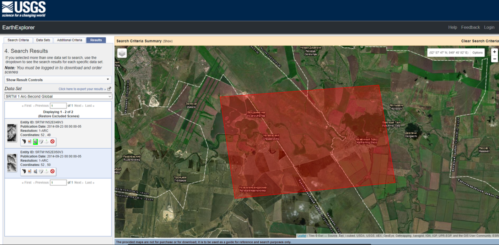

Доступные данные для загрузки рельефа через сайт USGS (требуется регистрация для загрузки)

После регистрации/авторизации выбираем интересуемый полигон местности и нажимаем на кнопку загрузки данных:

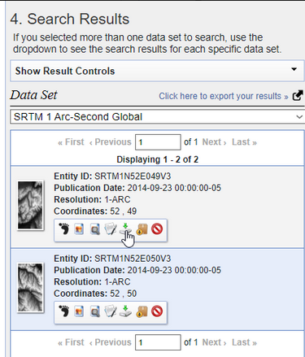

Выводим меню загрузки

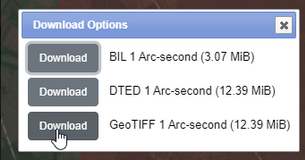

Выбираем последний пункт

И теперь можно сразу переходить к части 3 (далее рассмотрен другой случай, не через данный сайт).

Ввиду того, что по USGS записано много материала, мы с вами рассмотрим альтернативный вариант действий, тем более что работа с итоговыми файлами будет строиться примерно одинаково.

Одним из альтернативных вариантов получения моделей местности, в отличие от варианта с USGS, что мы пробовали выше, является модели DEM. В данном случае, обратимся к [данному сайту](http://www.viewfinderpanoramas.org) и с него перейдем на [следующий](http://viewfinderpanoramas.org/Coverage%20map%20viewfinderpanoramas_org3.htm).

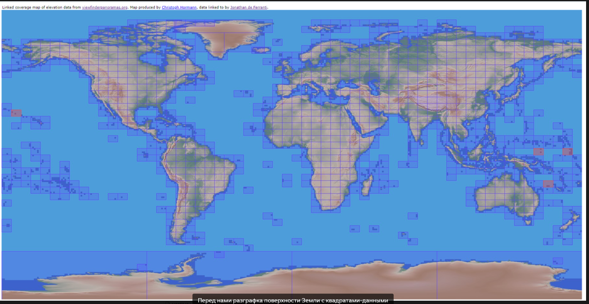

Альтернативная версия этого же представлена [тут](http://www.imagico.de/map/demsearch.php) (и выбор квадрата более осмысленный). В общем, выбираем один из квадратов, и загружаем данные по ним. Это будет обычный ZIP-архив, который после распаковки будет выглядеть следующим образом:

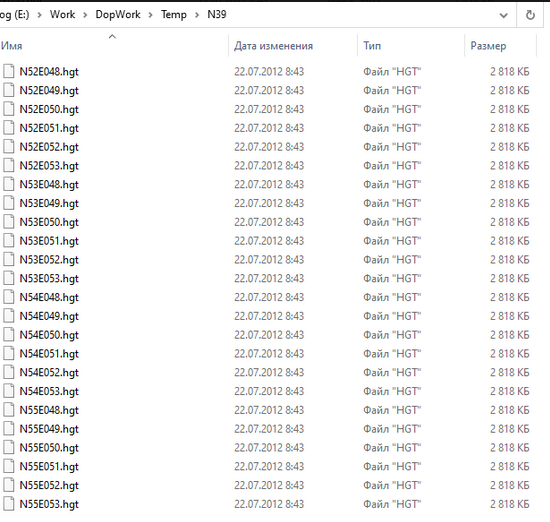

Вид распакованного архива

Вспомним координаты нашего населенного пункта - 52.896900, 49.955176. Если округлять до целых - это район квадрата 52 СШ и 49 ВД. Следовательно - это файл N52E049.hgt. То есть квадрат местности мы уже как минимум выбрали верный 😉.

Перед тем как грузить данные в Civil 3D, их сперва надо преобразовать в форматы данных, воспринимаемые Civil 3D.

Для этой цели рассмотрим небольшое open-source приложение VTBuilder (чтобы не качать большой QGIS), скачать которое можно по [этой](http://vterrain.org/dist/VTBuilder_130614.exe) ссылке с [данного сайта](http://vterrain.org/Doc/VTBuilder/overview.html).

Примечание: я намеренно не рассматриваю онлайн-конвертеры по причине их возможной "корявости" перевода данных

По умолчанию оно инсталлируется по следующему пути:

> C:\Program Files (x86)\VTP\Apps

Оттуда запускаем само приложение "VTBuilder.exe". Оно может ругаться на отсутствующие файлы систем координат PROJ, нажимаем ОК и продолжаем.

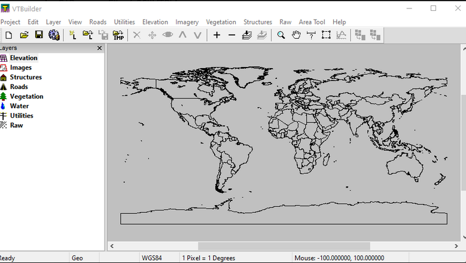

Вид приложения после запуска

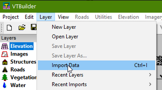

Выбираем с вами вкладку Layer и выбираем опцию Import Data:

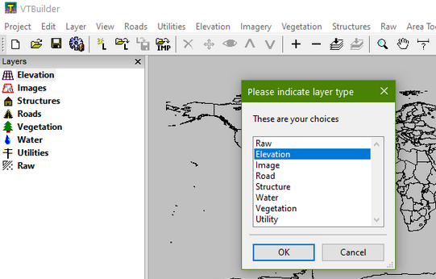

Тип данных указываем "Elevation" и нажимаем ОК

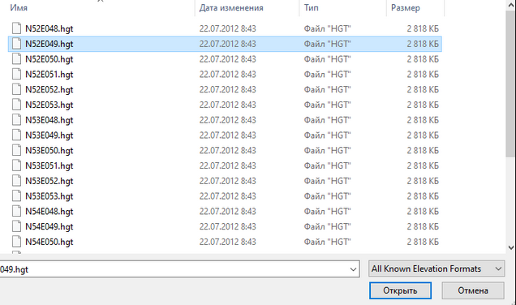

Указываем интересуемый "квадрат" местности и нажимаем ОК

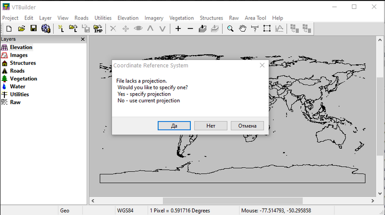

Выскочит уведомление, что файлу не задана система координат. Нажмём на No

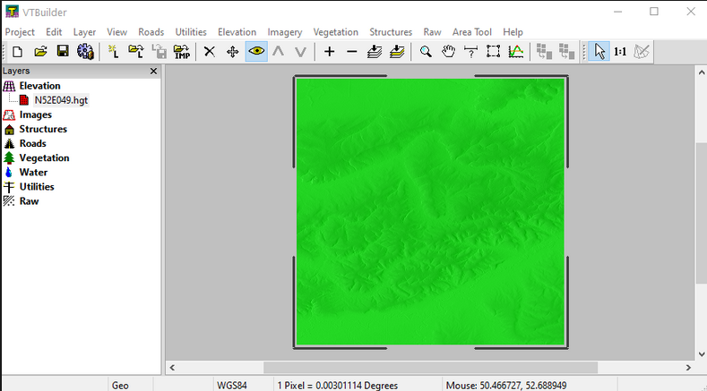

Вид загруженного файла

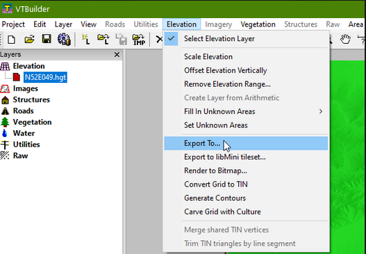

Выбираем опцию экспорта

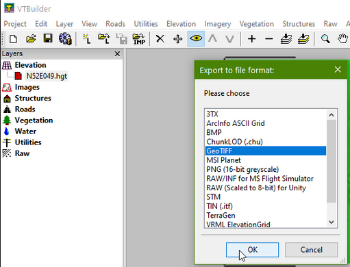

...в формат GeoTIFF и нажимаем ОК, выбираем место сохранения и выходим

### Часть 3 - загрузка данных в Civil 3D

И в случае с загрузкой данных через USGS, и в случае с DEM 3'' у нас на руках есть файлы GeoTIFF в географической системе координат EPSG:4326 (LL-84) разрешением 1х1 градус, которые нам с вами надо загрузить в Civil 3D и обрезать по границе нашего контура.

Логика работы с файлами будет строиться следующим образом:

1. Создаем пустой чертеж Civil 3D и назначаем ему систему координат EPSG:4326

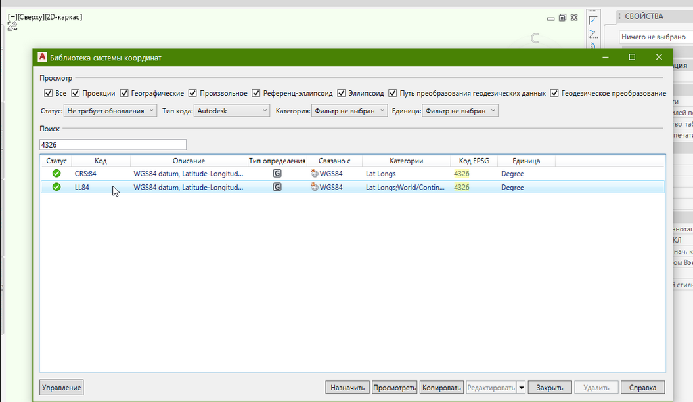

Назначаем пустому чертежу географическую систему координат LL-84

2. Переходим в Область инструментов и создаем новую поверхность на основе файла DEM:

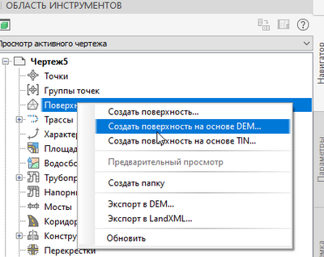

Нажимаем на данную опцию

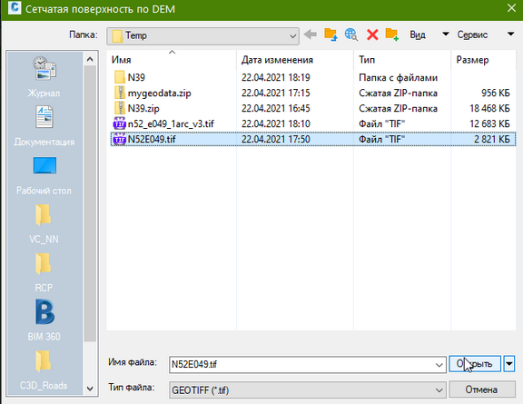

Выбираем файл

Примечание: элемент выше [n52_e049_1arc_v3.tif] - это данные что я получил с сайта USGS (размер больше почти в 5 раз) за счет точности данных в 1'' [угловую секунды] в отличие от 3'' файла DEM. Тем не менее иногда файлы DEM где-то лучше.

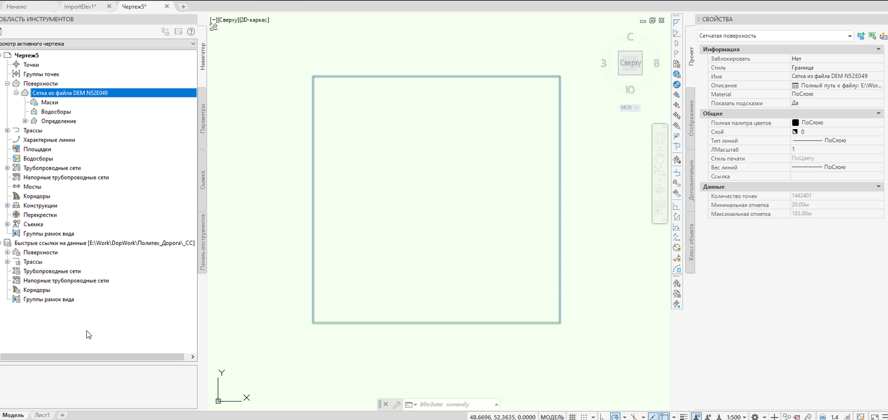

Данные вставились (в единицах градусов)

Следующий пункт можно обойти, но лучше обрезку данных сделать на данном этапе (чтобы не мучиться с потерей производительности далее)

3. Возвращаемся в наш чертеж с контуром местности, для которого надо получить рельеф, выбираем этот контур в формате замкнутой полилинии и активируем опцию mapexport [чертежу при этом **обязательно должна быть назначена система координат**].

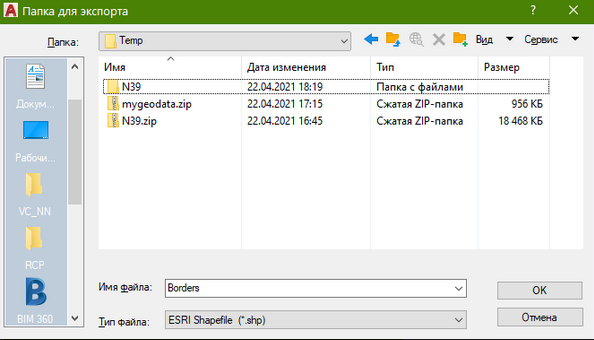

Первым действием выбираем папку для сохранения файла - и нажимаем на ОК

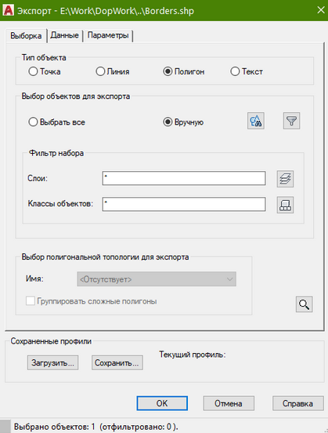

Тип объекта ставим "Полигон", параметры выбора Вручную - и выбираем этот контур (если он еще не был выбран)

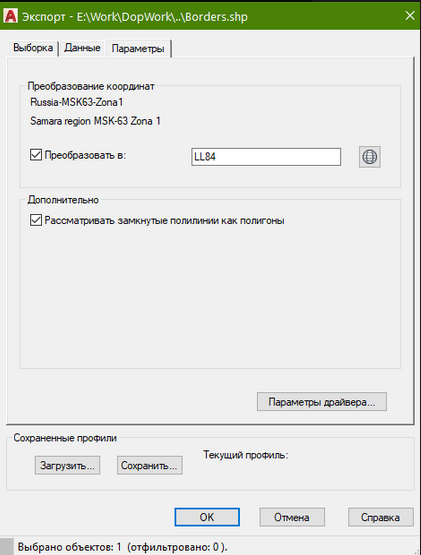

На третьей вкладке ставим опцию "Преобразовать в LL84" и "Рассматривать замкнутые полилинии как полигоны"

После простановки настроек экспорта SHP-файла нажимаем на ОК и переходим обратно в чертеж со вставленным файлом GEOTIFF.

4. Командой MAPIMPORT импортируем этот SHP-файл

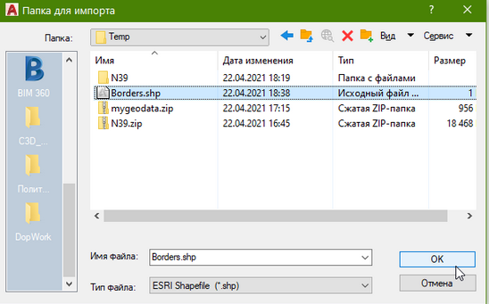

Выбираем сформированный файл

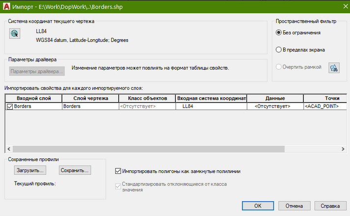

Включаем галочку "Импортировать полигоны как замкнутые полилинии и нажимаем на ОК

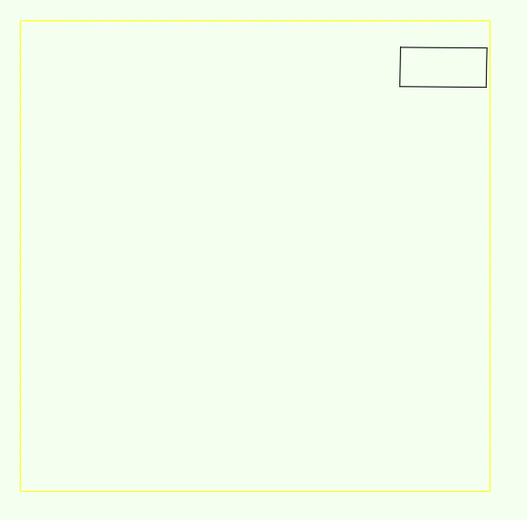

Вот вставляется наш полигон в масштабе зоны

Далее необходимо добавить границы к данной поверхности. Раскрываем её Определение и вызываем диалоговое окно Границы:

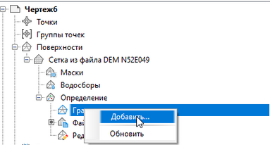

Открываем окно Границ

Здесь, ничего не меняя, нажимаем на ОК:

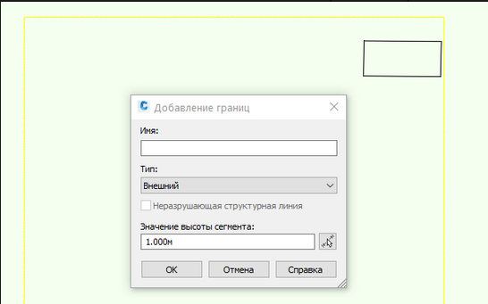

ОК

Далее ЛКМ щёлкаем на контур и поверхность обрезается до нашего контура:

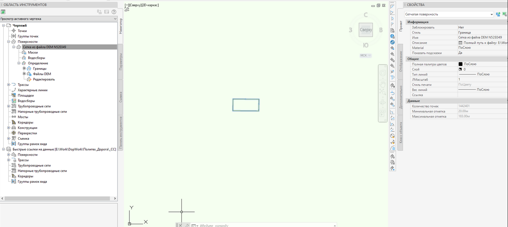

Поверхность обрезалась

Сохраним чертёж в таком виде.

5. Редактируем стиль поверхности, включая отображение точек:

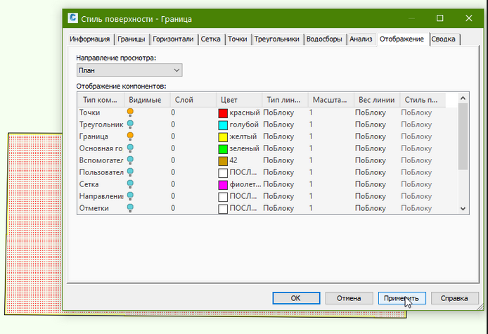

Включаем отображение точек

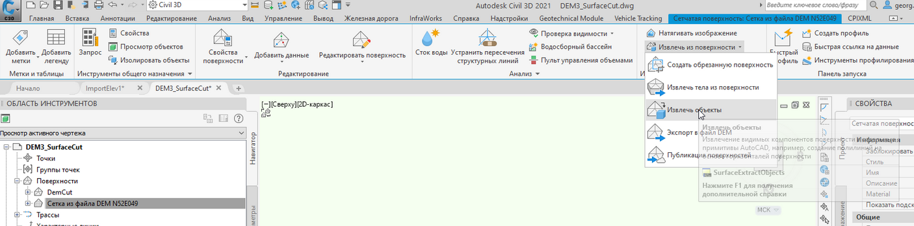

Извлекаем точки из поверхности

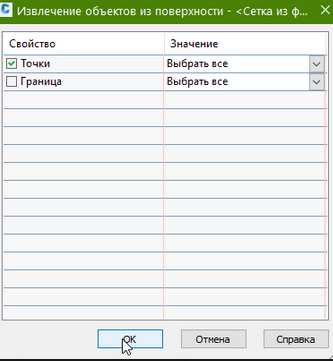

ОК

6. Активируем команду MAPEXPORT, выбираем место сохранения файла:

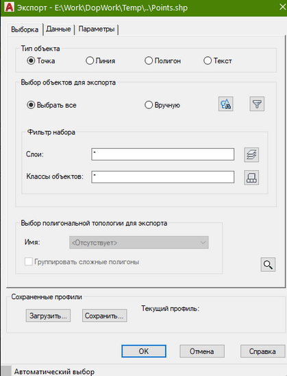

Тип указываем "Точка", опцию "Выбрать все"

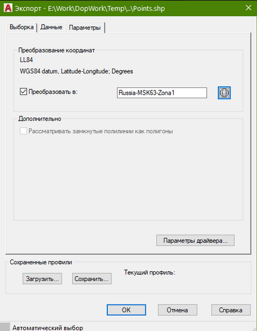

Ставим активный параметр "Преобразовать в:" и выбираем нажатием на глобус нашу СК для района работ

6. Заходим в наш начальный чертёж и активируем команду MAPIMPORT, выбираем данный SHP-файл и импортируем с настройками по умолчанию

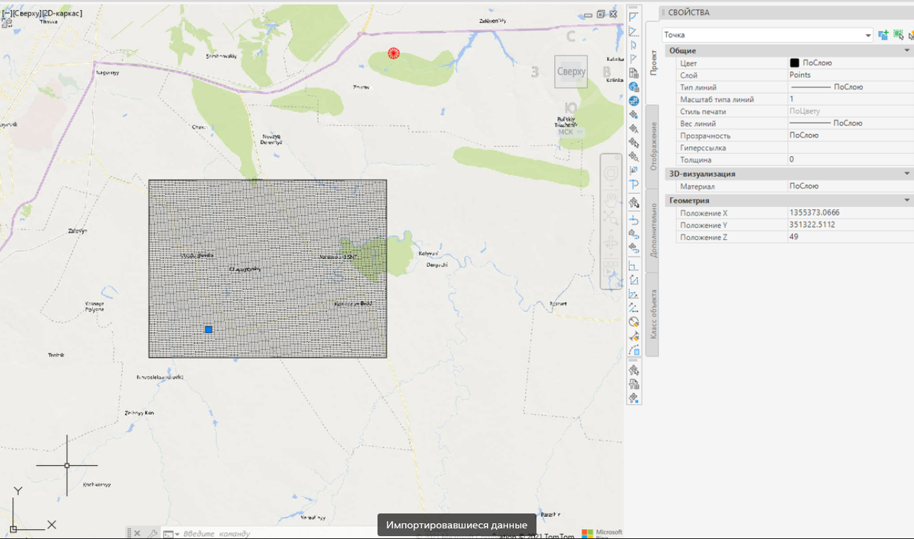

Импортировавшиеся данные

7. Создаем на основе точек поверхность

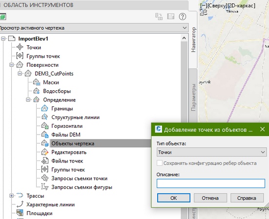

Поверхность - Определение - Объекты чертежа - Точки

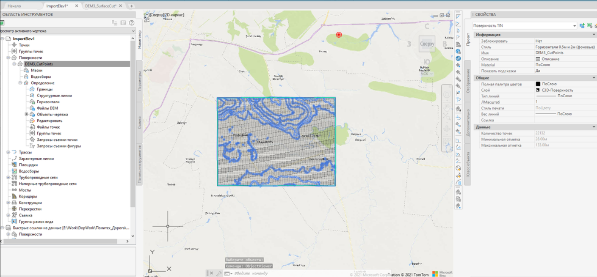

Получаем итоговую поверхность

## Это всё?

Уфффф, скажете вы. Неужели всё? Да. Это всё - поверхность создана, можете с ней работать/передавать в иное ПО через тот-же формат LandXML (к примеру, в Топоматик Робур, инструкция приведена [здесь](http://help.topomatic.ru/current/doku.php?id=road:work_with_cmm:create_and_edit_surface:import_surface_land_xml_format:start)):

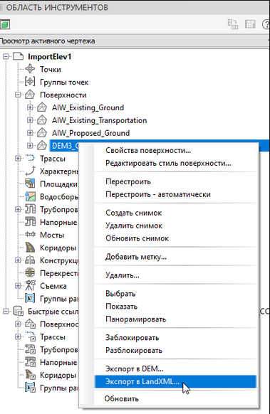

Экспорт поверхности в формат LandXML для использования в другом ПО (при необходимости)

Описанные выше действия были "классические", сугубо ручные без использования постороннего ПО, которое бы загрузило данные с меньшим числом шагов.

## Тоже самое, но средствами InfraWorks

> Не стоит беспокоиться, повествование много времени не займет.

Запускаем Autodesk InfraWorks и сразу переходим в Конструктор модели:

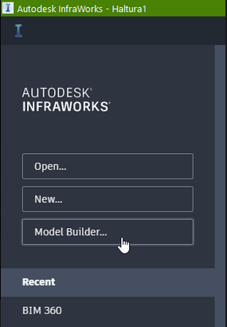

Запускаем Конструктор модели (он же Model Builder)

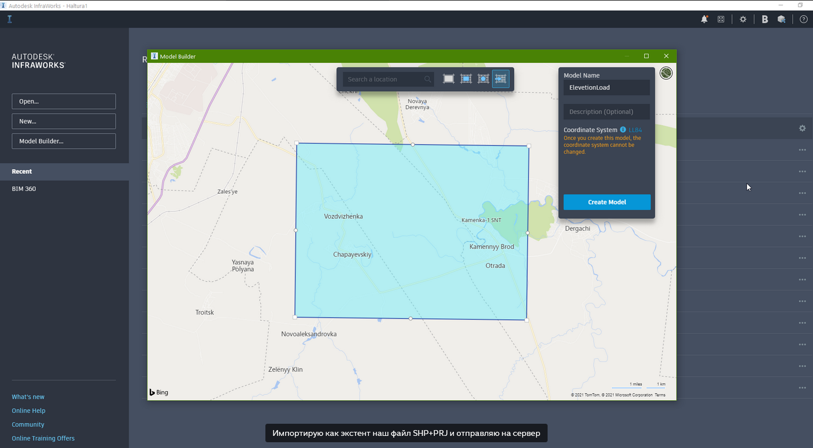

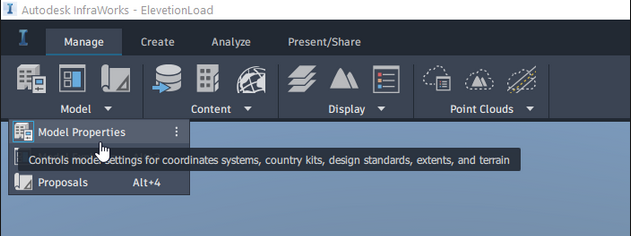

В открытой (после загрузки) модели заходим в Свойства

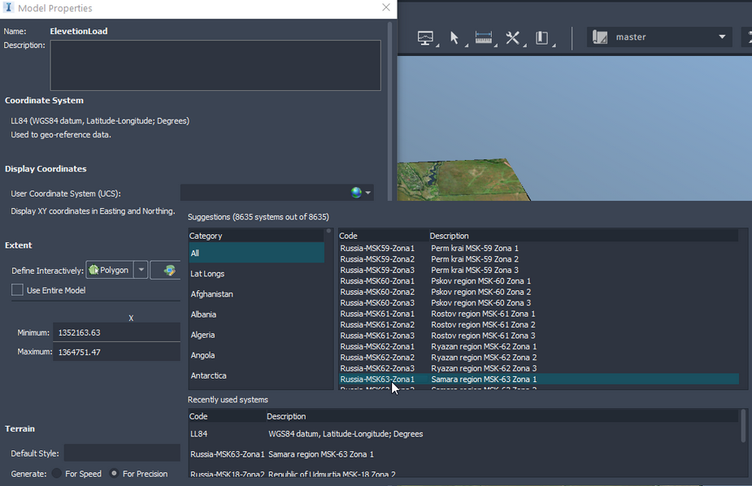

Меняем систему координат на СК нашего проекта (МСК 63 Зону 1)

Полученную модель выгружаем как IMX файл в координатах нашего проекта

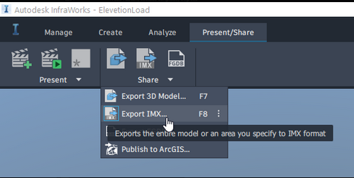

Активируем опцию экспорта в формат IMX

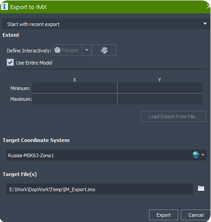

Экспортируя, ставим опцию "использовать модель целиком" - Use Entire Model и целевую СК

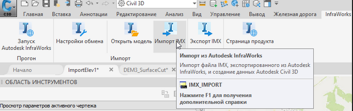

Импортируем данный файл

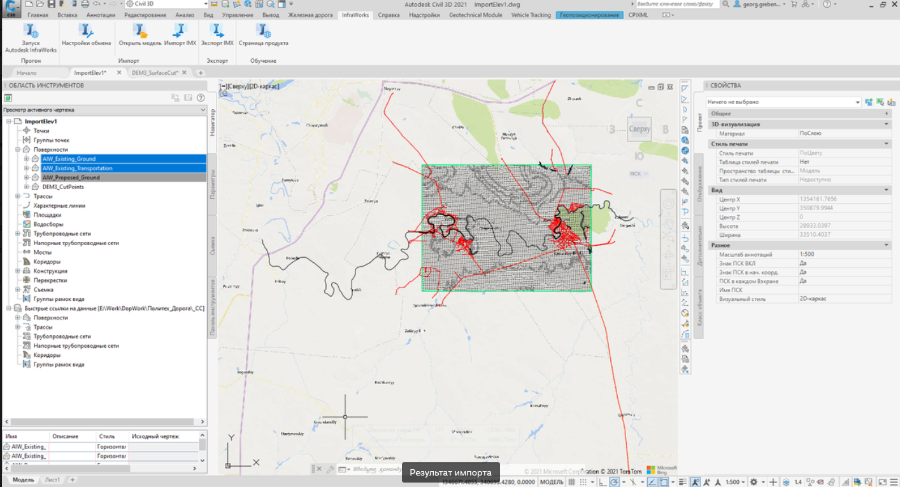

Результат импорта

**Примечание**: при импорте через IMX-файл у нас также импортируются трассы и другие поверхности, ненужное можно потом удалить.

Как видите - через InfraWorks идёт на порядок быстрее, но рассмотреть "ручной" способ мы были обязаны для понимания "логики процесса". 

## Заканчиваем статью

Итак, в данной статье мы рассмотрели с вами ручной способ загрузки информации о рельефе местности (результат обработки спутниковых снимков), доступных почти на всю территорию планеты и лежащих в открытом доступе с разной степенью точности.

**Примечание**: есть ряд сервисов и организаций, которые оказывают услуги по спутниковой съемке территорий с более высоким разрешением на коммерческой основе. К слову, просто рельефом сейчас уже не ограничиваются, и есть сервисы которые восстанавливают целые города по снимкам, формирую грубоватые (с точностью нескольких метров) 3D-модели зданий (пока, правда, на демо-режиме, так как технологии ещё обкатываются).

В завершающей же части статьи мы кратко показали, как эту же операцию сделать средствами Autodesk InfraWorks.

Также не лишним будет еще раз восстановить цепочку пути преобразования данных:

1. Определение экстента/границ местности, для которого необходимо получить рельеф

2. Получение географических координат данного экстента (фактически, переход от плоских прямоугольных координат к географическим EPSG:4326, в которых по большей части весь геопространственный фонд и хранится). То есть, необходимы **верные параметры систем координат**.

3. Загрузка из "фонда" участка рельефа на территорию, ограниченную [как правило] 1 градусом широты и 1 градусом долготы (или обрезка данных сразу на сервере по экстенту, если сервер это позволяет)

4. Обрезка загруженных данных по экстенту (например, с помощью библиотеки GDAL)

5. Возврат пользователю обрезанных данных - например, триангуляции/точек/горизонталей, которые он уже добавляет в состав поверхности (вручную, или также автоматизировано)

Примерно по такой схеме (выше) и работают программы, которые делают это вместо пользователя.

На этом моменте завершаем текущую статью, где действия опирались на настроенные параметры систем координат (о чем мы начали говорить в и серии статей по работе с системами координат в инфраструктуре продуктов Autodesk).
