# Погружаемся в системы координат. Часть 3 - нестандартные виды определений СК

*23 апреля 2021*

> Это архивная статья. Оригинал https://dzen.ru/a/YIKKKJNkXS0yCcT-

**Введение**: данная статья является третьей в серии статей по использованию систем координат (СК, далее) в инфраструктуре продуктов Autodesk. фундаментальная была посвящена вопросу состава библиотеки, взаимодействия элементов внутри неё друг с другом; - наполнению библиотеки пользовательскими определениями, отталкиваясь от наличия полного определения СК. Здесь, в третьей части, мы рассмотрим способы задания определения системы координат в том случае, если её определение имеет нестандартный тип, либо есть лишь набор опорных точек в этой неизвестной СК и какой-то известной; и на базе данных двух случаев последовательно рассмотрим варианты конформного и аффинного преобразований).

Ниже ссылки на предыдущие части:

1. [Часть 1 - как всё начиналось](./article_16042021.md)

2. [Часть 2 - ручное внесение в библиотеку информации о СК](./atricle_17042021.md)

Другие версии статей из серии:

1. [Часть 4 - автоматизация формирования библиотеки СК](./article_24042021.md)

2. [Часть 5 - стандартные инструменты пересчета координат](./article_27042021.md)

3. [Часть 6 - автоматизация пересчета координат](./article_01052021.md)

## Случай №1 - система координат задана нестандартного типа

**Отступление**: что мы имеем в виду под "нестандартного типа"? Как правило, это категории местных систем координат на населенный пункт/предприятие, в определении которых присутствует, например, функция угла поворота на некоторый угол - то есть несистемные параметры, какие не характерны для стандартных типов проекций.

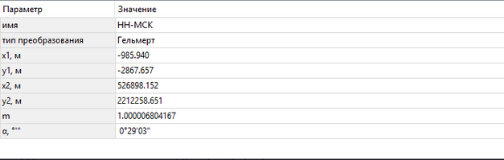

Пример местной системы координат для г. Нижний Новгород (неофициальный вариант)

Здесь определение городской системы координат завязано на региональной МСК-52 Зона 2, и в качестве параметров определения используются угол поворота. Тогда, имея набор координат вида X[₅](https://unicode-table.com/ru/2085/)[₂](https://unicode-table.com/ru/2082/) и Y[₅](https://unicode-table.com/ru/2085/)[₂](https://unicode-table.com/ru/2082/) можно перейти к городским координатам Xнн и Yнн по следующим формулам:

> Xнн = x[₁](https://unicode-table.com/ru/2081/)+1/m*cos(-a)*(X[₅](https://unicode-table.com/ru/2085/)[₂](https://unicode-table.com/ru/2082/)-x[₂](https://unicode-table.com/ru/2082/))-1/m*sin(-a)*(Y[₅](https://unicode-table.com/ru/2085/)[₂](https://unicode-table.com/ru/2082/)-y[₂](https://unicode-table.com/ru/2082/));
> 
> Yнн = y[₁](https://unicode-table.com/ru/2081/)+1/m*sin(-a)*(X[₅](https://unicode-table.com/ru/2085/)[₂](https://unicode-table.com/ru/2082/)-x[₂](https://unicode-table.com/ru/2082/))+1/m*cos(-a)*(Y[₅](https://unicode-table.com/ru/2085/)[₂](https://unicode-table.com/ru/2082/)-y[₂](https://unicode-table.com/ru/2082/));

Примечание: вариант с углом поворота является наиболее употребимым для нестандартных типов проекций. Для других вариантов ищите свои пути преобразований. В качестве вспомогательного ресурса (для нахождения эмпирических/научных формул) рекомендую [данный форум](https://geodesist.ru).

Заносим формулы в Excel-таблицу [использование программирования для столь простых формул не обосновано в контексте данной статьи] и переходим к следующему Случаю (в рамках которого объединим дальнейшие действия).

## Случай №2 - система координат задана набором точек

Несмотря на то, что мы оборвали предыдущий "случай", рассмотрим вариант, когда у нас имеется ряд пунктов/точек, координаты которых известны в обеих системах (некой неизвестной СК и некой известной [чьи параметры являются "классическими"]).

В этом случае, мы должны ограничить область местности, для которой хотим получить действующую систему координат путём выборки ряда точек из этого набора или пересчета в неизвестную СК этого же ряда точек используя формулы из Случая №1.

### Подготавливаем данные

Открываем Civil 3D и назначаем пустому чертежу систему координат, которая является известной [смотря по исходным данным] - в нашем случае, это МСК-52 Зона 2.

Далее приближаемся к интересуемому району, на который надо получить действующую систему координат и начинаем рисовать ~~пентаграммы~~ контуры треугольниками, на вершинах которых определяем точки в неизвестной СК.

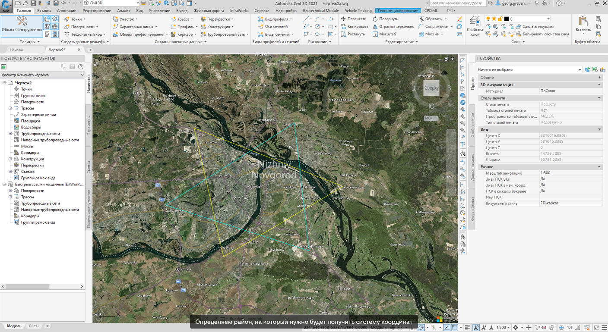

Определяем район, на который нужно будет получить систему координат

**Примечание**: в случае, если есть только ряд точек - необходимо сделать из них фигуру так, чтобы во внутреннюю зону попадало наибольшее число площади зоны.

Итак, собираем набор точек, в данном случае, по вершинам треугольников для последующей работы с ними:

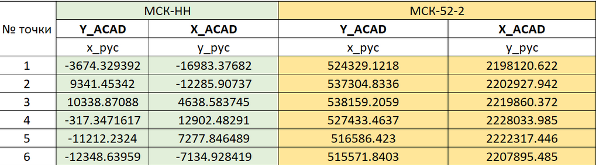

Таблица с данными

Увы, так как Дзен не располагает элементарными средствами разметки текста - таблицы придется делать скриншотами с Excel :(

Для удобства, все исходные и промежуточные данные я приведу на [данной странице](https://inj9.gitbook.io/msk-for-civil-3d/6.-prochie-chastnye-keisy/page1).

Обратим внимание на таблицу выше. Жёлтые ячейки, это координаты вершин наших треугольников, а зеленые - их пересчитанные значения. Нагляднее нумерацию точек можно отследить по картинке ниже:

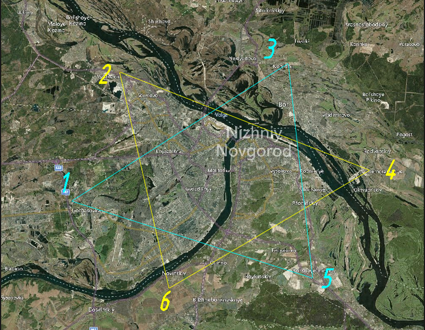

Схема нумерации точек

**Важное примечание**: в силу того, что отечественная геодезия подразумевает ориентацию осей X вверх, а Y вправо (в мировой практике, наоборот), мы делаем перепопределение данных, считая что X_рус = Y_acad; Y_рус = X_acad (в таблице видны эти поправки). В дальнейшем **всегда** стоит иметь в виду это допущение при работе с отечественным ПО и зарубежным ПО.

А теперь, имя набор точек, перейдем к теме статьи - обзору двух вариантов задания определения новой СК и начнем с аффинного преобразования:

## Аффинное преобразование для системы координат

Аффинное (или аффинново) преобразование являеется одним из способов описания проекции системы координат на локальную территорию, имея в наличии координаты в некоторой известной системе координат. Среди базовых типов проекций, имеющихся в библиотеке систем координат Autodesk [и в целом, OsGeo.MapGuide] это 2 типа проекций "Поперечная Меркатора с последующей аффинновой обработкой" и "Коническая равноугольная Ламберта с последующей аффинновой обработкой". Нас с вами будет интересовать, конечно первый тип.

### Выполняем численный расчет

Вычислять данное преобразование можно как в Excel, так и в специализированном ПО/среде программирования. Ввиду наличия у меня шаблона в Excel, мы это сделаем там [но в следующих версиях своего пакета Dynamo.MapConnection я постараюсь добавить эти действия и туда].

Теоретические основы описаны кратко [тут](https://inj9.gitbook.io/msk-for-civil-3d/4.-sozdanie-novykh-sk/untitled-1), и оттуда же есть отсылка к оригинальному материалу. Опустим теорию и перейдем к практике.

Обратимся к файлу "НН_ПараметрыСК.xlsx" и скопируем в буфер обмена нижнюю таблицу (там мы разместили на строках 1-3 координаты первого треугольника, а на строках 4-6 -- координаты второго треугольника).

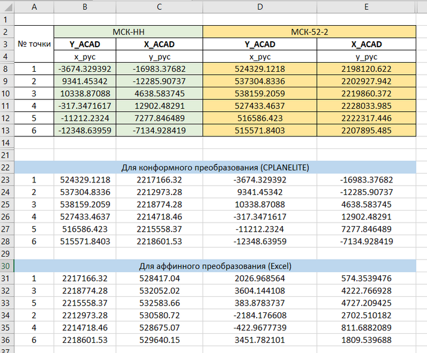

Это наши подготовленные исходные данные.

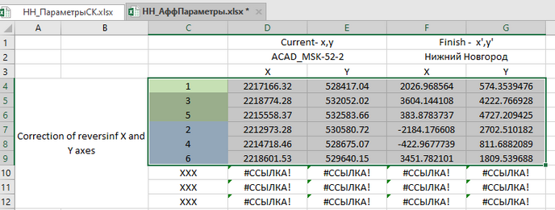

Вставляем их сюда в файл "НН_АффПараметры.xlsx"

Опускаем путь численного преобразования данных, и сразу переходим к *осредненным параметрам преобразования* для случая двух треугольников:

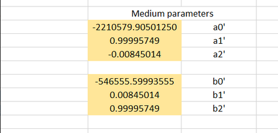

Результат расчета (осредненный)

Так как исходных треугольников было 2 - мы осреднили полученные результаты делением на 2 ("зеленый" и "голубой" расчеты). Так как для аффинного преобразования нужна тройка координат. В шаблон заложен третий треугольник - можно пользоваться и им, но должно хватит и двух.

### Вносим параметры СК в библиотеку

Переходим теперь к Civil 3D (Map 3D) и вносим определение рассчитанной системы координат в библиотеку СК.

1. Запускаем библиотеку командой MAPCSLIBRARY, находим в списке родительскую СК (ту, относительно которой мы находили значения координат для нашей неизвестной СК) и копируем её [во многом, чтобы не повторять действия по выбору референц-эллипсоида, экстента карты, категории]:

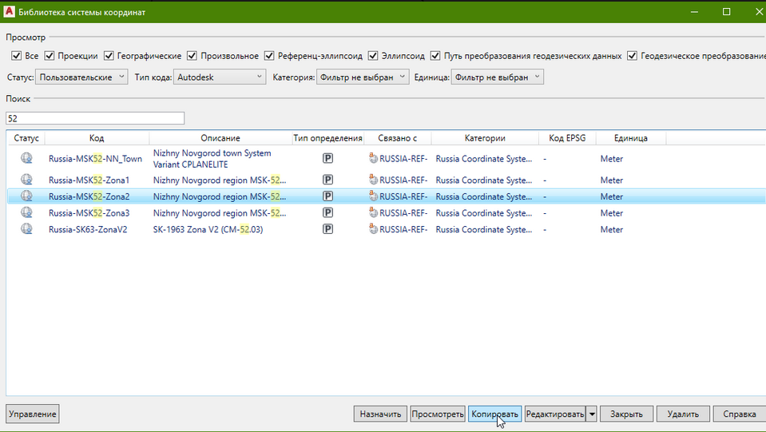

Копируем текущее определение СК

2. После копирования, переходим в её Редактирование:

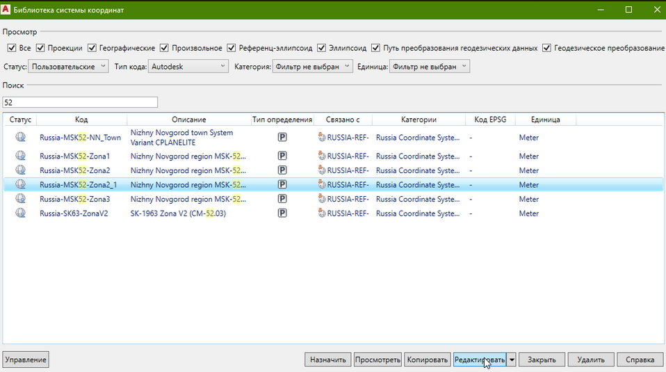

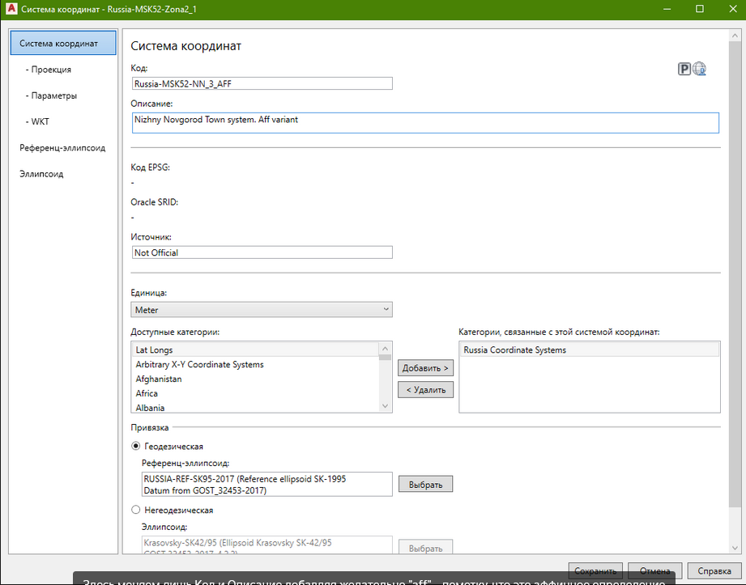

Здесь меняем лишь Код и Описание добавляя желательно "aff" - пометку, что это аффинное определение

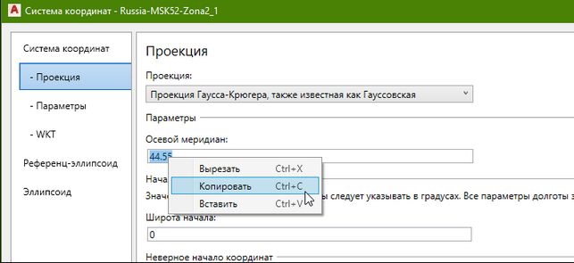

В параметрах Проекции копируем в буфер обмена/запоминаем значение осевого меридиана для данной СК

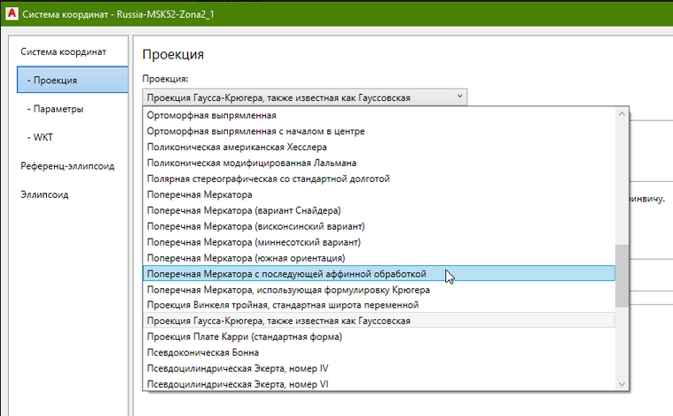

В параметрах Проекции ищем тип "Поперечная Меркатора с последующей аффинновой обработкой" и нажимаем на него ЛКМ

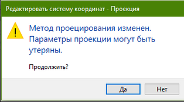

Продолжаем "Да"

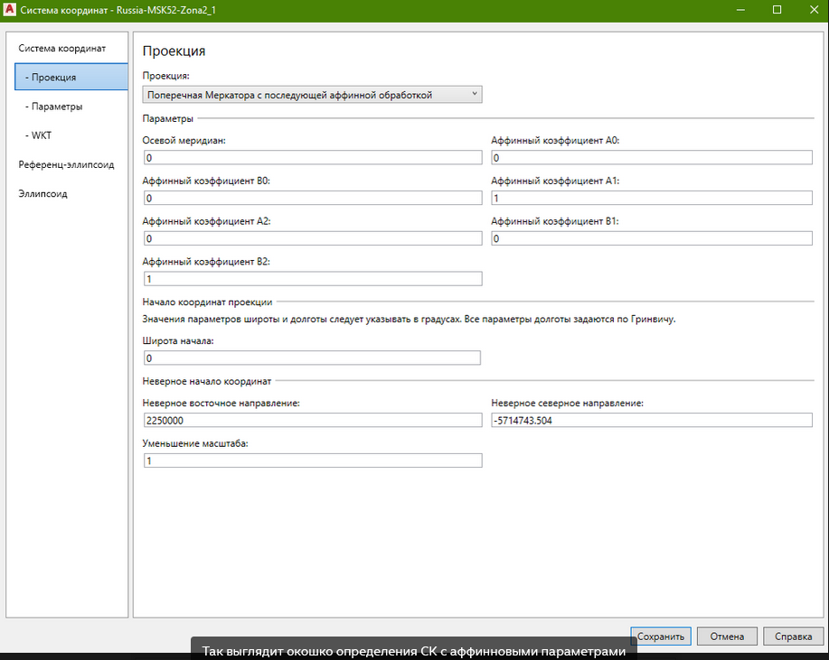

Копируем обратно из буфера обмена значение осевого меридиана. Далее согласно нашей таблицы Excel заполняем параметры А0, А1, А2, В0, В1, В2:

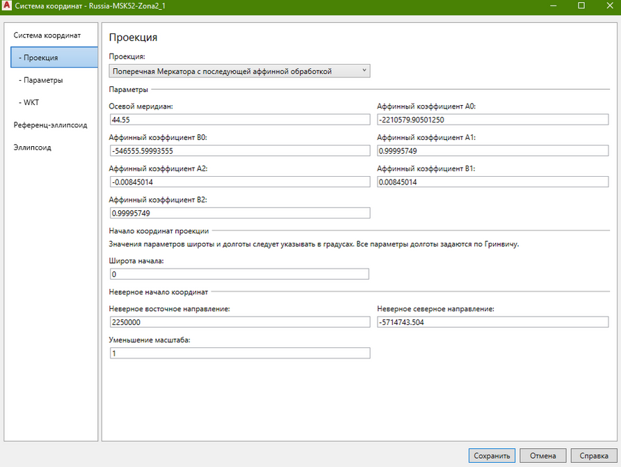

Параметры заполнены!

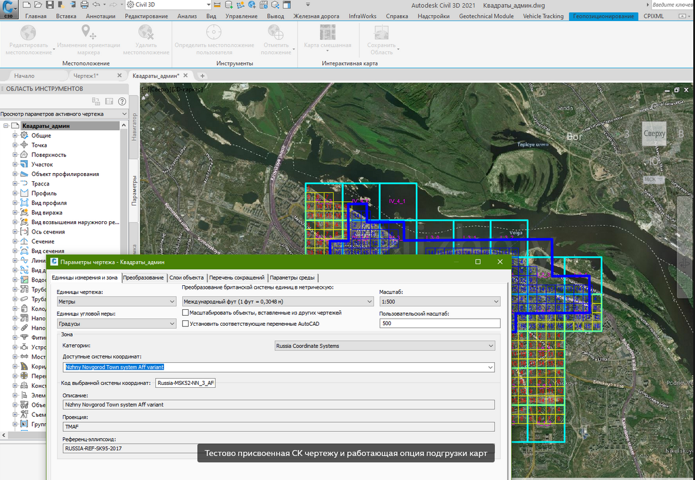

Тестово присвоенная СК чертежу и работающая опция подгрузки карт

Всё. Нажимаем "сохранить", перезагружаем программу (на всякий случай) и теперь можем назначать данную СК нашему чертежу с данными в этой новой СК и выполнять с ним транзакции (к примеру, перевод данных из региональной МСК52-2 в городскую) - эти действия подробно описаны [тут](https://app.gitbook.com/@inj9/s/msk-for-civil-3d/~/drafts/-MYzcJZJpSH0wRPczgdj/untitled) текстово и не думаю, что нуждаются в отдельной демонстрации.

### Немного об использовании данного преобразования

Несмотря на то, что данный способ рабочий, и позволяет получить параметры-описание для СК, аффинновыми преобразованиями **не рекомендуется** пользоваться, так как в аффинной геометрии [в отличие от евклидовой геометрии] используются не-единичные масштабы по декартовым осям, вследствие чего искажаются размеры элементов особенно за пределами нашей "условной" зоны, принятой в окрестностях "опорных треугольников", что недопустимо для BIM-моделирования (фактически, мы закладываем "бомбу" под наш дальнейший проект). Справедливости ради, для порчи геометрии вследствие влияния аффинного преобразования мы должны далеко отойти от нашей зоны, но всё же рекомендуется использовать конформное преобразование, к которому мы переходим далее.

Также аффинное преобразование описывается иными праметрами, что в контексте взаимодействия с ними в рамках библиотеки координат или скриптов будет обусловлено отдельными трудозатратами.

## Конформное преобразование

### Выполняем численный расчет

> Здесь автор деликатно опустит момент "минутки просвещения" и сразу перейдет к программной реализации, так как данные знания лежат за пределами его представлений о миросоздании.

Программная реализация, выполняющая переход к проекции типа "Поперечная Меркатора" на базе точек в двух системах координат находится [здесь](https://geodesist.ru/resources/cplanelite-programma-pereschjota-koordinat-po-obschim-tochkam.147/).

Переходим к расчету параметров неизвестной [городской] СК, отталкиваясь от набора исходных данных в нашей таблице:

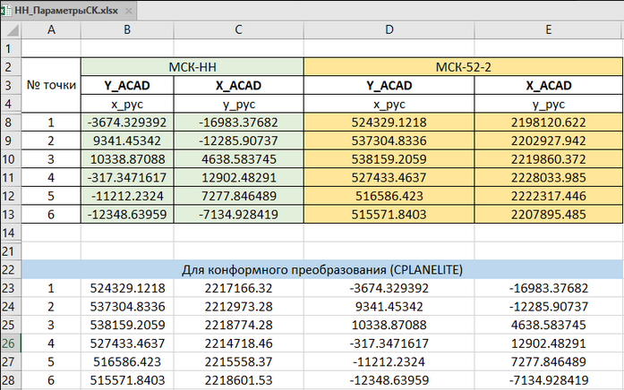

Снова та табличка

1. Редактируем файл CustomSYS.ini, где прописываем параметры исходной СК (от которой мы всё считали):

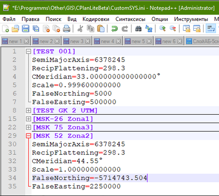

Вносим параметры о МСК 52-2 в конфигурационный файл программы, сохраняем его

2. Копируем в буфер обмена группу значений из файла Excel и вставляем в CplaneLite находясь в левом верхнем поле "Name":

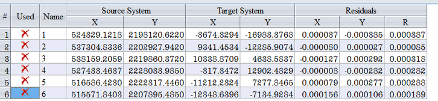

Вставляем данные в программу

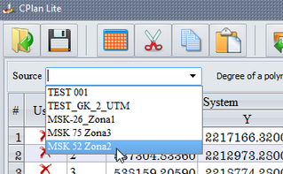

Выбираем в выпадающем списке нашу исходную СК

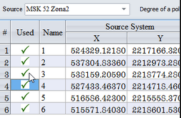

ЛКМ проставляем везде галочки (точки будут использоваться в расчете)

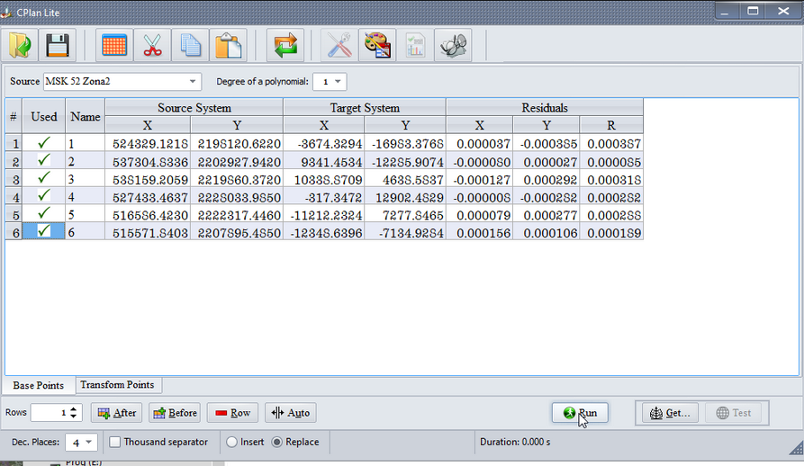

Запускаем расчет нажатием на Run

3. Смотрим, чтобы невязки R были менее 1 мм (визуальный контроль), и потом нажимаем кнопку Get

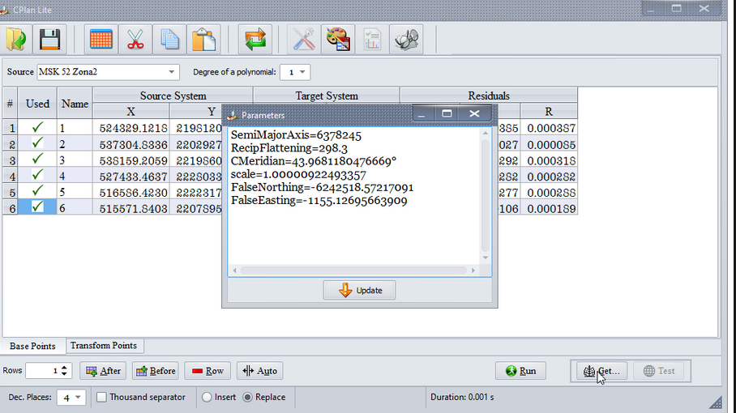

Рассчитанные параметры СК

### Вносим параметры СК в библиотеку

Теперь запускаем нашу библиотеку MAPCSLIBRARY, также копируем определение для региональной СК (в моем случае - МСК-52-2)

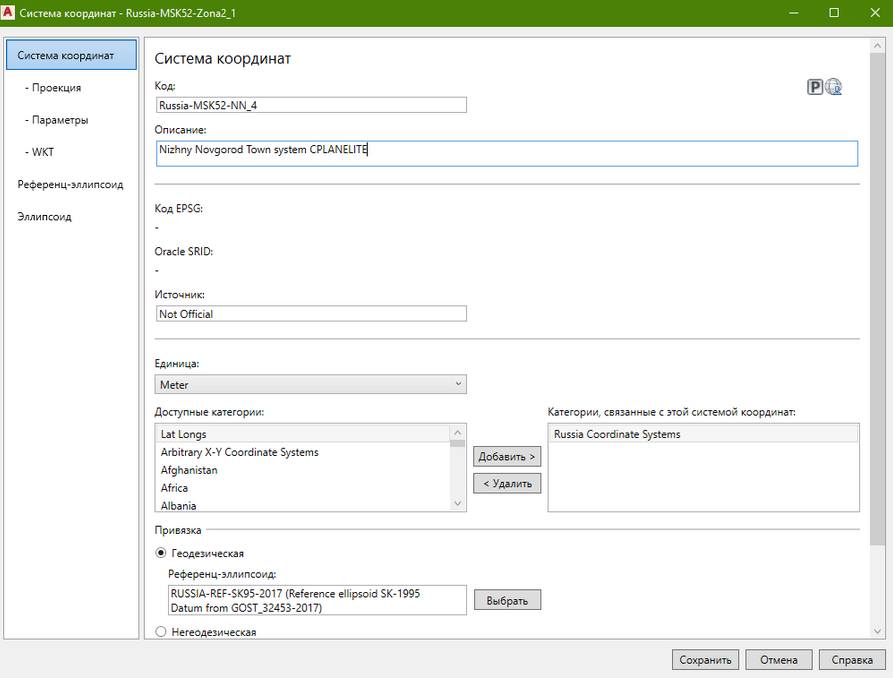

Аналогично аффинновой меняем имя/описание и переходим на вкладку Проекция

Ввиду того, что для типа проекции "Гаусса-Крюгера" нет возможности выставить масштабный фактор, мы меняем тип на проекция "Поперечная Меркатора" и заносим в её определение данные параметры:

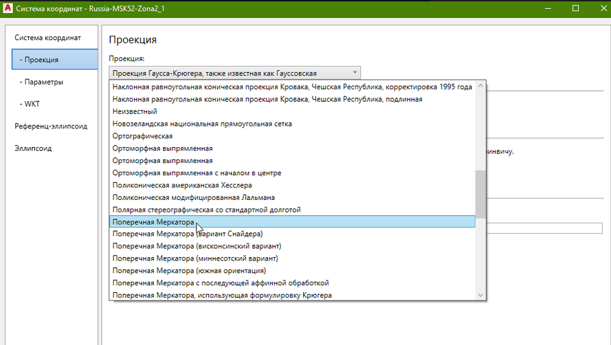

Меняем тип проекции

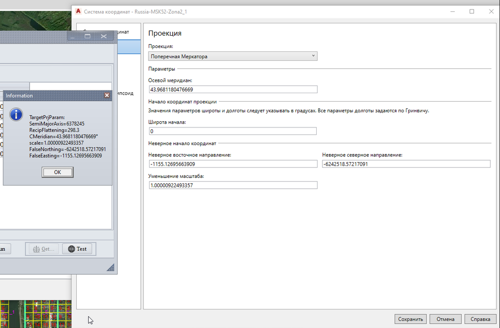

После внесения параметров сохраняем данное определение СК и после перезапуска программы назначаем её чертежу.

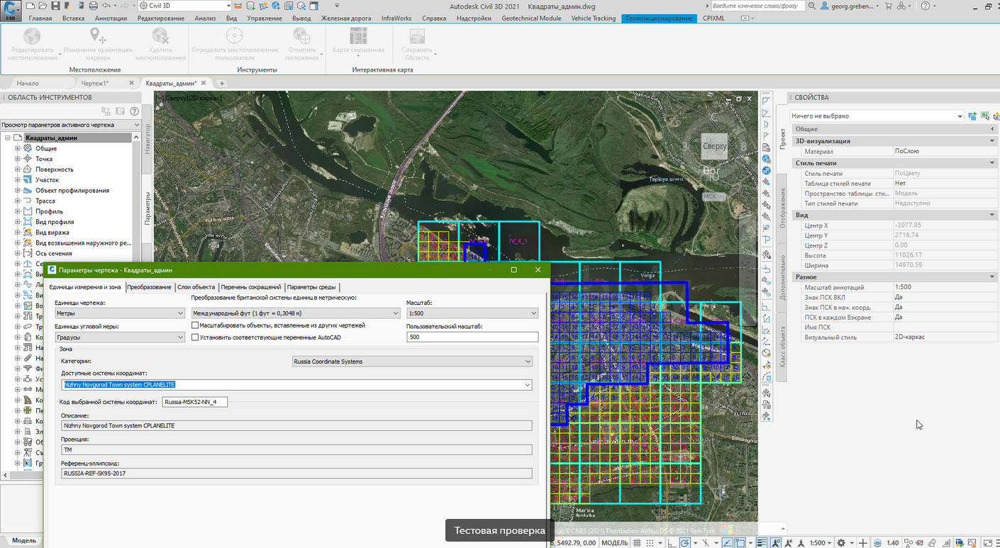

## На закуску

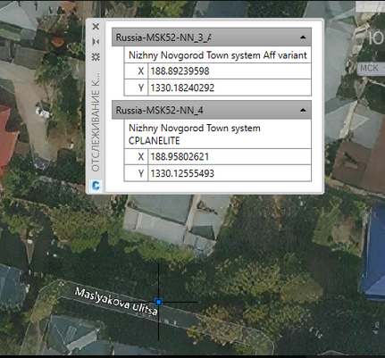

Координаты одной точки в разных настроенных СК

Казалось бы, одно и тоже, да вот не то 😀.

## 

Выводы

Итак, в данной статье мы рассмотрели с вами порядок действий по преобразованию нетипового определения СК в стандартное (путем получения ограничивающего контура и координат его вершин), которые впоследствии мы обсчитали через аффинное и конформное преобразование.

Следующая часть №4 будет посвящена уже вопросу автоматизации работы с библиотекой систем координат (мы рассмотрим пакет Dynamo.MapConnection в части инеструментария по работе с библиотекой), а в части №5 перейдем (надеюсь) к кейсам по преобразованию координат.
