# Погружаемся в системы координат. Часть 4 - автоматизация формирования библиотеки СК

*24 апреля 2021*

> Это архивная статья. Оригинал https://dzen.ru/a/YHcH0r-6U1way2PR

Введение: данная статья будет посвящена вопросам автоматизации стандартных действий по редактированию параметров систем координат в библиотеке СК (далее, систем координат) в рамках Dynamo над Civil 3D. Статья является четвёртой в серии статей по работе с системами координат в продуктах Autodesk. 

Ниже ссылки на предыдущие части:

1. [Часть 1 - как всё начиналось](./article_16042021.md)

2. [Часть 2 - ручное внесение в библиотеку информации о СК](./atricle_17042021.md)

3. [Часть 3 - нестандартные виды определений СК](./article_23042021.md)

Другие версии статей из серии:

1. [Часть 5 - стандартные инструменты пересчета координат](./article_27042021.md)

2. [Часть 6 - автоматизация пересчета координат](./article_01052021.md)

Было бы много волокиты без автоматизации. Оригинал картинки тут https://avatars.mds.yandex.net/get-zen_doc/1584893/pub_5d0400ec8440a20dc8702eec_5d0401014077f40d648bb569/scale_1200

## Общая концепция формирования библиотеки СК

Итак, на базе написанных частей №1-3 мы имеем достаточный материал, чтобы двигаться дальше. Вопрос о формировании локальной библиотеки систем координат, как правило, связан с переходом на BIM/трехмерное моделирование в рамках производственного холдинга/компании имеющей ряд промышленных площадок, каждая со своей системой координат (с набором систем координат).

1. Сперва каждая из систем координат (СК, далее) проходит процедуру "сортировки", то есть определяется - какие данные есть на неё, и как ее будем вносить в базу

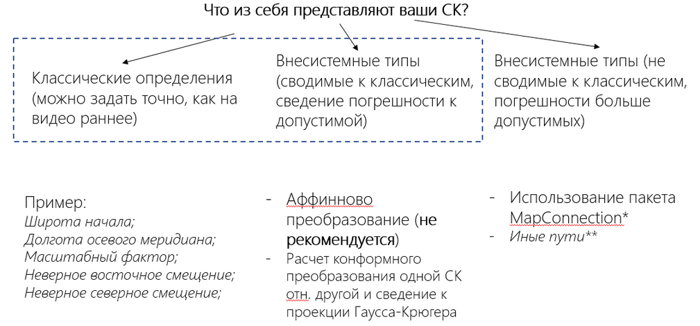

Схема действий в зависимости от типа СК

2. В зависимости от того, классическая ли это СК либо нет, следуя методике Части 2 или Части 3 - заносим эти определения в библиотеку.

**Примечание**: настоятельно рекомендуется включать в наименования всех определений некий общий **префикс**, чтобы впоследствии производить выборку по данному префиксу

3. Далее, имея на руках библиотеку с рядом систем координат, у нас есть цель - объединить наши созданные СК с другим каталогом.

Ввиду того, что конфигурационные файлы CSD **не редактируемы** (см. [Часть 1](./article_16042021.md)), необходимо выполнять транзакции из-под самой библиотеки. К счастью, с версии 2018 (или 2016?..) у нас есть пара встроенных команд MAPCSLIBRARYEXPORT и MAPCSLIBRARYIMPORT, которые выполняют, соответственно, экспорт и импорт библиотеки через её XML-представление. Фактически, эти команды являются "обёрткой" над базовым функционалом OsGeo.MapGuide, поэтому в силу объективных причин, в файл не попадает элемент под названием "Категория" - Category.CSD.

Как говорится в справке Autodesk, для экспорта определений нам необходимо сформировать Lsp-файл (лисп-файл) с упомянутой командой MAPCSLIBRARYEXPORT для пакетного извлечения параметров для набора наименований СК. Всё хорошо, но базовых возможностей по получению этого списка Civil 3D (Map 3D) не даёт. Никак не даёт. Вариантов 2 - парсить файл Category.CSD/Coordsys.CSD либо через API Map 3d обращаться к библиотеке и извлекать из неё необходимый список наименований.

Так как мы говорим про пользовательскую библиотеку, то и интересовать нас будет именно её "пользовательская" часть. Так как здесь речь уже начинает идти про автоматизацию, сделаем небольшое отступление, как установить упомянутый "набор инструментов" в среду Civil 3D.

## Установка пакета Dynamo.MapConnection в Civil 3D

Что такое Dynamo и базовые его основы см. [тут](https://dynamobim.org). Предполагается, что читатели уже знакомы с данным инструментом (встроен в Civil 3D с версии 2020).

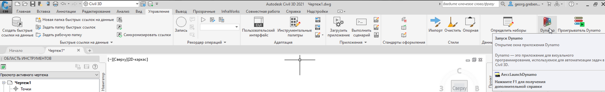

Запускаем модуль с вкладки Управление

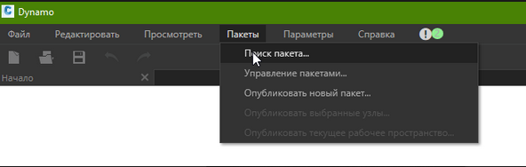

После запуска отдельного окна заходим во вкладку Пакеты и в выпадающем списке выбираем опцию "Поиск пакета"

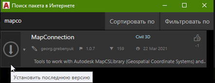

В поисковике начинаем вводить "mapcon***" и нажимаем на стрелочку для загрузки пакета (последнюю доступную версию)

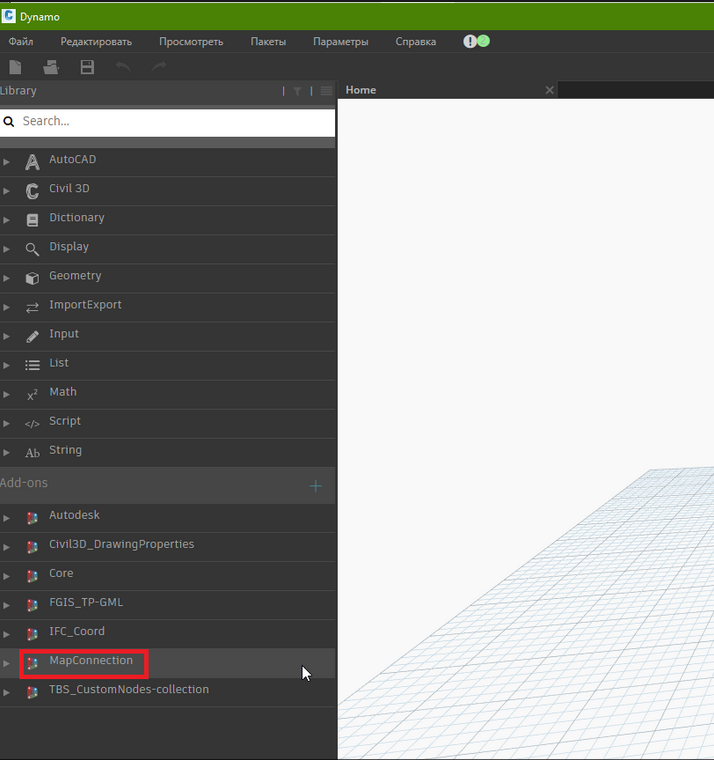

По окончанию загрузки данный пакет будет доступен в левой части панели среди загруженных дополнений

## Дальнейшие действия

### Получение списка наименований СК

Сделаем первый запрос к нашей локальной библиотеке, сформируя перечень СК, входящих в пользовательскую библиотеку

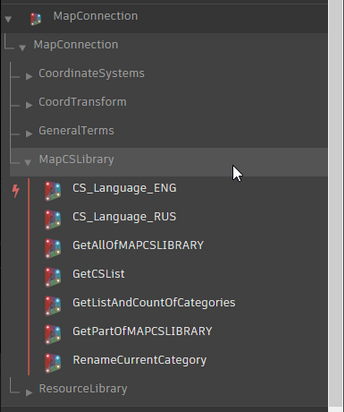

Сперва раскроем коллекцию "нодов" в группе MapCSLibrary - хранящую набор команд по работе с библиотекой СК

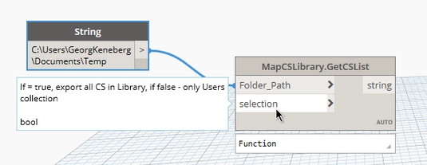

Выбираем нод "GetCSList", на вход подаем путь до каталога (где буден сформирован txt-файл со списком наименований СК) и опцию выбора - в данном случае, bool=false для ограничения только пользовательской библиотеки

**Примечание**: все транзакции с библиотекой рекомендуется выполнять в режиме "ручного" запуска скрипта из-за возможных фатальных ошибок программы

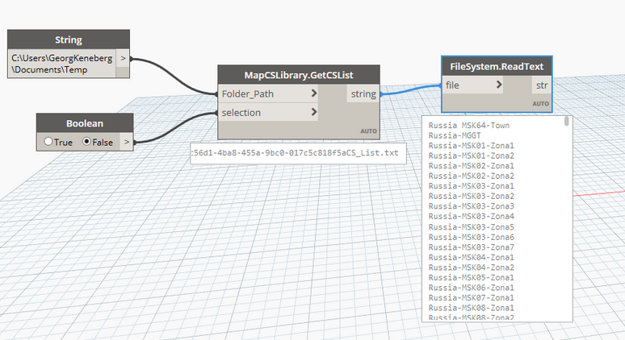

При помощи вспомогательного системного нода ReadText можно получить список наименований

Далее при желании список можно отфильтровать другими стандартными нодами Dynamo. Мы же перейдем к следующей операции

### Получение LSP-файла определений СК в пользовательской библиотеке

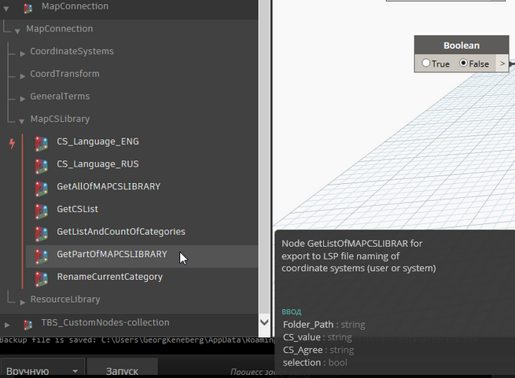

Выбираем базовый нод

Подаём ему на вход нужные определения и получаем сформированный Lisp-файл

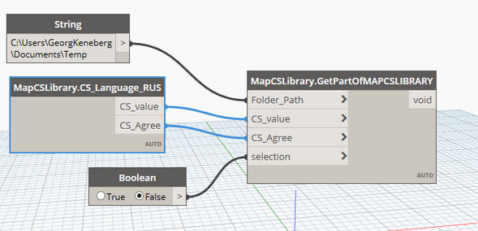

Подаем элементы на вход

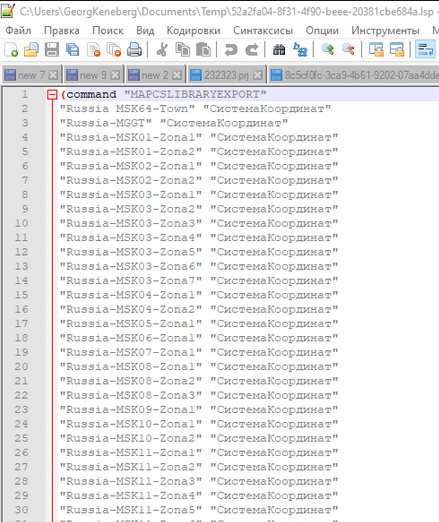

Вид образовавшегося файла

### Получаем XML-представление библиотеки СК

Здесь мы заходим на панель Управление и активируем опцию "Загрузить приложение"

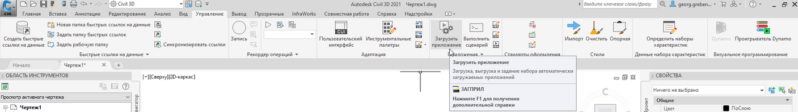

Включаем импорт приложений

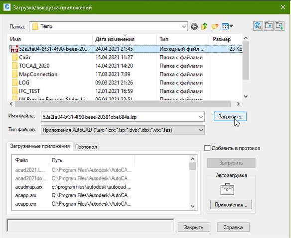

Выбираем в Проводнике наш сформированный Lisp-файл и нажимаем на Загрузить, потом на Закрыть

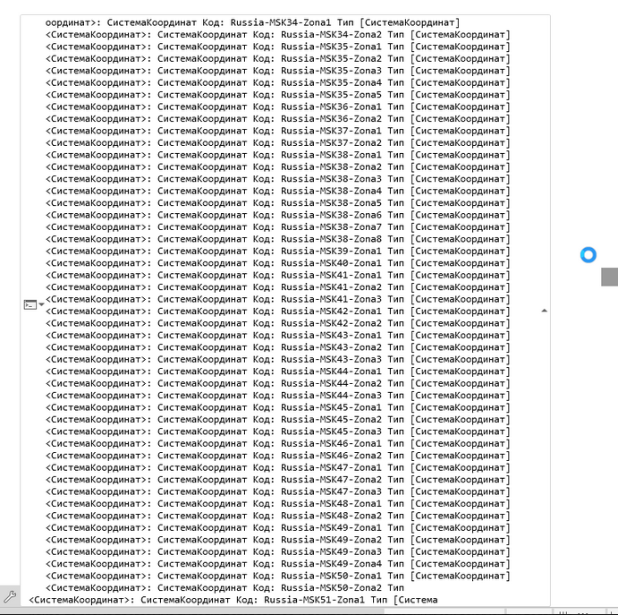

Какое-то время программа выполнит этот запрос, и по итогу в директории "Мои документы" появится сформированный файл

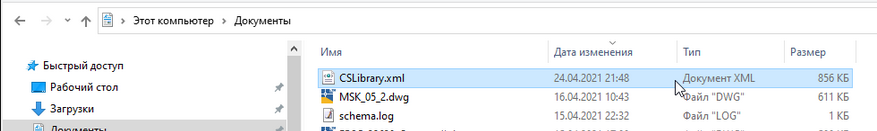

Это сформированная библиотека СК

### Импортируем XML-версию в библиотеку

Теперь мы можем заменить конфигурационные файлы CSD, поставив другую (целевую) библиотеку и импортировать эту библиотеку в формате XML в неё. Для этого просто вводим команду MAPCSLIBRARYIMPORT, выбираем XML-версию СК и ждём окончания импорта файлов.

Так как с файлом не передается категория для СК, ее необходимо назначить вручную через опцию Map 3D:

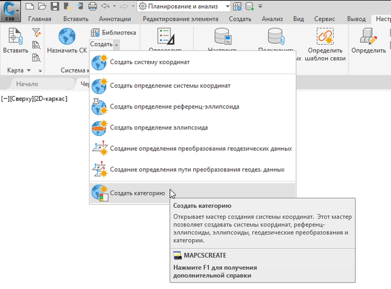

Запускаем Мастер настройки категорий СК

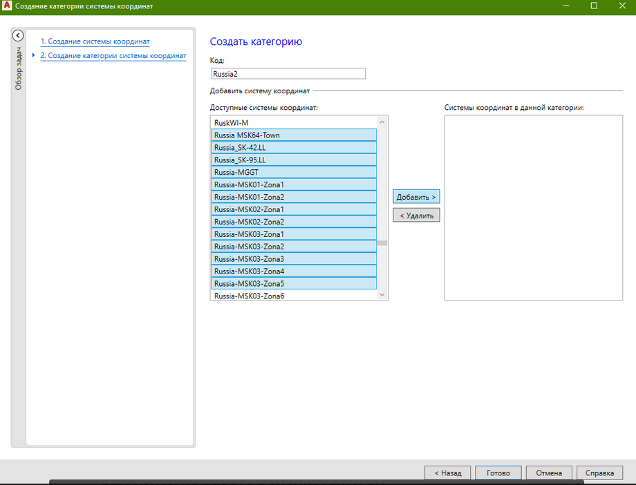

Здесь используя наш префикс опускаемся в списке до группы импортированных СК и выделяя их Shift'ом нажимаем на "Добавить",  предварительно озаглавив нашу новую категорию СК

### Еще кейсы по работе с библиотекой СК

Еще один интересный кейс - это получение кодов WKT2 для набора СК, отталкиваясь от её XML-представления. Это реализовано в рамках нода "GetWKT2Code_ofCSList" из группы "CoordinateSystems". Подробно это рассмотрено на [странице данного справочного пособия](https://inj9.gitbook.io/dynamo-mapconnection/operations-with-mapcslibrary/page2).

## Выводы

В данной статье мы рассмотрели вопрос, как автоматизировано выгружать информацию из библиотеки систем координат для слияний библиотек/выборки данных из неё. Для автоматизации мы использовали библиотеку для Dynamo под названием MapConnection, содержащую API-функции запросов к библиотеке, оформленные как "ноды" Dynamo.

Полную справку по данному пакету можно найти по [данной ссылке](https://inj9.gitbook.io/dynamo-mapconnection/). Сам пакет является open-source приложением и доступен по [ссылке на GitHub](https://github.com/TBS-Software/Dynamo.MapConnection).

На этом мы завершаем данную, четвёртую часть серии статей, а в следующей, пятой части, мы перейдем к обзору возможностей по пересчету данных из одной системы координат в другую используя данный пакет (так как в рамках данной статьи мы рассмотрели лишь его часть по работе с библиотекой СК).
