## Погружаемся в системы координат. Часть 5 - стандартные инструменты пересчета координат

*27 апреля 2021* 

> Это архивная статья. Оригинал на https://dzen.ru/a/YIffPTHX5QbAirBX

**Введение**: данная статья будет посвящена вопросам пересчета координат из одной системы в другую стандартными средствами Map 3D (Civil 3D), а затем, в следующей части №6 - автоматизированно при помощи функционала пакета Dynamo.MapConnection, который мы начали освещать в предыдущей версии статьи. Ниже ссылки на предыдущие части:

Ниже ссылки на предыдущие части:

1. [Часть 1 - как всё начиналось](./article_16042021.md)

2. [Часть 2 - ручное внесение в библиотеку информации о СК](./atricle_17042021.md)

3. [Часть 3 - нестандартные виды определений СК](./article_23042021.md)

4. [Часть 4 - автоматизация формирования библиотеки СК](./article_24042021.md)

Другие версии статей из серии:

1. [Часть 6 - автоматизация пересчета координат](./article_01052021.md)

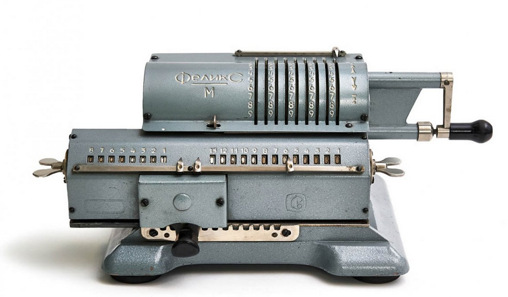

Так считали раньше и (есть подозрение), что в гос. органах считают до сих пор. Оригинал картинки: http://photo.sfu-kras.ru/files/imagecache/photo/photos2/sfu_museum-history_30smoll.jpg

## Инструмент отслеживания координат MAPTRACKCS

Активируем команду "MAPTRACKCS"

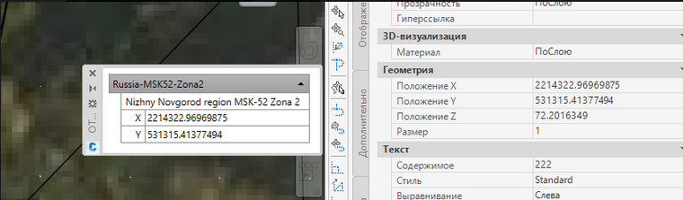

Так выглядит диалоговое окно опции

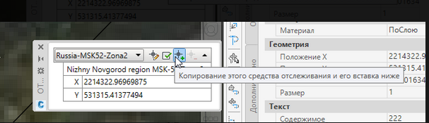

Добавим новую позицию

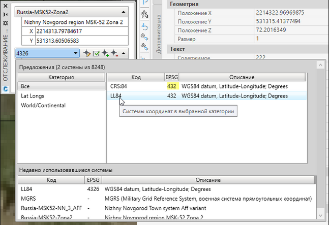

И в поисковой строке имени системы координат введем "4326" и выберем из Перечня "LL-84" - это общегеографическая система координат WGS-84 (EPSG:4326)

В данном окне можно настраивать неограниченно много различных СК, и значения будут меняться при перемещении курсора по экрану.

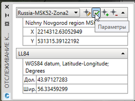

Формат вывода настраивается тут

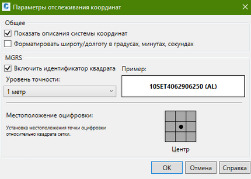

В виде следующего набора опций

## Инструменты вкладки "Геопозиционирование"

При условии назначенной чертежу системы координат, на активной вкладке "Геопозиционирование" у нас есть ряд опций, среди которых следующие:

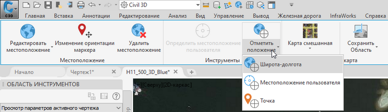

Опции вкладки "геопозиционирование"

### Простановка меток координат

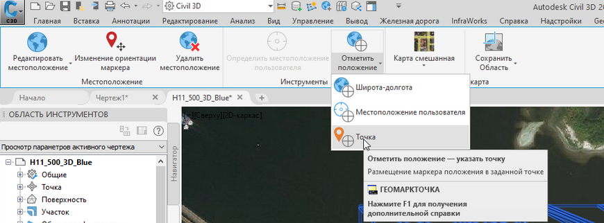

Активация соответствующей команды

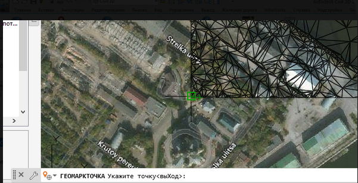

Программа спрашивает, куда поставить маркер

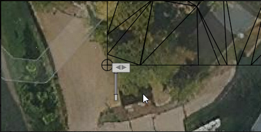

После простановки нужно ввести название точки (маркера). Имена могут повторяться.

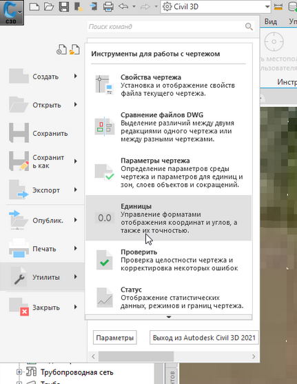

Для удобства использования - откроем окно "Единицы"

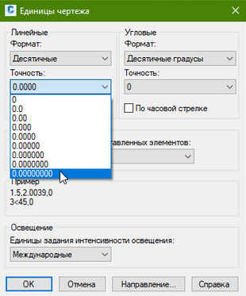

и выставим максимальную отображаемую точность

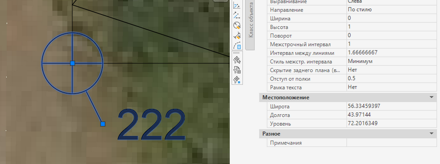

Теперь в свойствах будет отображаться географическое положение данной точки в системе координат LL-84 (EPSG:4326)

Активируем окно MAPTRACKCS и сравним его вычисляемые координаты и координаты маркера геоположения:

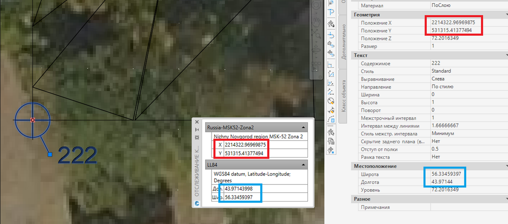

Сравниваем значения. Это один и тот же порядок чисел (точность на грани округления последних единиц)

Одинаковость вывода данных связано с тем, что оба инструмента черпают данные из определения системы координат.

### Простановка точек с известными географическими координатами

У опции выше есть обратная опция, по известным значениям широты/долготы в системе координат LL84 (EPSG:4326) получить точку в системе координат чертежа.

Возьмём к примеру позицию ниже с координатами (56.334213, 43.972990):

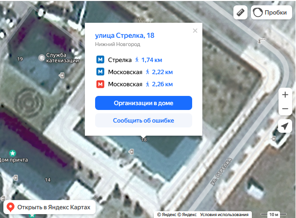

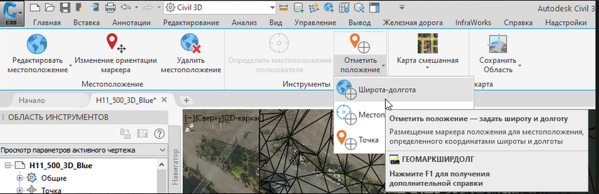

И введем координаты в данную опцию:

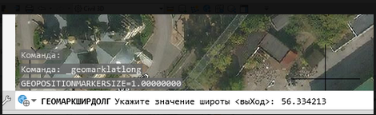

Сперва укажем широту с нажатием на Enter

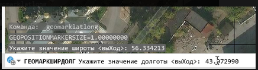

Затем долготу с подтверждением нажатия на Enter

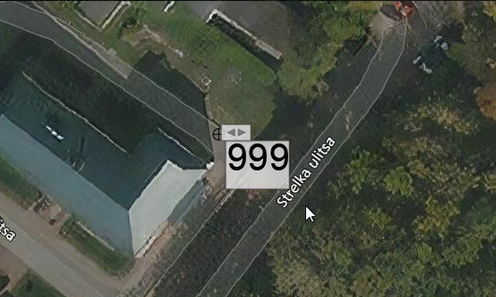

Аналогично опции выше - назовем маркер

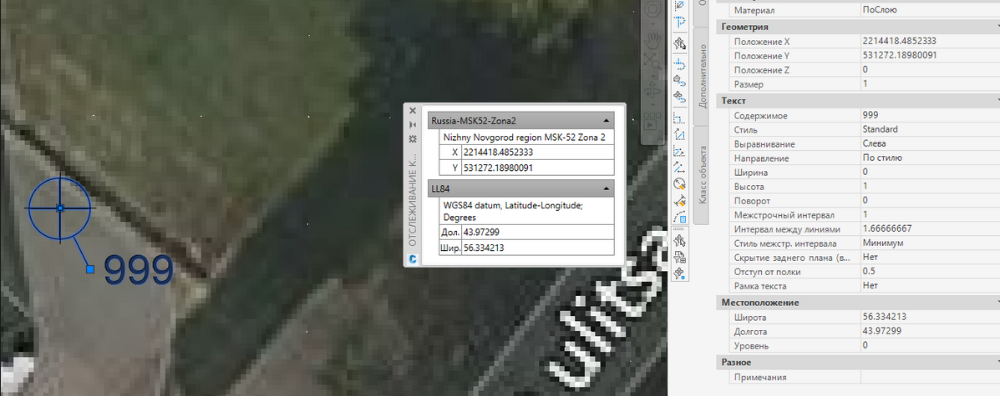

И получим его координаты в назначенной СК чертежу - МСК-52-2

Всё хорошо, но это точечные объекты.

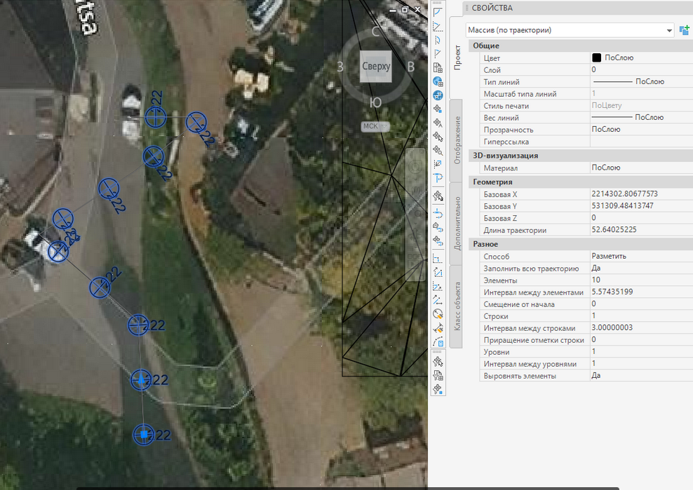

Да, их можно проставлять массивами по траектории, но ивзлекать стандартно метки из них мы ее можем - поэтому данные инструменты используются сугубо для "точечного" контроля

## Выражения для COGO-точек

Переходим к следующему интересному функционалу, а именно свойствам COGO точек. При назначении чертежу системы координат, у них активируется пара свойств - "Широта" и "Долгота". Вынесем эти свойства в метку и для проверки активируем инструмент отслеживания координат MAPTRACKSCS:

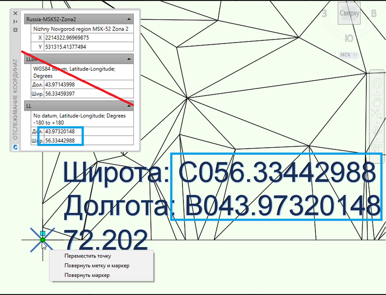

Видите, да? Отображаемые координаты не совпадают с LL84, а совпадают с так называемой LL (EPSG:4030)

Не вникая в тонкости, COGO точки у нас отображают координаты на эллипсоиде WGS-84 если бы эллипсоид данной системы координат был бы WGS-84. То есть в этой цепочке преобразований у нас не учитывается датум (или учитывается, но с "нулевыми" параметрами трансформации").

Для того, чтобы это обойти - можно воспользоваться методикой ручного пересчета геодезических координат, изложенной в [ГОСТ 32453-2017. Межгосударственный стандарт. Глобальная навигационная спутниковая система. Системы координат. Методы преобразований координат определяемых точек"](https://docs.cntd.ru/document/1200146867).

А именно, пункт 5.3

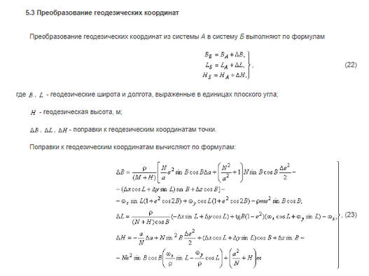

Формулы в рамках раздела 5.3

После внесения в выражения будет выглядеть примерно так:

(Скачать файл можно [отсюда](https://inj9.gitbook.io/msk-for-civil-3d/5.3.-vyrazheniya-u-tochek-cogo)).

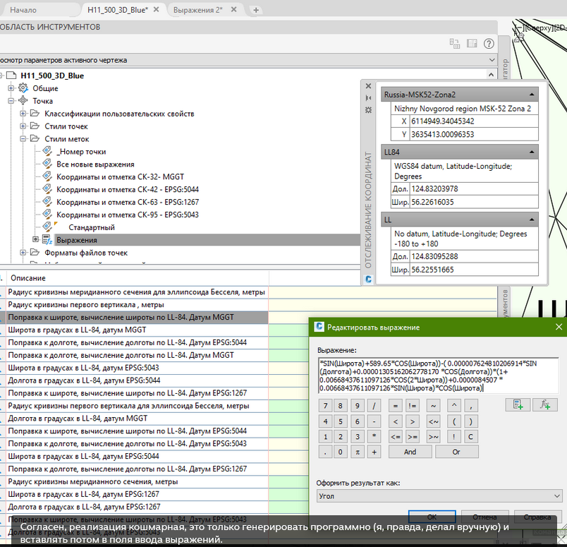

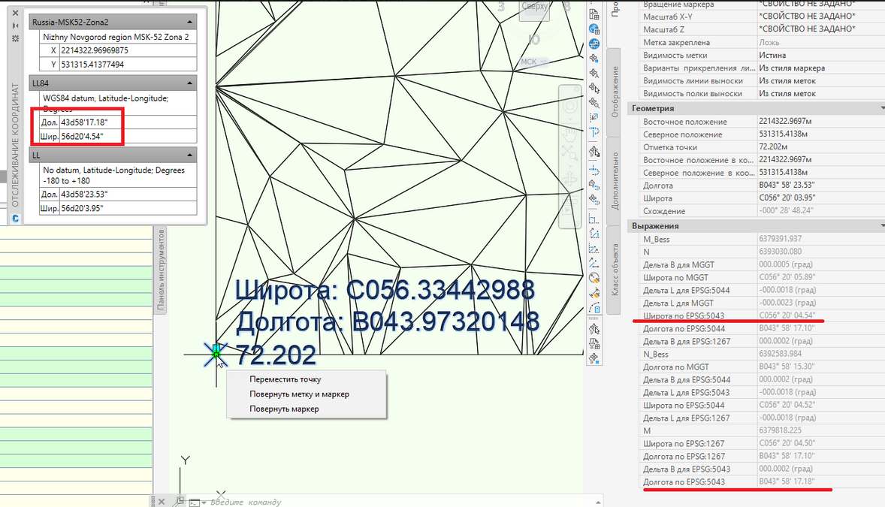

Вот наши верные значения; плюс выражений - что не надо в метку выводить, чтобы проверить :-) .

На основе COGO точек можно формировать таблицы, у них есть настраиваемые метки, то есть так стандартными средствами можно оформлять чертёж проставляя метки в иной СК.

**Примечание**: преобразования между прямоугольными СК инструментами выражений я не настраивал, правда - но это будет раза в 3 более трудоёмко.

## Инструмент запросов Map 3D на пересчет координат (_ADEQUERY)

Перейдем теперь к самой интересной базовой функции, за что любят Map 3D (Civil 3D) - это инструмент преобразования чертежей с примитивами AutoCAD (блоки, полилинии, 3D-грани, штриховки, точки) из одной системы координат в другую. В целом, эти же операции могут осуществляться и через ГИС-программы типа QGIS, но как там будет сохранена топология объектов - это под вопросом. Здесь же функционал доступен "из коробки".

Итак, перейдем к демонстрации этого функционала. В качестве рабочей задачи рассмотрим процесс пересчета нескольких чертежей из региональной МСК-52 Зоны 2 в городскую СК г. Нижний Новгород. (Дополнительно мы также базово рассмотрим транзакции для нескольких чертежей).

### Стадия подготовки исходных файлов

Для начала, необходимо, чтобы всем файлам, данные из которых мы хотим получить, была назначена их система координат. На этом собственно и всё. Ну и конечно, чтобы они были в метрической системе.

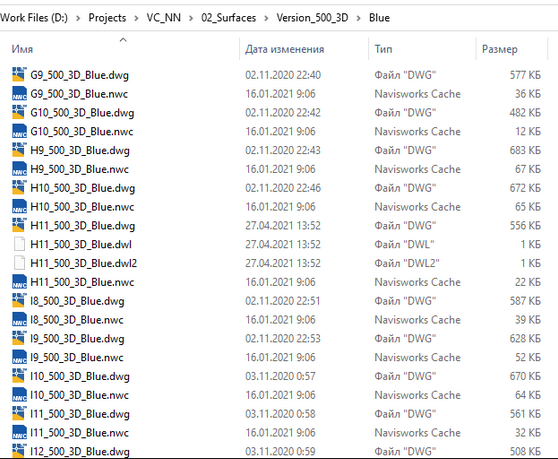

Ряд файлов DWG, которым назначена система координат

### Стадия подготовки целевого чертежа

Здесь также всё просто. Создаем новый пустой чертёж в метрическим шаблоне (иначе перевод будет некорректным). И назначаем ему систему координат, в **которой** мы хотим получить извлеченные данные.

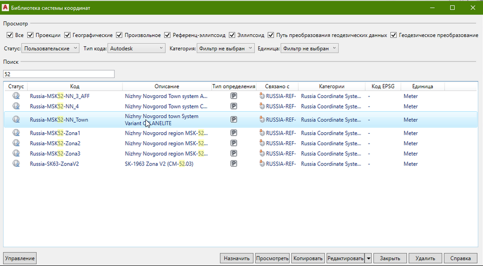

Назначаю городскую СК

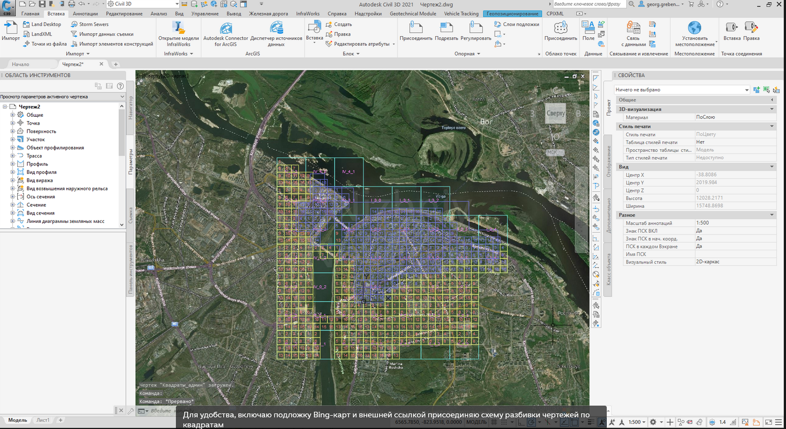

Далее вводим в командной строке MAPWSPACE и нажимаем "Вкл":

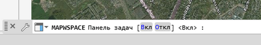

Активируем рабочее пространство Map 3D

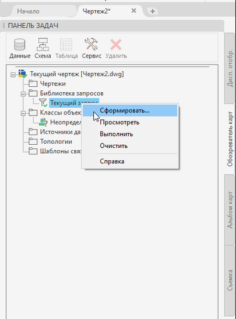

Далее переключаемся на вкладку "обозреватель карт", библиотека запросов и "Сформировать"

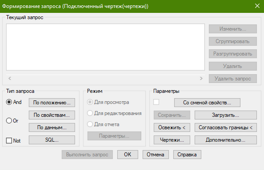

откроется окно следующего вида

Сперва необходимо подключить чертежи (файлы), с которыми мы будем работать.

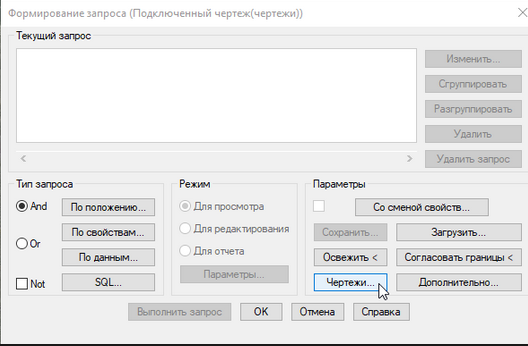

Выбираем опцию "Чертежи"

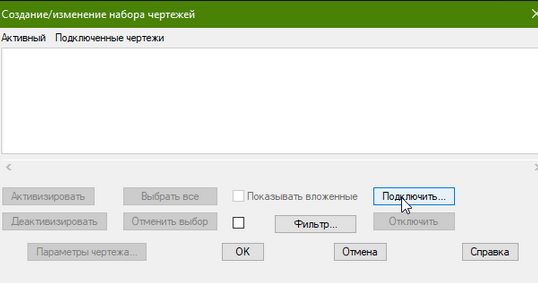

Опцию "Подключить"

~~И попадаем в 2000 год.~~

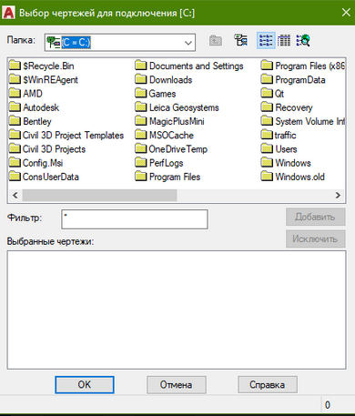

Перед нами диалоговое окно Проводника.

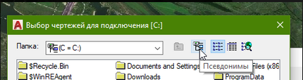

запустим эту опцию для добавления нового пути к рабочим файлам

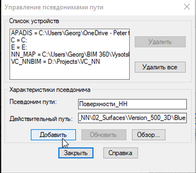

В строку "Псевдоним пути" введем условное наименование, в строку "Действительный путь" - скопированный полный путь к каталогу с данными. После этого нажмем на "Добавить"

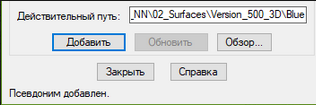

Появится строка - "Псевдоним добавлен". Закрываем окно

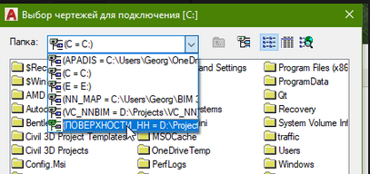

Теперь в строке поиска выберем наш созданный каталог и перейдем в него

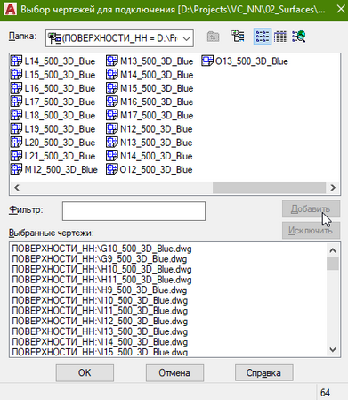

Выберем все файлы и нажмем на "Добавить", после чего на ОК

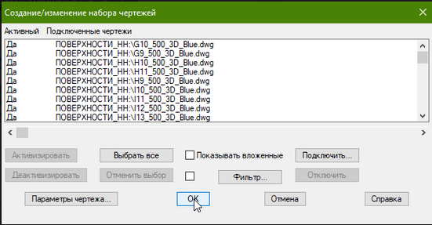

Еще раз на ОК без настроек

**Примечание**: фильтры мне настроить не получилось - чертежи видны отфильтрованные, но при применении запроса почему-то участвуют все данные

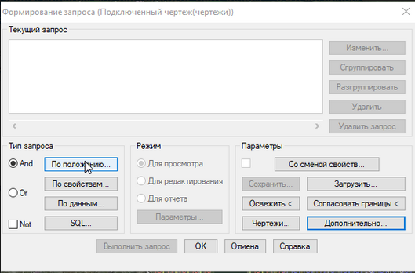

В первом окне нажмем на "По положению"

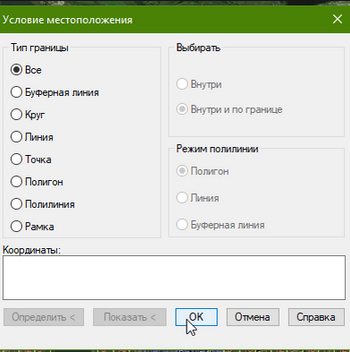

Без изменений нажмем на ОК

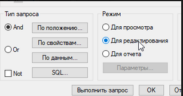

Режим - для редактирования

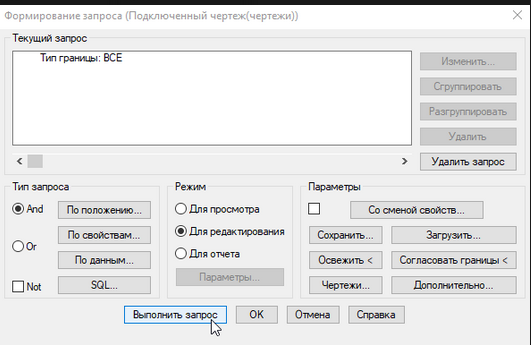

И после этого на "Выполнить запрос"

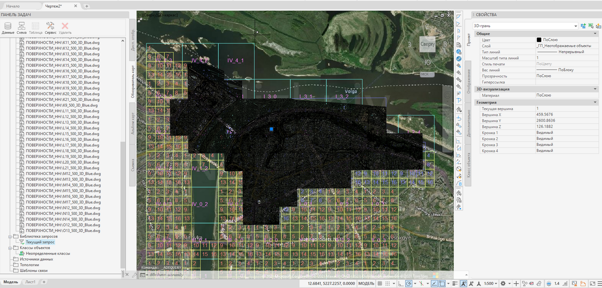

Вот мы получили пересчитанные данные (3D-грани) о поверхности

Так как это временные файлы (удалятся после закрытия чертежа даже с сохранением), то сохраним их с копированием в пересчитанных координатах в новый чертеж, либо сразу пустим в дело - здесь у нас 3D-грани, следовательно построим на их основе поверхность, добавив их как Объекты чертежа -- 3D-грани обязательно с сохранением конфигурации исходных рёбер.

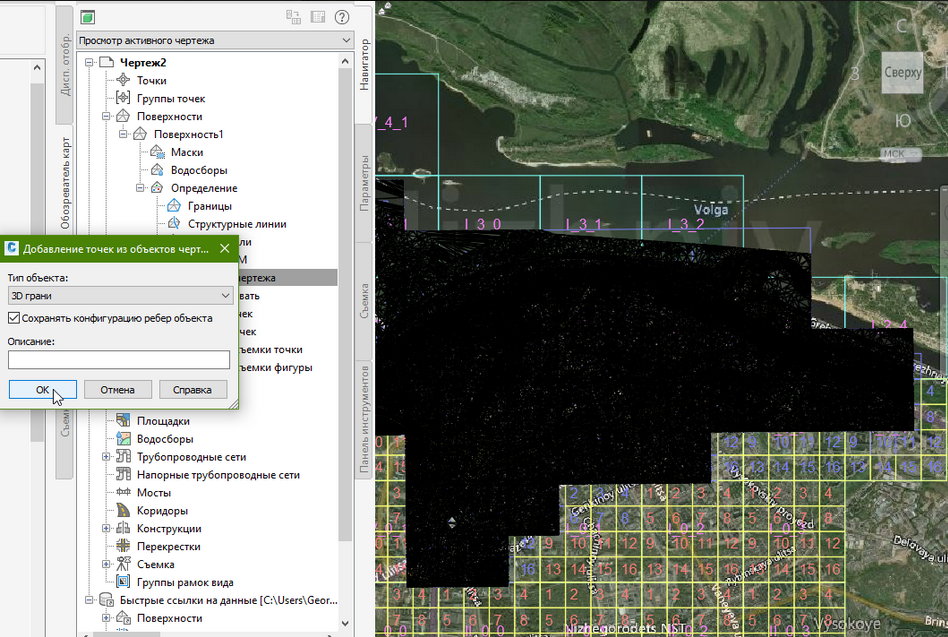

Создаем новую поверхность и добавляем ей в определение наши грани

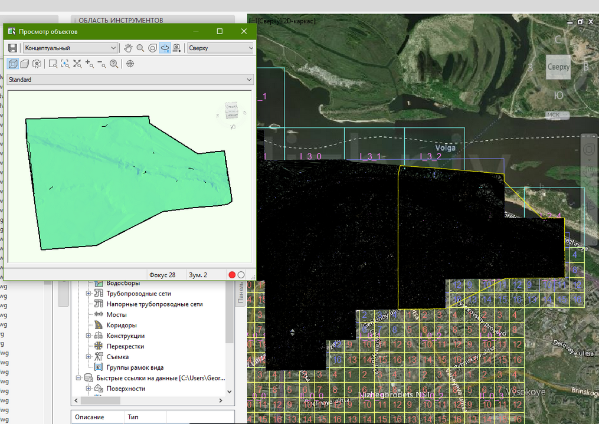

Для скорости я это делаю для кусочка всех данных

Обратим внимание, что для подключенных чертежей рядом будут находиться файлы *.DWK:

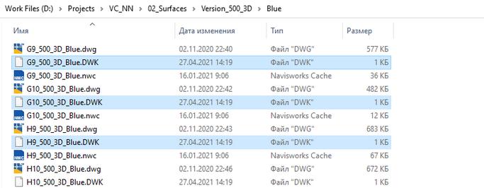

Файлы блокировки (для включенных чертежей)

При их наличии файл нельзя будет изменить. Надо либо файлы удалить, либо удалить сам запрос

## Выводы

В данной статье мы рассмотрели стандартные возможности Civil 3D (Map 3D) по преобразованию координат. Это были инструменты вкладки "Геопозиционирование" - единичные маркеры координат, инструмент отслеживания координат MAPTRACKCS, Выражения для COGO точек и функционал запросов _ADEQUERY Map 3D.

Это были стандартные инструменты Civil 3D, даны чтобы почувствовать "боль" и их ограниченность без автоматизации. А вот тему альтернативных действий мы осветим в следующей Части №6 с использованием пакета Dynamo.MapConnection.
