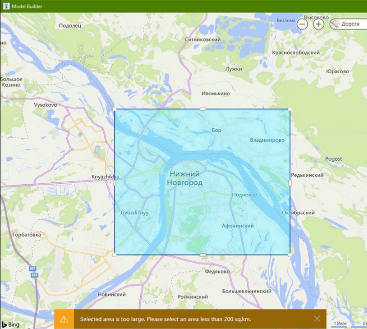
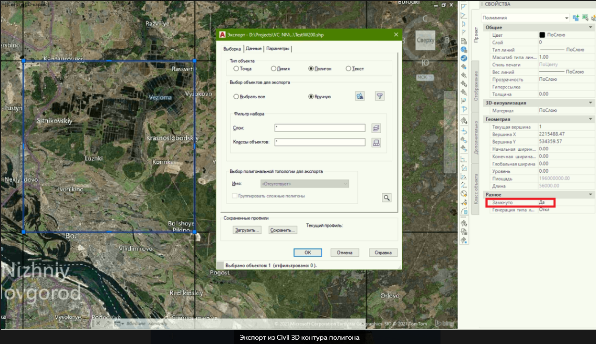
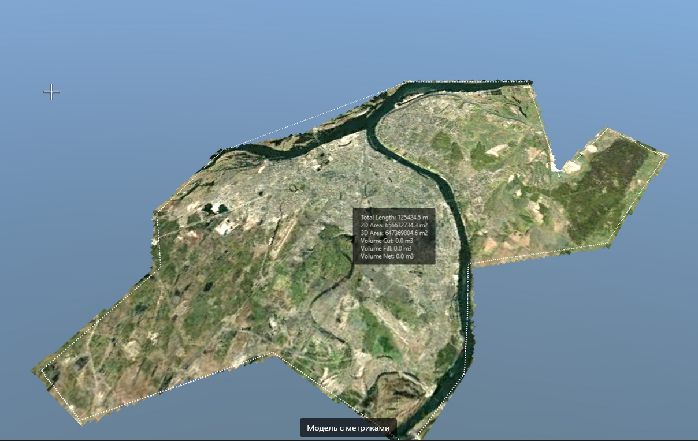
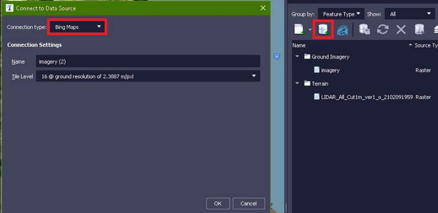
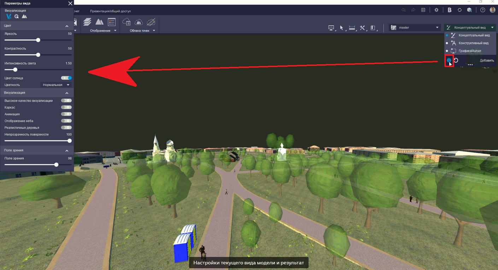
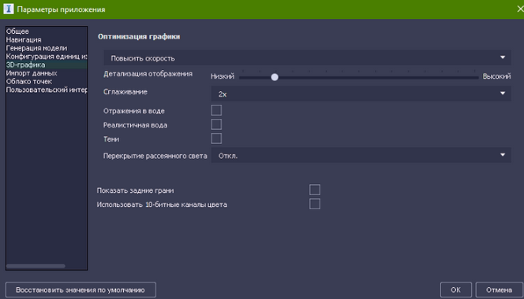
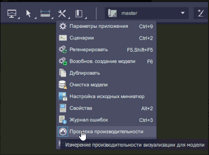

## Autodesk InfraWorks. Обходим аппаратные ограничения больших моделей

*14 апреля 2021*

> Это архивная статья, оригинал на https://dzen.ru/a/YHbSdgH_UCrQ_SsB

**Введение**: в данной статье рассмотрим методологию действий по первичной загрузке через Конструктор модели InfraWorks территорий, превышающих максимальный размер программы - в 200 кв. км и некоторые другие кейсы по работе с большими площадными объектами

**Предыстория**: программа Autodesk InfraWorks предоставляет возможности по концептуальному проектированию объектов инфраструктуры (позиционируется как продолжение Civil 3D), анализа застройки, сборки геометрии из разного ПО для визуализации инфраструктурного проекта/проектов по благоустройству территорий. Среди прочего, в базовом функционале программа может формировать 3D модели реальной застройки и относительно-реального рельефа из публичных картографических ресурсов - рельефных карт SRTM/ASTER GDEM и OSM. Нежелательность их использования и возможные невязки по сравнению с реальными данными приведены в курсе ниже.

Более полно программа освещается в моем открытом курсе на платформе Александра Высоцкого [тут](https://bim.vc/edu/courses/sozdanie-kontseptualnoy-modeli-mestnosti-v-autodesk-infraworks/) (в части загрузки данных, координации данных, визуализации местности встроенными средствами).

Суть вопроса: при попытке выделить квадрат/полигон местности, превышающий лимит в 200 кв. км программа выдаст предупреждение:

Наши действия: Для загрузки местности, размеры которой превышают в плане 200 кв. км необходимо воспользоваться опцией загрузки области через Импорт границ SHP файла. Перед этим, надо данные границы подготовить - это можно сделать через Civil 3D, воспользовавшись стандартным инструментом AutoCAD - "прямоугольный массив". Создадим группу квадратов 14х14 км (196 кв. км суммарно) с взаимным перекрытием порядка 50 метров для последующего схождения поверхностей рельефа на стыках моделей. Далее экспортируем полученные полигоны каждый в отдельный SHP файл, убедившись что:

- контур из полилинии имеет тег "Замкнуто: Да"

- экспорт идет в формат Esri SHP

- на вкладке "Выборка" стоит опция "Выбор вручную" и экспорт в формате "Полигон"

- на вкладке "Параметры" стоит галочка "Преобразовать в систему координат LL84"

- на вкладке "Параметры" стоит галочка "Рассматривать замкнутые полилинии как полигоны"

После этого в IW (здесь и далее, InfraWorks) выставляем опцию загрузки границ из SHP-файлы и выбираем файлы SHP и PRJ для интересуемого квадрата местности, выставляем название модели и ждем окончания облачной обработки модели. После повторения данных действий для всех моделей производим экспорт из каждой файлов IMX (Рельеф + Дороги), далее создаем пользовательскую модель и импортируем туда все файлы IMX. Profit!

Ниже подобная большая модель с площадью покрытия 650 кв. км:

**Примечание**: автор предпочитает грузить рельеф местности иными способами сразу единым файлом (через QGIS) обходя столь длительный процесс подготовки, об этом мы поговорим в отдельной статье (то есть не в рамках InfraWorks).

### 

## Загрузка растра Bing на всю местность

Предположим, что мы создали пользовательскую модель способом выше и хотим загрузить поверх неё растровый спутниковый снимок. Стандартный функционал InfraWorks предоставляет такую возможность из панели "Источники данных" запускаем менеджер поделючения к базам данных (см. картинку ниже), выбираем пункт "Карты Bing", необходимое разрешение и обновляем данный источник данных для старта загрузки изображения

Подключение к Bing-картам

**Примечание**: карты Bing имеют низкую степень детализации и актуальности на территории РФ, поэтому рекомендуется пользоваться иными картами (мы это также освятим в рамках последующих статей)

Сопутствующая задача, которая может стоять - выгрузить растр местности, повторяющий очертания рельефа в среду Navisworks - для этого можно воспользоваться экспортом сцены InfraWorks в формат FBX с разделением на файлы (оставить только "Поверхность земли"). Сам рельеф предварительно удалять не надо (так как модель регенерируется и в отсутствие рельефа растр примет плоский вид

## Производительность графики

На больших сборках рекомендуется настраивать виды (см. скрин ниже), а именно убирать прорисовку деревьев, неба, анимацию.

Похожее окно, управляющее детализацией моделей - это параметры 3D-Графики, доступные из Настроек программы (там, как правило, убирается прорисовка фасадов, отражения в воде и т.д.)

Индикатором скорости отклика модели на выставленные настройки может служить интересная системная опция "Проверка производительности". Результат выполнения - это справочное диалоговое окно с количество fps для сцены модели.

**Примечание**: проверка показывает разные результаты в завимости от степени приближения к разным группам элементов модели. Для большей чистоты рекомендуется применять ее в месте наибольшего скопления элементов (максимальный LOD детализации).
