# Погружаемся в системы координат. Часть 2 - ручное внесение в библиотеку информации о СК

*17 апреля 2021*

Введение: данная статья является второй из серии статей про реализацию систем координат в инфраструктуре продуктов Autodesk. В отличие от первой-фундаментальной, здесь будет рассмотрена частная тема о внесении информации в библиотеку о новой системе координат, отталкиваясь от некоего представления этой СК в строчном/ином виде как готовая формулировка.

> Статья рекомендуется к прочтению при необходимости вносить вручную новые определения в библиотеку систем координат

Предыдущую часть см. [Погружаемся в системы координат. Часть 1 - как всё начиналось](./article_16042021.md)

## 

## Где можно формировать библиотеку?

Сперва акцентируем внимание читателя на том, что в инфраструктуре продуктов Autodesk пользоваться инструментами по созданию и редактированию элементов библиотеки систем кооррдинат можно лишь базово в двух продуктах - AutoCAD Civil 3D и AutoCAD Map 3D. Там за это дело отвечают команды **mapcslibrary** и **_mapcscreate**.

**Программно** также можно создавать и редактировать элементы библиотеки - через набор библиотек OsGeo.MapGuide.....dll. Я так не делал, только лишь обращался к библиотеке для извлечения из нее информации по отдельным элементам (подробнее см. следующую Часть 3)

К примеру для установленных AutoCAD версий ХХ путь к библиотекам будет иметь вид:

> C:\Program Files\Autodesk\AutoCAD ХХ\map\bin\GisPlatform*

**Примечание**: при установке продуктов на диск C

Поэтому далее мы будем показывать процесс создания систем координат сугубо в продукте AutoCAD Civil 3D.

## 

Что такое классическое определение системы координат?

На самом деле, "классическим" назвал его я, формально такие определения могут называться "явными", то есть в виде, из которого мы сможем понять все числовые параметры и занести их в нашу библиотеку.

К числу наиболее популярных форматов относят форматы от MapInfo, WKT/WKT2, PROJ.4. Ниже представлены 3 варианта записи СК для города Санкт-Петербурга

> "МСК-1964 СПб ГОСТ 51794-2008", 8, 9999, 3, 23.57, -140.95, -79.8, 0, -0.35, -0.79, -0.22, 0, 7, 30, 0, 1, 95942.17, -6552810.0

Это (выше) формат MapInfo (взято [отсюда](https://mapbasic.ru/msk1964)).

> BOUNDCRS[SOURCECRS[PROJCRS["Russia-MSK1964",BASEGEOGCRS["Unknown datum based upon the Krasovsky-SK42/95 ellipsoid",DATUM["RUSSIA-REF-SK63",ELLIPSOID["Ellipsoid Krasovsky SK-42/95 GOST 32453-2017_4.2.2",6378245,298.30000000,LENGTHUNIT["metre",1,ID["EPSG",9001]]]],PRIMEM["Greenwich",0,ANGLEUNIT["degree",0.0174532925199433],ID["EPSG",8901]]],CONVERSION["Russia-MSK1964",METHOD["Transverse Mercator",ID["EPSG",9807]],PARAMETER["Latitude of natural origin",0,ANGLEUNIT["degree",0.0174532925199433],ID["EPSG",8801]],PARAMETER["Longitude of natural origin",30,ANGLEUNIT["degree",0.0174532925199433],ID["EPSG",8802]],PARAMETER["Scale factor at natural origin",1,SCALEUNIT["unity",1],ID["EPSG",8805]],PARAMETER["False easting",95942.17,LENGTHUNIT["metre",1],ID["EPSG",8806]],PARAMETER["False northing",-6552810,LENGTHUNIT["metre",1],ID["EPSG",8807]]],CS[Cartesian,2],AXIS["(E)",east,ORDER[1],LENGTHUNIT["metre",1,ID["EPSG",9001]]],AXIS["(N)",north,ORDER[2],LENGTHUNIT["metre",1,ID["EPSG",9001]]],USAGE[BBOX[59,28,61,32]]]],TARGETCRS[GEOGCRS["WGS 84",DATUM["World Geodetic System 1984",ELLIPSOID["WGS 84",6378137,298.257223563,LENGTHUNIT["metre",1]]],PRIMEM["Greenwich",0,ANGLEUNIT["degree",0.0174532925199433]],CS[ellipsoidal,2],AXIS["geodetic latitude(Lat)",north,ORDER[1],ANGLEUNIT["degree",0.0174532925199433]],AXIS["geodetic longitude(Lon)",east,ORDER[2],ANGLEUNIT["degree",0.0174532925199433]],ID["EPSG",4326]]],ABRIDGEDTRANSFORMATION["Reference ellipsoid SK-1963 (Krasovsky)",METHOD["Coordinate Frame rotation",ID["EPSG",9607]],PARAMETER["X-axis translation",23.92,ID["EPSG",8605]],PARAMETER["Y-axis translation",-141.27,ID["EPSG",8606]],PARAMETER["Z-axis translation",-80.9,ID["EPSG",8607]],PARAMETER["X-axis rotation",0.00000000,ID["EPSG",8608]],PARAMETER["Y-axis rotation",0.35000000,ID["EPSG",8609]],PARAMETER["Z-axis rotation",0.82000000,ID["EPSG",8610]],PARAMETER["Scale difference",1.00000012,ID["EPSG",8611]]]]

Это (выше) формат WKT2 (сгенерирован вручную средствами пакета MapConnection, читай об этом в Части 3).

> +proj=tmerc +lat_0=0 +lon_0=30 +k=1 +x_0=95942.17 +y_0=-6552810.0 +ellps=krass +towgs84=23.57,-140.95,-79.8,0,-0.35,-0.79,-0.22 +units=m +no_defs

Это формат PROJ.4

Для чтения форматов рекомендую обратиться к [данной статье](https://gis-lab.info/qa/mapinfo_to_wkt_proj4.html). Для чистоты эксперимента я удалю все определения из своей библиотеки - чтобы создать все элементы "набело":

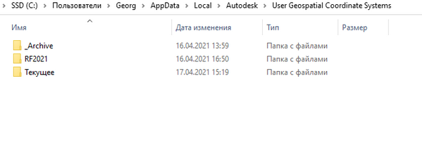

Очищаем нашу пользовательскую библиотеку

**Примечание**: конфигурационные файлы CSD для их инициализации системой должны находиться в корне данной директории (вложенными в другие папки они не читаются, поэтому в подобных папках можно хранить различные версии библиотеки).

## Пошаговое руководство по внесению определения СК в библиотеку

Запускаем Civil 3D/Map 3D и переходим к команде **_mapcscreate** для старта:

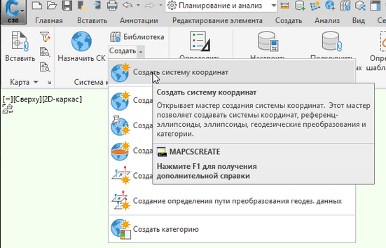

Запускаем "Мастер создания"

Следующее диалоговое окно:

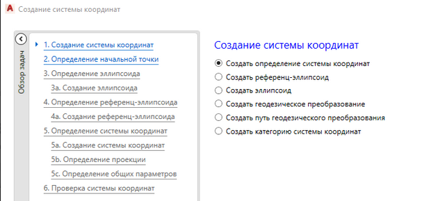

### Внесение определений для эллипсоида и референц-эллипсоида

Помня содержание первой статьи (), начнем создание определения новой СК с эллипсоида.

**Примечание**: рекомендуется по-максимуму использовать готовые определения, имеющиеся в системной библиотеке, чтобы не плодить "клонов". К примеру, для эллипсоида Красовского, характерного почти для всех отечественных СК, можно использовать системный эллипсоид"KRASOV" с кодом [EPSG:7024](https://epsg.io/7024-ellipsoid).

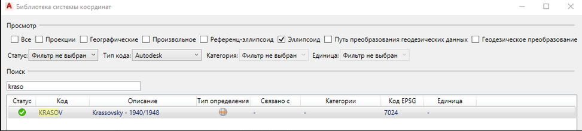

Эллипсоид Красовского в "системной" библиотеке

С эллипсоидом определились, теперь переходим к следующему элементу - референц-эллипсоиду:

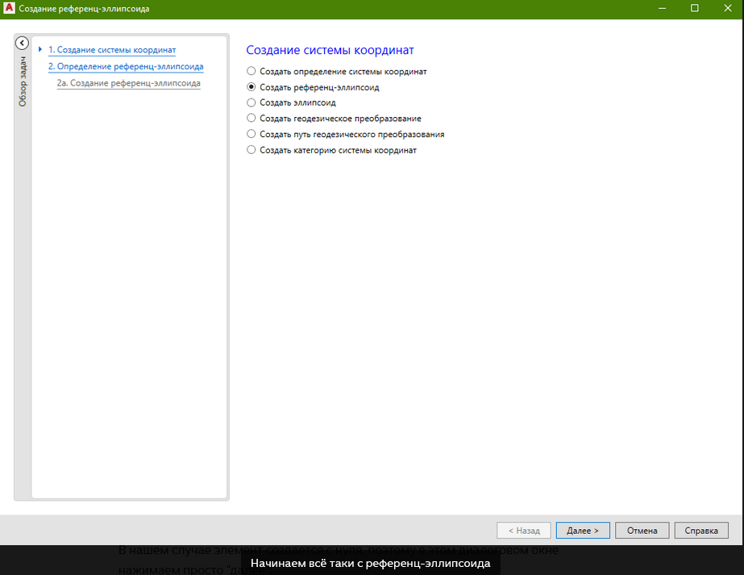

В нашем случае элемент создается с нуля, поэтому в этом диалоговом окне нажимаем просто "далее":

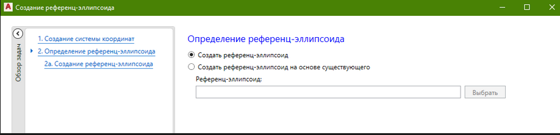

Проходим мимо

Приступаем к заполнению "карточки" референц-эллипсоида:

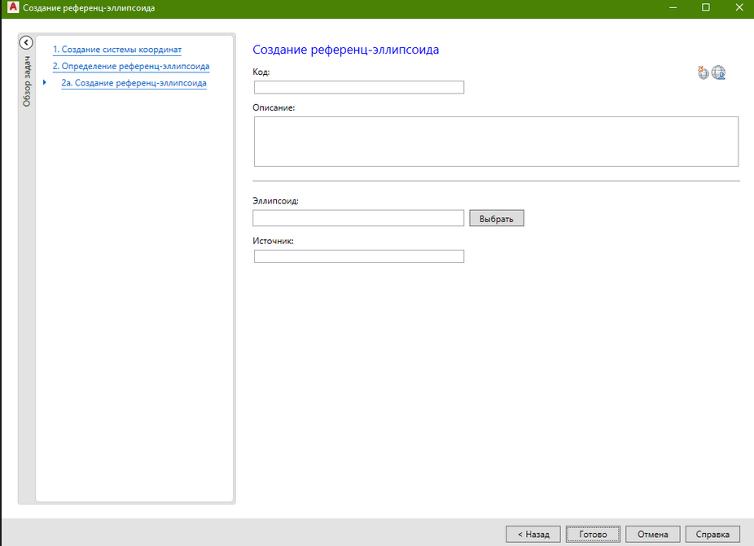

Поля для создания референц-эллипсоида

**Примечание**: здесь и далее любые наименования указываем только на латинице ввиду отсутствия поддержки кириллических символов с версии 2018 (приводит к крашу библиотеки). Также не рекомендуется использовать в названиях символ нижнего подчеркивания "_", который приводит к багам в InfraWorks.

В качестве кода указываем краткое название, которое желательно (как и любые элементы впоследствии) предварять префиксом, например "RUSSIA123-..."

Заполняем параметры в следующем стиле:

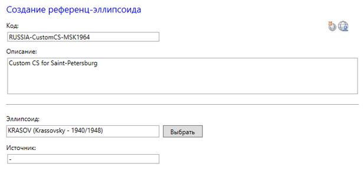

Элемент "Описание" позволяет хранить до 64 символов.

По окончанию действий нажимаем на "Готово"

### Внесение информации о геодезическом преобразовании (датуме)

Перед тем как создавать непосредственно определение для СК, зададим элемент "геодезическое преобразование", который позволит в дальнейшем подключаться и импортировать источники данных в географических координатах (корректнее, в системе координат LL84 - EPSG:4326) типа спутниковых снимков, рельефа SRTM, векторных данных OSM и пр.).

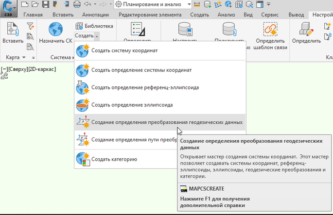

Запускаем соответствующий пункт меню

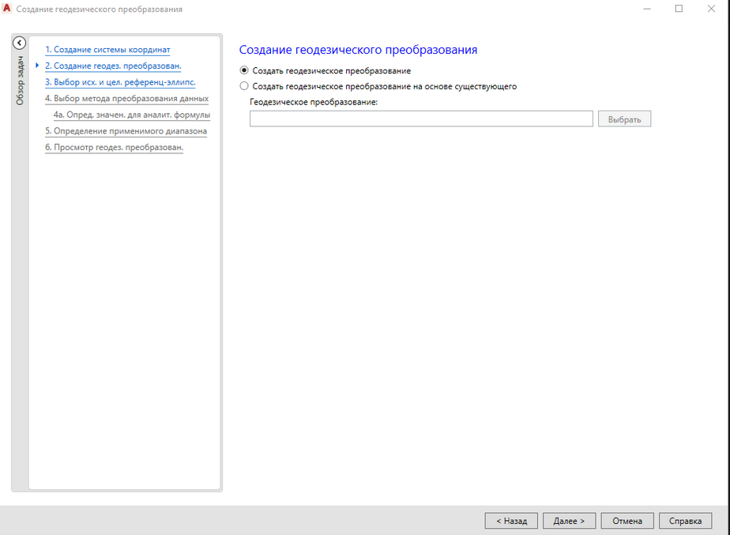

Переходим далее

Выбираем исходный (тот, на котором будет основана СК) и целевой (СК, данные в которой мы хотим получать) и переходим далее:

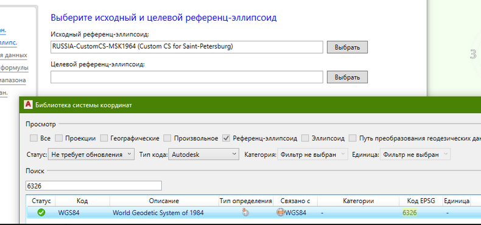

Указываем в качестве целевого эллипсоида - WGS84 EPSG:6326

Здесь предлагается выбрать метод преобразования

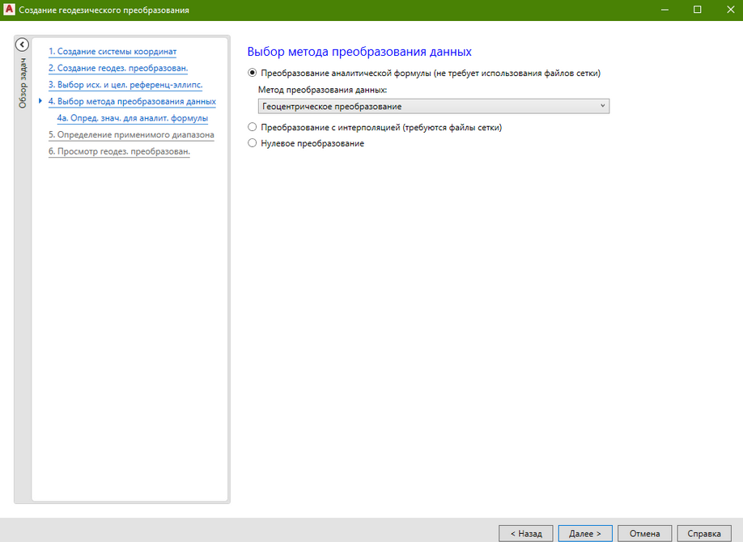

Окно выбора типа преобразования

Выбираем "По семи параметрам", так как оно "ГОСТировано" и в целом, наиболее часто используется и переходим далее

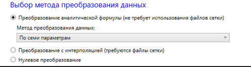

Выбор семи-параметрического преобразования, оно же преобразование Гельмерта

Перед нами поля для ввода значений:

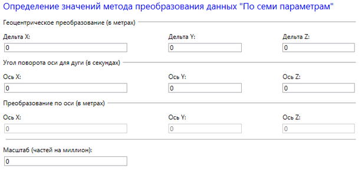

Вводим параметры согласно имеющемуся определению в описании СК либо (при их отсутствии) пользуемся формулировками, указанными в [данном пособии](https://structure.mil.ru/files/pz-90.pdf) на странице 42.

Ниже приведены основные датумы, занесённые в EPSG (официальные):

1. For SK-42 to WGS-84 EPSG: `5044 23.57,-140.95,-79.8,0,-0.35,-0.79,-0.22`

2. For SK-42 to WGS-84 and SK-63 EPSG:1267 `23.92,-141.27,-80.9,0.0,-0.35,-0.82,-0.12`

3. For SK-42 to WGS-84 EPSG:1254 `28.0,-130.0,-95.0,0.0,0.0,0.0,0.0`

4. For SK-95 to WGS-84 EPSG:5043 `24.47,-130.89,-81.56,0.0,0.0,-0.13,-0.22`

5. For SK-95 to WGS-84 EPSG:1281 `24.82,-131.21,-82.66,0.0,0.0,-0.16,-0.12`

6. For MGGT to WGS-84 `316.151,78.924,589.65,1.57273,-2.69209,-2.34693,8.4507`

В нашем случае, это строка под номером 1

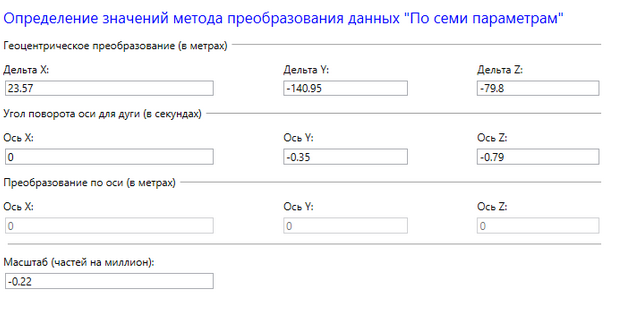

Заносим параметры и нажимаем Далее

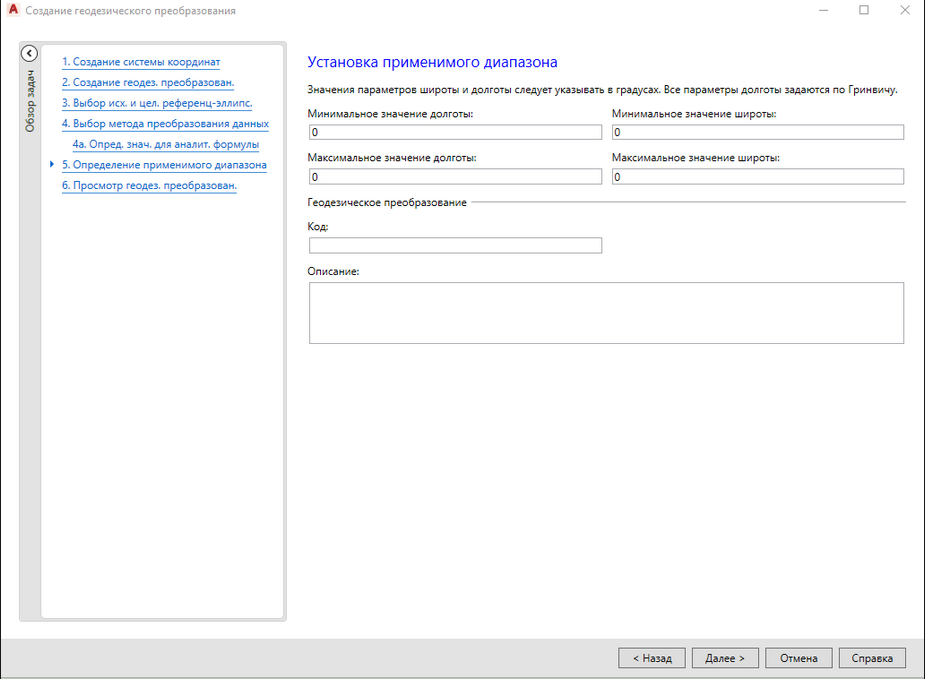

Вид следующего диалогового окна

Здесь указываем "пространные" значения для всей территории страны и наименование с описанием:

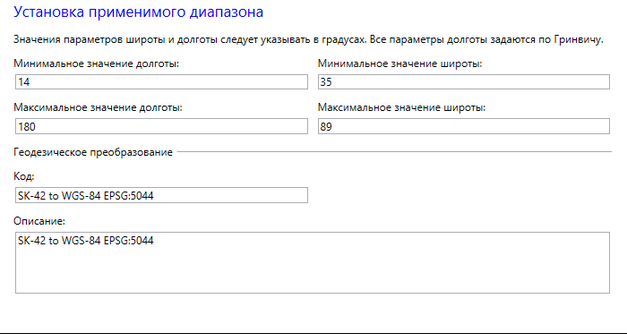

Указываем диапазон действия определений  (не влият вроде ни на что).

Переходим далее к следующему окну:

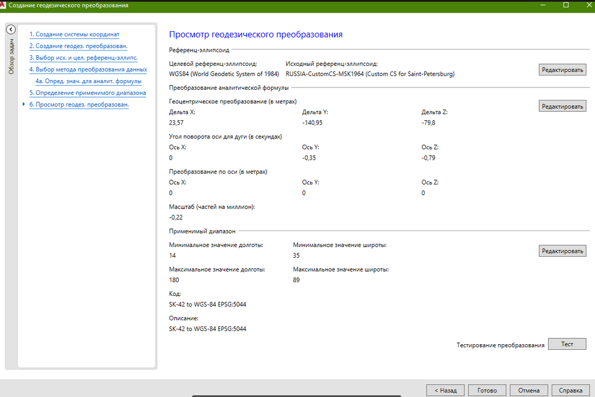

Итоговое окно - все раннее внесенные параметры

Завершаем создание элемента "геодезическое преобразование" нажатием на "Готово". Тестировать "Тест" будем по-другому.

### Создание определения для системы координат

Остался последний шаг - создать определение системы координат. Для этого активируем соответствующее меню:

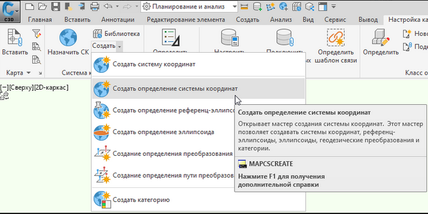

Меню создания системы координат

Так как остальные элементы мы уже создали, перейдем сразу к определению СК:

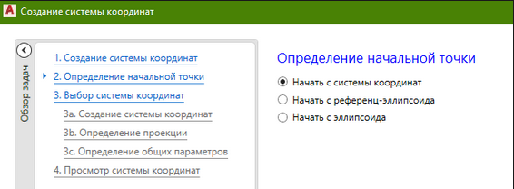

Выбираем нужный пункт и переходим далее

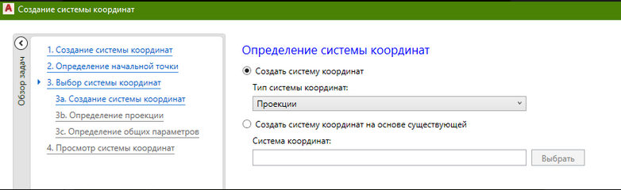

Вид следующего диалогового окна

Тут выбираем тип "Проекции" и переходим далее

Перед нами диалоговое окно внесения общей информации о системе координат:

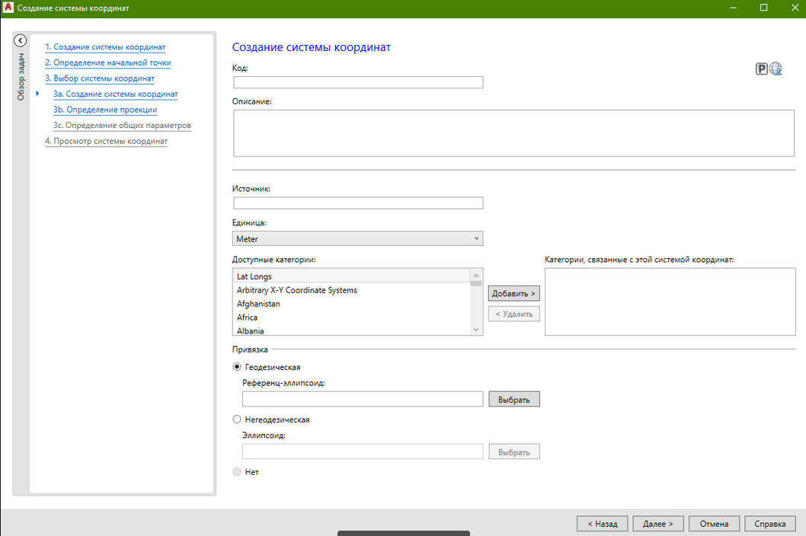

Общие параметры СК

Заполняем информацию согласно принятым ранее соглашениям. Категорию (без нее не пройдет дальше), указываем пока "USSR, Former Territories", привязку оставляем "Геодезическая" к раннее созданному референц-эллипсоиду, для которого уже создано геодезическое преобразование.

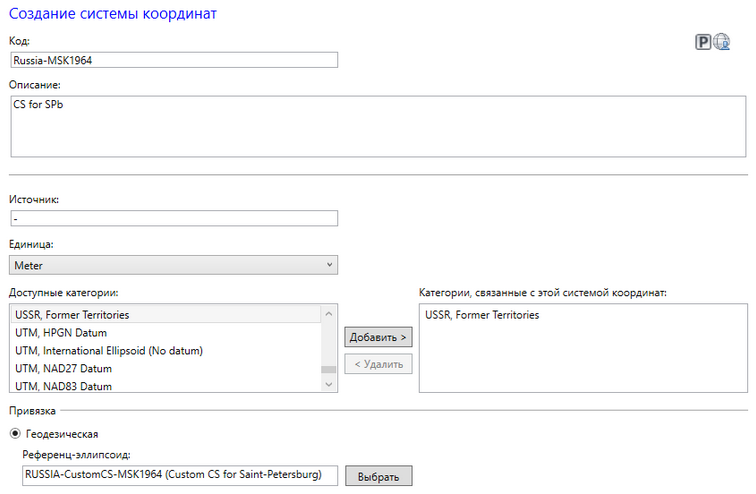

Внесённые параметры

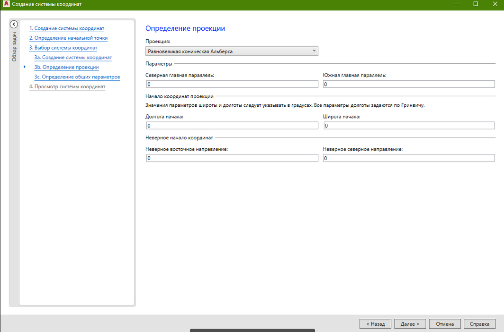

Вид следующего диалогового окна

Здесь выбираем тип проекции. Если в исходном определении СК масштабный коэффициент = 1, то выбираем тип "Проекция Гаусса-Крюгера". В противном случае - выбираем общий случай, "Поперечная Меркатора"

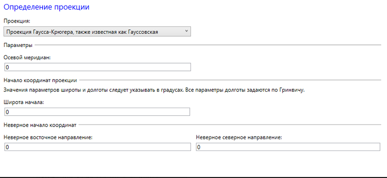

Шаблон для ввода данных для типа СК - "Гаусса-Крюгера"

Далее приступаем к вводу числовых параметров согласно имеющемуся описанию:

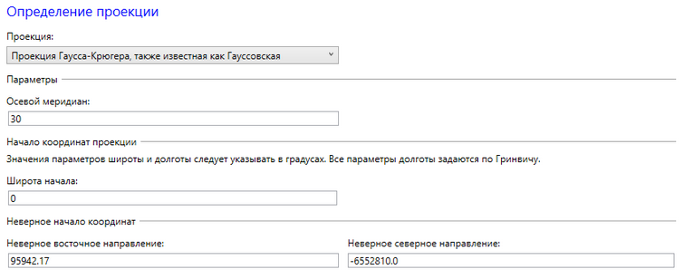

Заполняем параметры

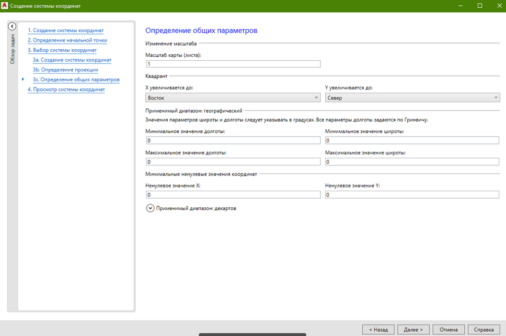

Следующее диалоговое окно

Здесь необходимо указать экстент для СК (границы, в пределах которых она будет действовать). Для этого на тех же Яндекс-Картах можно получить координаты левого нижнего и правого верхнего углов:

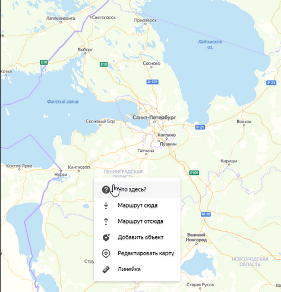

Получаем координаты левого нижнего угла - 59.332449, 28.905964

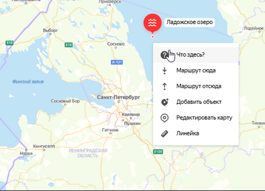

Получаем координаты правого верхнего угла - 60.680319, 31.090514

Для удобства, округляем левый нижний угол до меньшего целого, а правый верхний - до большего целого (в градусной мере).

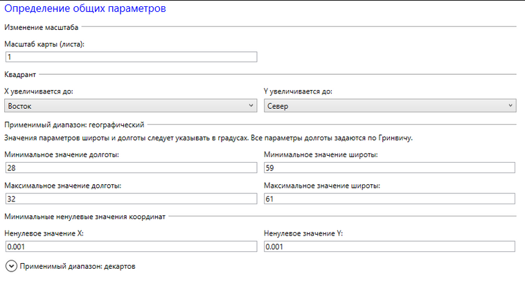

Заносим принятые параметры

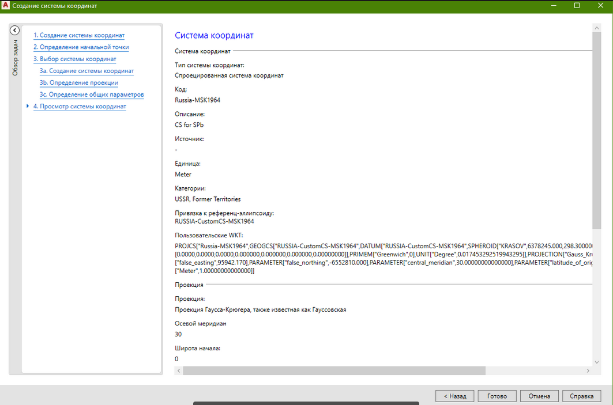

В следующем диалоговом окне нажимаем на "готово"

Теперь после внесения в библиотеку изменений необходимо перезапустить Civil 3D/Map 3D для внесения изменений в базу СК (иногда при дальнейших операциях с определениями при отсутствии перезапуска могут возникать баги).

## Проверяем функционирование определений

Для этого действия откроем пустой чертеж и назначим ему нашу созданную СК командой mapcsassign/в свойствах чертежа, как кому нравится. Первый индикатор - это активная вкладка "Геопозиционирование" на ленте вкладок:

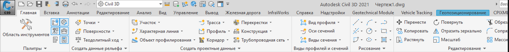

Активная вкладка Геопозиционирование после назначения СК

Далее перейдем в эту вкладку и вызовем опцию "Карты смешанные"

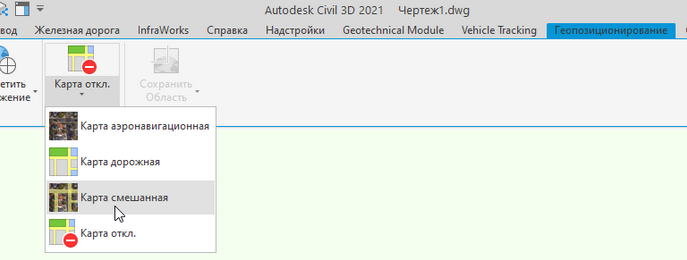

Включаем подложку карт

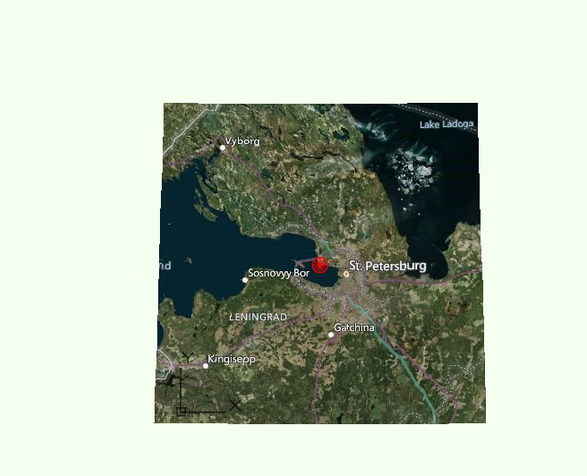

Отдаляем экран

Теперь приблизимся к какому-либо точечному открытому объекту - к примеру, к Вечному Огню на Марсовом поле тут:

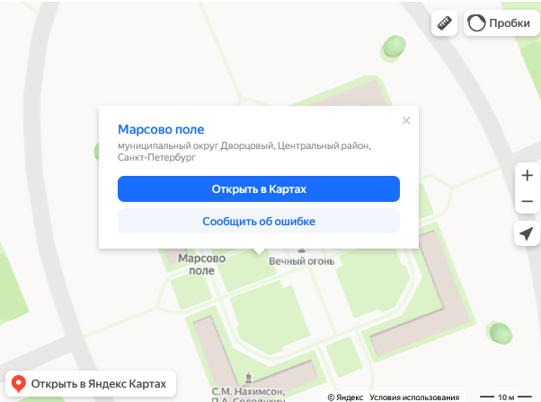

Далее используя функцию **_units** в Civil 3D включим максимальное число десятичных знаков для единиц:

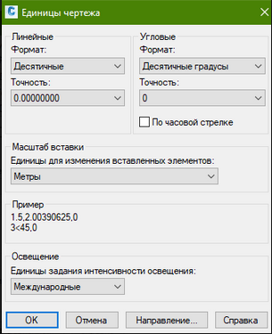

Теперь проставим "маркер геопозиции" из инструментов Геопозиционирования примерно в центр Вечного Огня

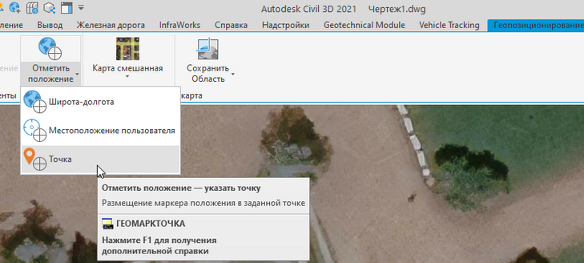

Маркер геопозиции

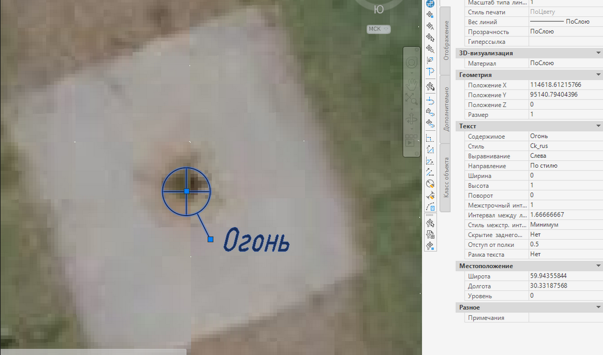

Маркер и его свойства на объекте

В свойствах видим координаты объекта - скопируем их:

> Широта - 59.94355844
> Долгота - 30.33187568

Получим аналогичные координаты из Яндекс-Карт:

> Долгота - 59.943565
> Широта - 30.331868

Произведем простые математические операции и найдем невязку:

dX = | 59.94355844 - 59.943565| * 112 000 м = -0.00000656 * 112 000 м = 0.735 м

dY = |30.33187568 - 30.331868| * 56 000 м = 0.00000768 * 56 000 м = 0.43 м

Видим, что пространственная невязка составляет до 1 метра (что для использования "осредненного" датума считается более чем достаточным. Следовательно, параметры настроены верно

**Примечание**: мы домножали разности широт на линейную величины 1 градуса в пределах СЗФО - 1 градус широты ~ 112 км; 1 градус долготы ~ 56 км.

# 

## Выводы

На этом завершаем данную статью, в которой мы познакомились с процедурой задания описания для СК имея на руках её формулировку в явном виде, а также проверили достоверность параметров (примерно).

Отдельные моменты более подробно описаны в [данном пособии](https://inj9.gitbook.io/msk-for-civil-3d/) (справка по системам координат к пакету адаптации для Civil 3D 2021).

Следующую статью мы посвятим вопросу определений нетиповых СК, либо для которых не было найдено описание в явном виде и есть набор ряда опорных точек в данной СК.
